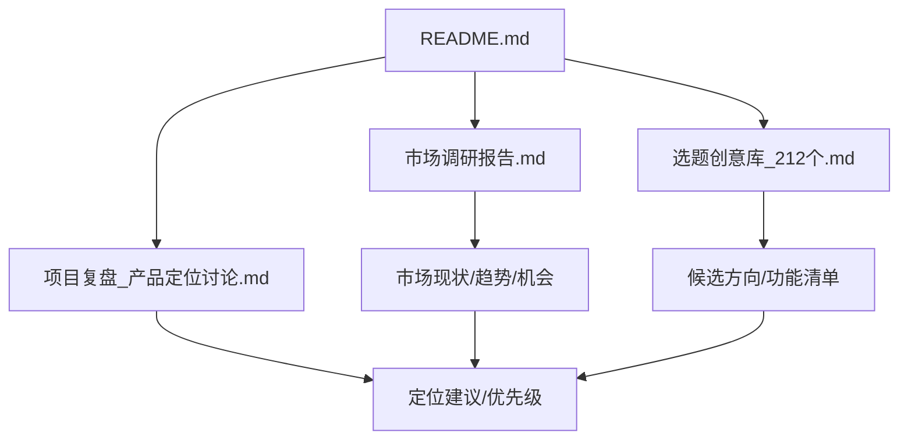
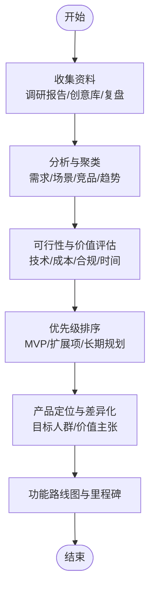
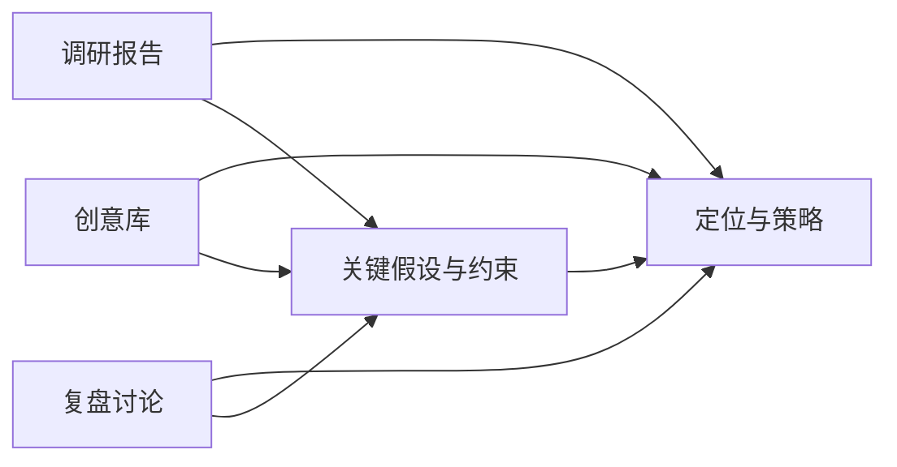

# 市场分析

<cite>
**本文引用的文件**   
- [README.md](file://README.md)
- [市场调研报告.md](file://市场调研报告.md)
- [选题创意库_212个.md](file://选题创意库_212个.md)
- [项目复盘_产品定位讨论.md](file://项目复盘_产品定位讨论.md)
</cite>

## 目录
1. [引言](#引言)
2. [项目结构](#项目结构)
3. [核心组件](#核心组件)
4. [架构总览](#架构总览)
5. [详细组件分析](#详细组件分析)
6. [依赖分析](#依赖分析)
7. [性能考量](#性能考量)
8. [故障排查指南](#故障排查指南)
9. [结论](#结论)
10. [附录](#附录)

## 引言
本文件基于仓库中的“市场调研报告”与“选题创意库”，结合“项目复盘_产品定位讨论”的结论，形成一份面向天气智能体市场的全面市场分析文档。目标包括：
- 梳理天气智能体市场现状、趋势与发展机会
- 评估竞争格局，识别空白点与差异化策略
- 归纳用户需求与痛点，进行技术可行性评估
- 给出产品定位建议与功能优先级排序
- 以数据与案例为依据支撑决策

## 项目结构
仓库围绕“调研—创意—定位”的主线组织内容，关键文件如下：
- README.md：项目说明与入口指引
- 市场调研报告.md：行业规模、用户画像、竞品与趋势等调研结果
- 选题创意库_212个.md：候选产品方向与功能点子集合
- 项目复盘_产品定位讨论.md：对定位、差异化与优先级的复盘结论

图表来源
- [README.md](file://README.md)
- [市场调研报告.md](file://市场调研报告.md)
- [选题创意库_212个.md](file://选题创意库_212个.md)
- [项目复盘_产品定位讨论.md](file://项目复盘_产品定位讨论.md)

章节来源
- [README.md](file://README.md)
- [市场调研报告.md](file://市场调研报告.md)
- [选题创意库_212个.md](file://选题创意库_212个.md)
- [项目复盘_产品定位讨论.md](file://项目复盘_产品定位讨论.md)

## 核心组件
- 市场调研报告：提供市场规模、增长驱动、用户分层、使用场景、竞品矩阵、进入壁垒与合规要点等，构成需求侧与供给侧的基本面判断。
- 选题创意库：沉淀大量可落地的产品方向与功能点，便于按价值与可行性筛选组合。
- 项目复盘（定位讨论）：明确目标人群、核心价值主张、差异化路径与MVP范围，指导后续迭代。

章节来源
- [市场调研报告.md](file://市场调研报告.md)
- [选题创意库_212个.md](file://选题创意库_212个.md)
- [项目复盘_产品定位讨论.md](file://项目复盘_产品定位讨论.md)

## 架构总览
从“输入—处理—输出”的角度，将三份材料整合为市场分析工作流：
- 输入：市场数据、用户洞察、竞品信息、创意清单
- 处理：需求聚类、机会识别、可行性评估、优先级排序
- 输出：产品定位、功能路线图、商业化策略与风险对策

[本图为概念性流程图，不直接映射具体代码文件]

## 详细组件分析

### 市场现状与趋势
- 市场规模与增长：依据调研报告中的历史规模、增速与渗透率，判断当前所处阶段（导入/成长/成熟），并识别未来3–5年复合增长率的关键驱动因素。
- 技术趋势：大模型能力增强、多模态交互、实时数据接入、边缘计算与隐私计算等，推动天气智能体从“查询工具”向“决策助手”演进。
- 监管与合规：数据源授权、个人信息保护、行业规范与平台政策，影响产品上线与商业化节奏。

章节来源
- [市场调研报告.md](file://市场调研报告.md)

### 竞争格局与差异化
- 竞争者类型：通用AI助手、垂直天气应用、出行/农业/物流等行业方案商、云平台内置能力。
- 差异化切入点：场景化深度（如通勤、户外、农业、应急）、体验差异（对话式、主动推送、可视化）、生态集成（地图、日历、IoT设备）。
- 进入壁垒：数据质量与时效、算法精度、渠道与品牌、合规资质。

章节来源
- [市场调研报告.md](file://市场调研报告.md)
- [项目复盘_产品定位讨论.md](file://项目复盘_产品定位讨论.md)

### 用户需求与痛点
- 典型用户分层：普通消费者、户外运动爱好者、交通出行从业者、农业与物流从业者、企业运营与应急管理部门。
- 常见痛点：信息碎片化、准确性与时效性不足、缺乏个性化与可执行建议、跨平台联动弱、隐私与数据安全顾虑。
- 需求优先级：准确性与及时性 > 个性化建议 > 多端一致体验 > 生态集成 > 高级可视化与报表。

章节来源
- [市场调研报告.md](file://市场调研报告.md)
- [选题创意库_212个.md](file://选题创意库_212个.md)

### 技术可行性评估
- 数据层：权威气象数据源接入、缓存与更新策略、异常检测与回退机制。
- 模型层：自然语言理解、意图识别、知识图谱/规则引擎、推理与解释能力。
- 工程层：高可用架构、低延迟响应、可扩展微服务、监控与告警。
- 安全合规：数据脱敏、最小权限、审计追踪、合规审查流程。

章节来源
- [项目复盘_产品定位讨论.md](file://项目复盘_产品定位讨论.md)

### 产品定位建议
- 目标人群：优先聚焦高频刚需且对时效敏感的人群（如通勤族、户外人群、城市运营人员）。
- 价值主张：准确、及时、可执行的天气决策助手，覆盖“看—懂—做”闭环。
- 差异化策略：强场景化+强集成（地图/日历/IoT）+强可信（权威数据+可解释建议）。

章节来源
- [项目复盘_产品定位讨论.md](file://项目复盘_产品定位讨论.md)

### 功能优先级排序（MVP→扩展→长期）
- MVP（快速验证）：精准天气问答、个性化提醒、基础可视化、常用平台集成（消息/日历）。
- 扩展（提升粘性）：多源数据融合、离线/弱网优化、行业模板（出行/户外/农业）、协同共享。
- 长期（构建壁垒）：预测与归因、自动化策略（联动IoT/调度系统）、开放API与生态伙伴。

章节来源
- [选题创意库_212个.md](file://选题创意库_212个.md)
- [项目复盘_产品定位讨论.md](file://项目复盘_产品定位讨论.md)

### 商业与增长策略
- 商业模式：订阅增值、B端解决方案、广告与推荐（谨慎）、生态分润。
- 增长飞轮：高质量数据与体验 → 口碑传播 → 更多场景与数据 → 模型与服务升级。
- 关键指标：DAU/MAU、留存、任务完成率、NPS、错误率、时延、转化率。

章节来源
- [市场调研报告.md](file://市场调研报告.md)
- [项目复盘_产品定位讨论.md](file://项目复盘_产品定位讨论.md)

## 依赖分析
三份材料之间的逻辑依赖关系如下：
- 调研报告为“需求与机会”的来源
- 创意库为“功能与方向”的素材池
- 复盘定位为“取舍与落地”的依据

图表来源
- [市场调研报告.md](file://市场调研报告.md)
- [选题创意库_212个.md](file://选题创意库_212个.md)
- [项目复盘_产品定位讨论.md](file://项目复盘_产品定位讨论.md)

章节来源
- [市场调研报告.md](file://市场调研报告.md)
- [选题创意库_212个.md](file://选题创意库_212个.md)
- [项目复盘_产品定位讨论.md](file://项目复盘_产品定位讨论.md)

## 性能考量
- 数据时效与一致性：采用多级缓存与增量更新，保障峰值时段稳定。
- 响应时延：热点问答本地化、异步批处理、请求合并与去重。
- 可用性：多活部署、自动熔断降级、灰度发布与回滚。
- 观测性：全链路追踪、关键指标看板、异常告警与自愈。

[本节为通用性能建议，不直接引用具体文件]

## 故障排查指南
- 数据源异常：切换备用源、降级到最近快照、记录错误上下文。
- 模型推理失败：回退到规则引擎、限制并发、采样日志与复现用例。
- 接口超时：限流与重试策略、连接池调优、下游健康检查。
- 合规问题：数据访问审计、权限校验、敏感字段脱敏。

[本节为通用排障建议，不直接引用具体文件]

## 结论
- 市场处于快速成长期，技术演进与场景深化带来显著机会。
- 差异化关键在于“强场景+强体验+强可信”。
- 以MVP快速验证核心价值，逐步扩展至行业化与生态化。
- 以数据与案例为依据持续校准定位与优先级，确保资源投入产出比最优。

[本节为总结性内容，不直接引用具体文件]

## 附录
- 数据来源与口径说明：详见调研报告的数据来源与方法论部分。
- 术语表：天气智能体、数据源、模型推理、MVP、NPS等。
- 参考链接：内部文档与外部公开资料的索引。

[本节为补充信息，不直接引用具体文件]