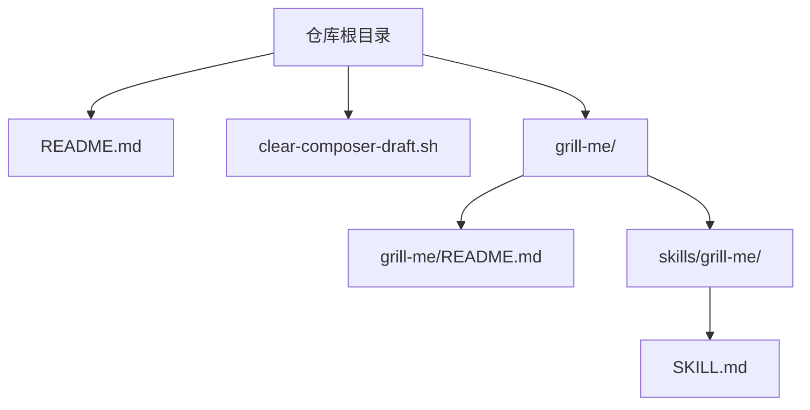
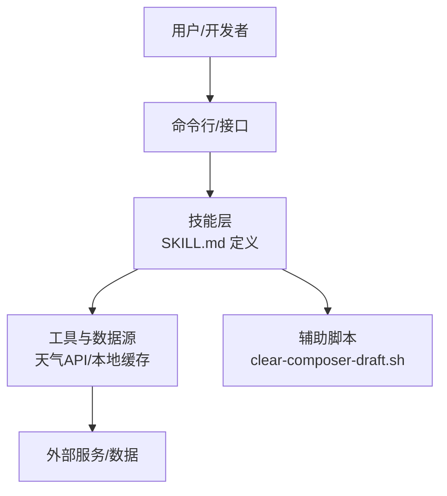
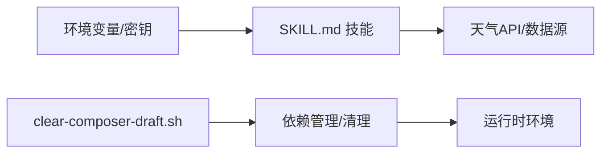

# 快速开始

<cite>
**本文档引用的文件**   
- [README.md](file://README.md)
- [grill-me/README.md](file://grill-me/README.md)
- [grill-me/skills/grill-me/SKILL.md](file://grill-me/skills/grill-me/SKILL.md)
- [clear-composer-draft.sh](file://clear-composer-draft.sh)
</cite>

## 目录
1. [简介](#简介)
2. [项目结构](#项目结构)
3. [核心组件](#核心组件)
4. [架构总览](#架构总览)
5. [详细组件分析](#详细组件分析)
6. [依赖关系分析](#依赖关系分析)
7. [性能注意事项](#性能注意事项)
8. [故障排查指南](#故障排查指南)
9. [结论](#结论)
10. [附录](#附录)

## 简介
本指南面向首次参与“天气智能体竞赛”的开发者，目标是帮助你在最短时间内完成环境准备、安装依赖、配置运行，并创建你的第一个智能体。内容涵盖：
- 环境与依赖要求
- 安装与初始化步骤
- 配置文件说明
- 首个智能体的创建流程
- 常用命令行操作
- 常见问题与解决方案

## 项目结构
仓库采用以功能域为主的组织方式，根目录包含项目说明文档与脚本，grill-me 子目录为技能（Skill）示例与资源。关键目录与文件：
- README.md：项目顶层说明
- grill-me/README.md：grill-me 模块说明
- grill-me/skills/grill-me/SKILL.md：技能定义与使用说明
- clear-composer-draft.sh：清理草稿的辅助脚本

图表来源
- [README.md](file://README.md)
- [grill-me/README.md](file://grill-me/README.md)
- [grill-me/skills/grill-me/SKILL.md](file://grill-me/skills/grill-me/SKILL.md)
- [clear-composer-draft.sh](file://clear-composer-draft.sh)

章节来源
- [README.md](file://README.md)
- [grill-me/README.md](file://grill-me/README.md)

## 核心组件
- 顶层说明与入口：根级 README.md 提供项目背景、目标与总体指引。
- 技能示例（Skill）：grill-me 模块下的 SKILL.md 定义了技能的行为、输入输出与使用方式，是构建天气智能体的基础模板。
- 辅助脚本：clear-composer-draft.sh 用于清理 Composer 相关草稿或中间产物，便于重复开发与调试。

章节来源
- [README.md](file://README.md)
- [grill-me/README.md](file://grill-me/README.md)
- [grill-me/skills/grill-me/SKILL.md](file://grill-me/skills/grill-me/SKILL.md)
- [clear-composer-draft.sh](file://clear-composer-draft.sh)

## 架构总览
从“快速开始”的角度，系统可抽象为三层：
- 用户层：通过命令行或接口调用智能体能力
- 技能层：基于 SKILL.md 定义的规则与工具组合，封装天气查询、数据处理等能力
- 支撑层：依赖管理、脚本工具与环境配置

[本图为概念性示意，不直接映射具体代码文件]

## 详细组件分析

### 技能（Skill）快速上手
- 定位：位于 grill-me/skills/grill-me/SKILL.md，描述技能的职责、输入参数、输出格式与调用约定。
- 使用要点：
  - 阅读技能说明，明确输入字段与期望输出
  - 根据说明准备必要的环境变量或密钥（如天气 API Key）
  - 在本地环境中加载该技能，并通过命令行或集成框架触发执行
- 扩展建议：
  - 新增自定义工具函数时，保持输入输出契约一致
  - 对异常进行统一处理与日志记录，便于排错

章节来源
- [grill-me/skills/grill-me/SKILL.md](file://grill-me/skills/grill-me/SKILL.md)

### 辅助脚本：清理草稿
- 作用：清理 Composer 相关的草稿或临时产物，避免干扰后续构建与测试。
- 使用场景：
  - 开发过程中出现依赖冲突或中间文件污染
  - 需要重置状态后重新安装依赖
- 使用方法：在项目根目录执行脚本，确保具备执行权限

章节来源
- [clear-composer-draft.sh](file://clear-composer-draft.sh)

### 模块说明：grill-me
- 内容：grill-me/README.md 提供该模块的背景、用途与基本用法，有助于理解技能的组织方式与运行边界。
- 建议：在创建新智能体前，先通读该说明，了解模块的职责划分与最佳实践。

章节来源
- [grill-me/README.md](file://grill-me/README.md)

## 依赖关系分析
- 语言与包管理器：根据 clear-composer-draft.sh 的存在，项目可能使用 PHP 生态中的 Composer 进行依赖管理。请确认已安装对应运行时与包管理器。
- 外部依赖：技能通常需要访问天气数据源（例如第三方天气 API），需在环境变量中配置必要的密钥与端点信息。
- 内部依赖：SKILL.md 作为技能契约，约束了输入输出与行为；其他组件应遵循该契约进行集成。

[本图为概念性示意，不直接映射具体代码文件]

## 性能注意事项
- 缓存策略：对频繁的天气查询结果进行本地缓存，减少对外部 API 的调用频率。
- 超时与重试：合理设置网络请求的超时时间与重试次数，提升鲁棒性。
- 并发控制：在高并发场景下，限制并行请求数量，避免触发限流或资源争用。
- 日志与监控：记录关键指标与错误信息，便于问题定位与性能优化。

[本节为通用指导，不直接分析具体文件]

## 故障排查指南
- 无法执行脚本：
  - 检查脚本是否具备执行权限，必要时赋予执行位
  - 确认当前 Shell 环境支持脚本解释器
- 依赖安装失败：
  - 确认包管理器版本与网络可达性
  - 使用清理脚本清除中间产物后重试
- 天气 API 调用失败：
  - 校验环境变量中的密钥与端点是否正确
  - 检查网络连通性与速率限制
- 技能行为异常：
  - 对照 SKILL.md 的输入输出契约，检查参数格式
  - 查看日志输出，定位错误堆栈与上下文信息

章节来源
- [clear-composer-draft.sh](file://clear-composer-draft.sh)
- [grill-me/skills/grill-me/SKILL.md](file://grill-me/skills/grill-me/SKILL.md)

## 结论
通过本快速开始指南，你应已完成环境准备、依赖安装与首个智能体的创建。建议进一步阅读 SKILL.md 与模块说明，深入理解技能契约与扩展方式。遇到问题时，优先检查环境变量、网络连通性与日志输出，结合本指南的故障排查部分逐步定位。

[本节为总结性内容，不直接分析具体文件]

## 附录

### 安装与环境准备
- 前置条件：
  - 操作系统：Linux/macOS/Windows（推荐 Linux 或 macOS）
  - 运行时：根据 clear-composer-draft.sh 推断，需安装 PHP 与 Composer
  - 网络：能够访问外部天气 API 服务
- 安装步骤：
  - 克隆仓库到本地
  - 进入项目根目录
  - 安装依赖（参考 Composer 常规命令）
  - 配置环境变量（天气 API Key、端点等）
  - 验证安装（执行基础命令或示例）

[本节为通用指导，不直接分析具体文件]

### 配置文件设置
- 环境变量：
  - 天气 API Key：用于鉴权访问天气服务
  - 端点地址：指定天气 API 的基础 URL
  - 缓存路径：本地缓存目录，提升响应速度
- 配置文件位置：
  - 建议在项目根目录或环境变量文件中集中管理
  - 避免将敏感信息提交至版本库

[本节为通用指导，不直接分析具体文件]

### 第一个智能体的创建流程
- 步骤概览：
  - 阅读 SKILL.md，明确输入输出与行为
  - 准备必要的环境变量与密钥
  - 在本地加载技能并执行一次调用
  - 验证返回结果是否符合预期
- 常见检查点：
  - 参数格式与必填项
  - 网络连通性与速率限制
  - 日志与错误码含义

章节来源
- [grill-me/skills/grill-me/SKILL.md](file://grill-me/skills/grill-me/SKILL.md)

### 常用命令行操作示例
- 清理草稿：在项目根目录执行清理脚本，确保干净的依赖状态
- 安装依赖：使用包管理器安装依赖
- 运行技能：根据 SKILL.md 的说明，构造输入并调用技能
- 查看日志：定位错误信息与运行状态

章节来源
- [clear-composer-draft.sh](file://clear-composer-draft.sh)
- [grill-me/skills/grill-me/SKILL.md](file://grill-me/skills/grill-me/SKILL.md)