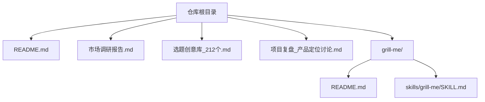
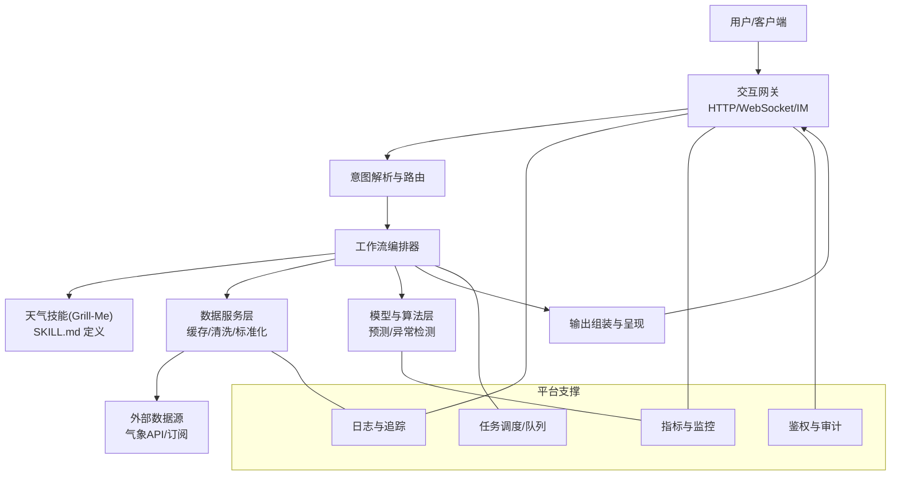
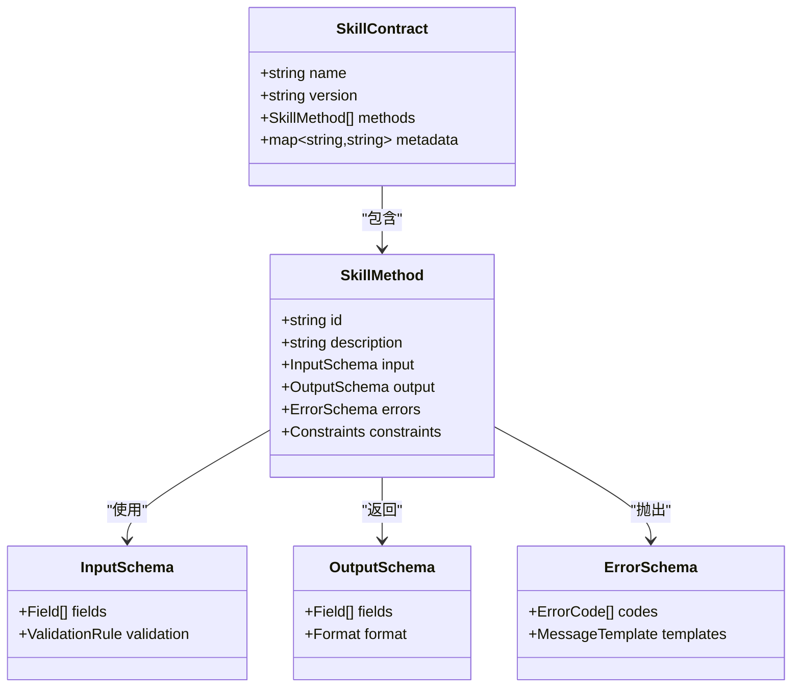
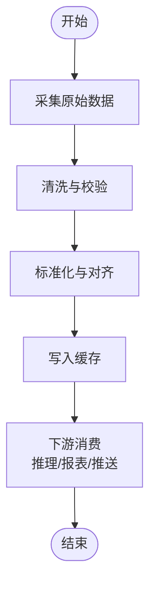
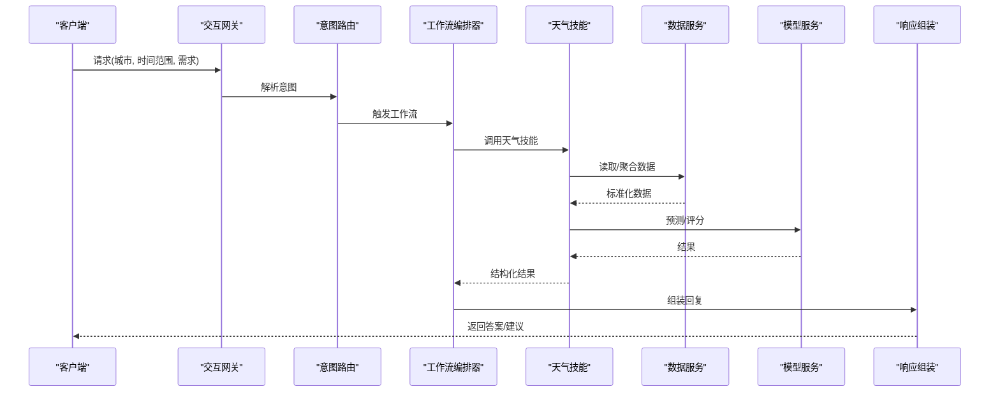
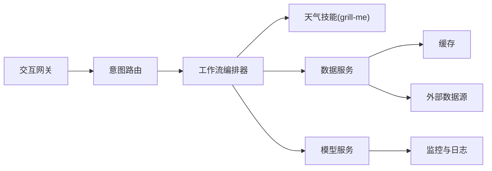

# 技术实现

<cite>
**本文引用的文件**   
- [README.md](file://README.md)
- [市场调研报告.md](file://市场调研报告.md)
- [选题创意库_212个.md](file://选题创意库_212个.md)
- [项目复盘_产品定位讨论.md](file://项目复盘_产品定位讨论.md)
- [grill-me/README.md](file://grill-me/README.md)
- [grill-me/skills/grill-me/SKILL.md](file://grill-me/skills/grill-me/SKILL.md)
</cite>

## 目录
1. [引言](#引言)
2. [项目结构](#项目结构)
3. [核心组件](#核心组件)
4. [架构总览](#架构总览)
5. [详细组件分析](#详细组件分析)
6. [依赖关系分析](#依赖关系分析)
7. [性能考虑](#性能考虑)
8. [故障排查指南](#故障排查指南)
9. [结论](#结论)
10. [附录](#附录)

## 引言
本技术实现文档面向“天气智能体”项目，旨在系统化阐述系统架构设计、核心模块与关键技术选型，并给出数据处理流程、算法实现思路、系统集成方案、代码结构说明、接口设计与扩展机制。同时提供部署配置要点、监控告警建议与故障排查指南，以及性能优化策略与安全注意事项。由于当前仓库以文档与技能说明为主，未包含可执行源代码，本文在保持严谨性的前提下，基于现有材料进行架构化解读与落地指导，确保非技术读者也能理解整体设计。

## 项目结构
仓库根目录包含项目说明、市场与选题资料，以及一个名为 grill-me 的技能包。该技能包内包含 README 与 SKILL 定义，体现“智能体技能”的装配方式与能力边界。

图表来源
- [README.md:1-200](file://README.md#L1-L200)
- [grill-me/README.md:1-200](file://grill-me/README.md#L1-L200)
- [grill-me/skills/grill-me/SKILL.md:1-200](file://grill-me/skills/grill-me/SKILL.md#L1-L200)

章节来源
- [README.md:1-200](file://README.md#L1-L200)
- [grill-me/README.md:1-200](file://grill-me/README.md#L1-L200)
- [grill-me/skills/grill-me/SKILL.md:1-200](file://grill-me/skills/grill-me/SKILL.md#L1-L200)

## 核心组件
围绕“天气智能体”，核心组件通常包括：
- 用户交互层：对话入口（如聊天机器人）、指令解析与意图识别
- 技能编排层：将“天气查询”“预警推送”“出行建议”等能力组合为工作流
- 数据服务层：接入气象数据源（API/订阅），负责缓存、清洗与标准化
- 模型与算法层：趋势预测、异常检测、个性化推荐
- 平台与集成层：消息总线、任务调度、日志与指标采集、鉴权与审计

在本仓库中，grill-me 技能包通过 SKILL.md 描述能力边界与调用约定，是“智能体技能”的最小可复用单元；README 则提供使用说明与上下文。

章节来源
- [grill-me/skills/grill-me/SKILL.md:1-200](file://grill-me/skills/grill-me/SKILL.md#L1-L200)
- [grill-me/README.md:1-200](file://grill-me/README.md#L1-L200)

## 架构总览
下图展示了一个典型的“天气智能体”端到端架构，涵盖从用户输入到数据获取、处理、推理与回传的完整链路，并与 grill-me 技能包对接。

图表来源
- [grill-me/skills/grill-me/SKILL.md:1-200](file://grill-me/skills/grill-me/SKILL.md#L1-L200)
- [grill-me/README.md:1-200](file://grill-me/README.md#L1-L200)

## 详细组件分析

### 技能包：grill-me（天气技能）
- 职责：封装“天气相关”的可复用能力，如城市天气查询、空气质量、预警信息、出行建议等
- 契约：通过 SKILL.md 声明能力清单、输入参数、返回格式、错误码与调用约束
- 集成：由工作流编排器按需加载与调用，支持热插拔与版本管理

图表来源
- [grill-me/skills/grill-me/SKILL.md:1-200](file://grill-me/skills/grill-me/SKILL.md#L1-L200)

章节来源
- [grill-me/skills/grill-me/SKILL.md:1-200](file://grill-me/skills/grail-me/SKILL.md#L1-L200)
- [grill-me/README.md:1-200](file://grill-me/README.md#L1-L200)

### 数据处理流程
- 数据采集：从外部气象 API 或订阅通道拉取原始数据
- 数据清洗：去重、缺失值填充、单位统一、时间对齐
- 数据标准化：按城市/区域维度归一化，建立主数据映射
- 数据缓存：热点数据入缓存（TTL 控制），降低下游压力
- 数据消费：供模型训练、在线推理与报表生成

图表来源
- [grill-me/skills/grill-me/SKILL.md:1-200](file://grill-me/skills/grill-me/SKILL.md#L1-L200)

章节来源
- [grill-me/skills/grill-me/SKILL.md:1-200](file://grill-me/skills/grill-me/SKILL.md#L1-L200)

### 算法实现思路
- 趋势预测：基于时序模型对温度、降水、风速等进行短期预测
- 异常检测：识别极端天气事件与数据异常点
- 个性化推荐：结合用户位置、偏好与历史行为生成出行建议
- 评估指标：MAE/RMSE、F1/AUC（分类）、业务转化率

图表来源
- [grill-me/skills/grill-me/SKILL.md:1-200](file://grill-me/skills/grill-me/SKILL.md#L1-L200)

章节来源
- [grill-me/skills/grill-me/SKILL.md:1-200](file://grill-me/skills/grill-me/SKILL.md#L1-L200)

### 接口设计（示例）
- 天气查询接口：输入城市、时间粒度、字段列表；返回温度、湿度、风况、空气质量、预警标签
- 预警推送接口：输入阈值与受众；返回命中事件与触达状态
- 建议生成接口：输入用户画像与场景；返回出行/健康建议

章节来源
- [grill-me/skills/grill-me/SKILL.md:1-200](file://grill-me/skills/grill-me/SKILL.md#L1-L200)

### 扩展机制
- 新技能接入：遵循 SKILL 契约，注册至编排器，配置路由规则
- 插件化数据源：抽象数据适配器，支持多源接入与切换
- 模型热更新：模型服务独立部署，支持灰度发布与回滚
- 配置中心：集中化管理环境变量、开关与限流策略

章节来源
- [grill-me/README.md:1-200](file://grill-me/README.md#L1-L200)
- [grill-me/skills/grill-me/SKILL.md:1-200](file://grill-me/skills/grill-me/SKILL.md#L1-L200)

## 依赖关系分析
- 内部依赖：交互网关依赖意图路由；工作流编排器依赖天气技能与数据服务；数据服务依赖缓存与外部数据源
- 外部依赖：气象 API、消息队列、对象存储、监控系统
- 耦合与解耦：通过 SKILL 契约与数据适配层降低耦合；通过事件驱动提升弹性

图表来源
- [grill-me/skills/grill-me/SKILL.md:1-200](file://grill-me/skills/grill-me/SKILL.md#L1-L200)

章节来源
- [grill-me/skills/grill-me/SKILL.md:1-200](file://grill-me/skills/grill-me/SKILL.md#L1-L200)

## 性能考虑
- 缓存策略：热点城市与短时预报优先缓存，设置合理 TTL 与失效策略
- 异步处理：耗时任务（批量计算、报表生成）走消息队列
- 连接池与限流：对外部 API 调用采用连接池与令牌桶限流
- 资源隔离：不同技能与模型服务独立部署，避免相互影响
- 观测性：全链路追踪与关键指标埋点，便于容量规划与瓶颈定位

[本节为通用指导，不直接分析具体文件]

## 故障排查指南
- 常见问题
  - 数据源不可用：检查网络连通性、鉴权凭证、配额与限流
  - 缓存不一致：核对 TTL、键空间与一致性策略
  - 技能调用失败：核对 SKILL 契约、参数校验与错误码
  - 模型延迟高：检查 GPU/CPU 利用率、批大小与并发度
- 排查步骤
  - 查看网关日志与链路追踪，定位失败阶段
  - 检查数据服务健康检查与上游依赖状态
  - 验证 SKILL 版本兼容性与配置项
  - 回放请求样本，复现问题并收集诊断信息

章节来源
- [grill-me/README.md:1-200](file://grill-me/README.md#L1-L200)
- [grill-me/skills/grill-me/SKILL.md:1-200](file://grill-me/skills/grill-me/SKILL.md#L1-L200)

## 结论
本仓库以文档与技能说明为核心，明确了“天气智能体”的能力边界与集成方式。通过 grill-me 技能包的契约化设计，可实现能力的模块化与可插拔；配合数据服务与模型服务的解耦，能够支撑高可用与可扩展的系统演进。后续可在工程化层面补充代码实现、测试与自动化流水线，进一步提升交付质量与运维效率。

[本节为总结性内容，不直接分析具体文件]

## 附录
- 参考材料
  - 市场调研报告：用于明确目标用户、场景与价值主张
  - 选题创意库：拓展智能体能力与差异化卖点
  - 项目复盘：沉淀经验教训与改进方向

章节来源
- [市场调研报告.md:1-200](file://市场调研报告.md#L1-L200)
- [选题创意库_212个.md:1-200](file://选题创意库_212个.md#L1-L200)
- [项目复盘_产品定位讨论.md:1-200](file://项目复盘_产品定位讨论.md#L1-L200)