# 数据处理

<cite>
**本文档引用的文件**   
- [README.md](file://README.md)
- [市场调研报告.md](file://市场调研报告.md)
- [选题创意库_212个.md](file://选题创意库_212个.md)
- [项目复盘_产品定位讨论.md](file://项目复盘_产品定位讨论.md)
- [grill-me/README.md](file://grill-me/README.md)
- [grill-me/skills/grill-me/SKILL.md](file://grill-me/skills/grill-me/SKILL.md)
</cite>

## 目录
1. [简介](#简介)
2. [项目结构](#项目结构)
3. [核心组件](#核心组件)
4. [架构总览](#架构总览)
5. [详细组件分析](#详细组件分析)
6. [依赖关系分析](#依赖关系分析)
7. [性能考虑](#性能考虑)
8. [故障排查指南](#故障排查指南)
9. [结论](#结论)
10. [附录](#附录)

## 简介
本文件面向“天气数据处理系统”的数据处理主题，围绕数据采集、清洗、转换与分析的完整流程进行说明。由于当前仓库未包含具体的代码实现，本文基于仓库中的文档与说明材料，提炼出可落地的数据规范、验证规则、存储策略以及实时与批量处理思路，并给出可视化流程图与最佳实践建议，帮助读者快速搭建或完善一个健壮的天气数据处理流水线。

## 项目结构
仓库以文档与策划为主，包含项目概述、调研与选题材料，以及一个名为 grill-me 的子模块说明。整体结构如下：
- README.md：项目顶层说明
- 市场调研报告.md：市场背景与需求洞察
- 选题创意库_212个.md：创意与方向参考
- 项目复盘_产品定位讨论.md：产品定位与复盘要点
- grill-me/README.md：子模块说明
- grill-me/skills/grill-me/SKILL.md：技能定义与使用说明

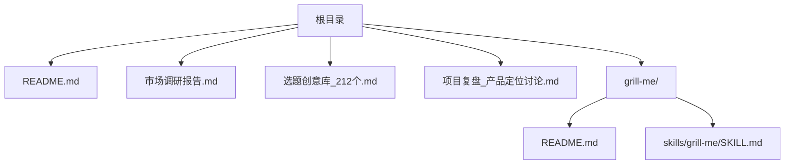

图表来源
- [README.md](file://README.md)
- [市场调研报告.md](file://市场调研报告.md)
- [选题创意库_212个.md](file://选题创意库_212个.md)
- [项目复盘_产品定位讨论.md](file://项目复盘_产品定位讨论.md)
- [grill-me/README.md](file://grill-me/README.md)
- [grill-me/skills/grill-me/SKILL.md](file://grill-me/skills/grill-me/SKILL.md)

章节来源
- [README.md](file://README.md)
- [市场调研报告.md](file://市场调研报告.md)
- [选题创意库_212个.md](file://选题创意库_212个.md)
- [项目复盘_产品定位讨论.md](file://项目复盘_产品定位讨论.md)
- [grill-me/README.md](file://grill-me/README.md)
- [grill-me/skills/grill-me/SKILL.md](file://grill-me/skills/grill-me/SKILL.md)

## 核心组件
结合天气数据处理系统的常见需求与仓库内容，核心组件包括：
- 数据采集器：对接气象观测站、卫星遥感、公开API等数据源
- 数据清洗器：去噪、缺失值填补、异常值检测与修正
- 数据转换器：格式标准化、单位换算、时空对齐、特征工程
- 数据分析器：统计指标、趋势分析、相关性分析、模型评估
- 存储层：时序数据库、对象存储、缓存与索引
- 监控与告警：数据质量监控、异常检测、恢复策略

章节来源
- [README.md](file://README.md)
- [市场调研报告.md](file://市场调研报告.md)
- [项目复盘_产品定位讨论.md](file://项目复盘_产品定位讨论.md)

## 架构总览
下图展示了一个端到端的天气数据处理流水线，涵盖采集、清洗、转换、分析与存储，并支持实时与批量两种模式。

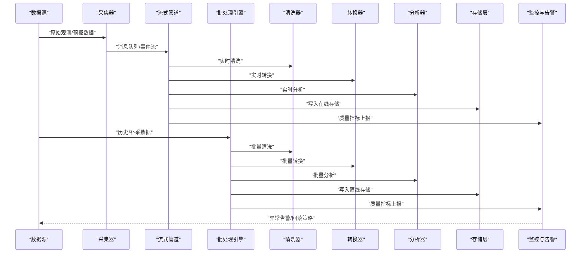

图表来源
- [README.md](file://README.md)
- [市场调研报告.md](file://市场调研报告.md)
- [项目复盘_产品定位讨论.md](file://项目复盘_产品定位讨论.md)

## 详细组件分析

### 数据采集
- 数据源类型：地面观测站、雷达、卫星、数值预报、第三方API
- 采集方式：HTTP轮询、WebSocket推送、文件拉取（CSV/NetCDF/HDF5）
- 可靠性保障：重试机制、断点续传、幂等写入、去重
- 元数据管理：采集时间戳、站点ID、传感器类型、版本信息

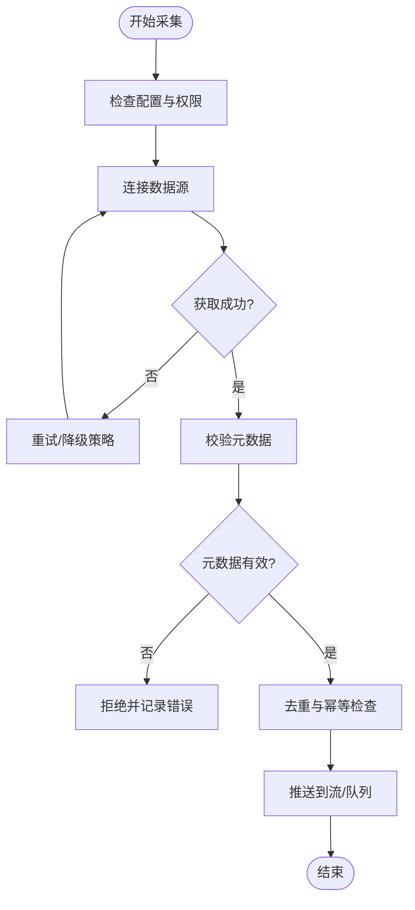

图表来源
- [README.md](file://README.md)
- [市场调研报告.md](file://市场调研报告.md)

章节来源
- [README.md](file://README.md)
- [市场调研报告.md](file://市场调研报告.md)

### 数据清洗
- 缺失值处理：插值、前向填充、后向填充、多源融合
- 异常值检测：阈值法、统计方法（Z-score）、机器学习异常检测
- 噪声过滤：滑动平均、小波滤波、卡尔曼滤波
- 一致性校验：单位统一、时间同步、空间一致性

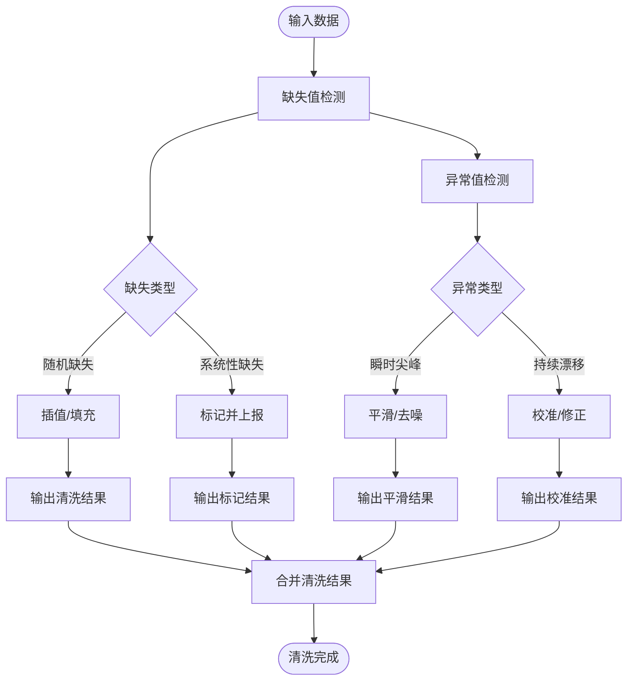

图表来源
- [README.md](file://README.md)
- [市场调研报告.md](file://市场调研报告.md)

章节来源
- [README.md](file://README.md)
- [市场调研报告.md](file://市场调研报告.md)

### 数据转换
- 格式标准化：统一JSON/Parquet/Avro等格式
- 单位换算：温度（℃/℉）、风速（m/s/knots）、降水（mm/inch）
- 时空对齐：时间戳归一化、时区处理、网格化插值
- 特征工程：衍生指标（体感温度、湿度指数、风切变）

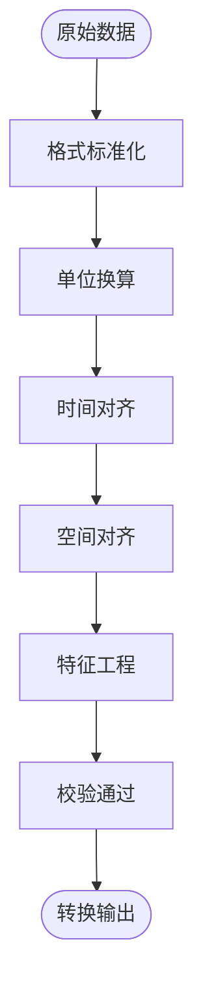

图表来源
- [README.md](file://README.md)
- [市场调研报告.md](file://市场调研报告.md)

章节来源
- [README.md](file://README.md)
- [市场调研报告.md](file://市场调研报告.md)

### 数据分析
- 描述性统计：均值、方差、分位数、极值
- 趋势与周期：移动平均、季节性分解、傅里叶分析
- 相关性分析：变量间相关系数、滞后相关性
- 模型评估：MAE、RMSE、R²、AUC

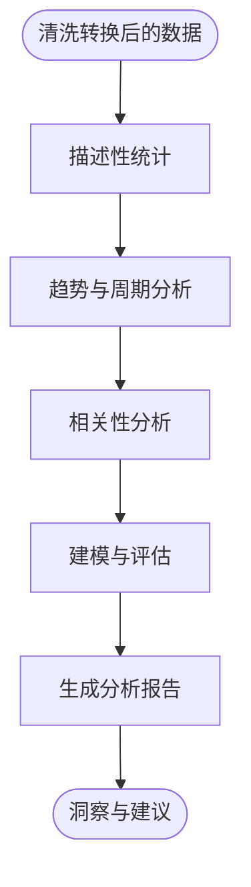

图表来源
- [README.md](file://README.md)
- [市场调研报告.md](file://市场调研报告.md)

章节来源
- [README.md](file://README.md)
- [市场调研报告.md](file://市场调研报告.md)

### 存储策略
- 在线存储：时序数据库（如InfluxDB/TDengine），用于实时查询与可视化
- 离线存储：对象存储（S3/OSS）+ Parquet列式存储，用于批量分析
- 缓存层：Redis/Memcached，热点数据加速
- 索引策略：时间分区、站点索引、字段倒排索引

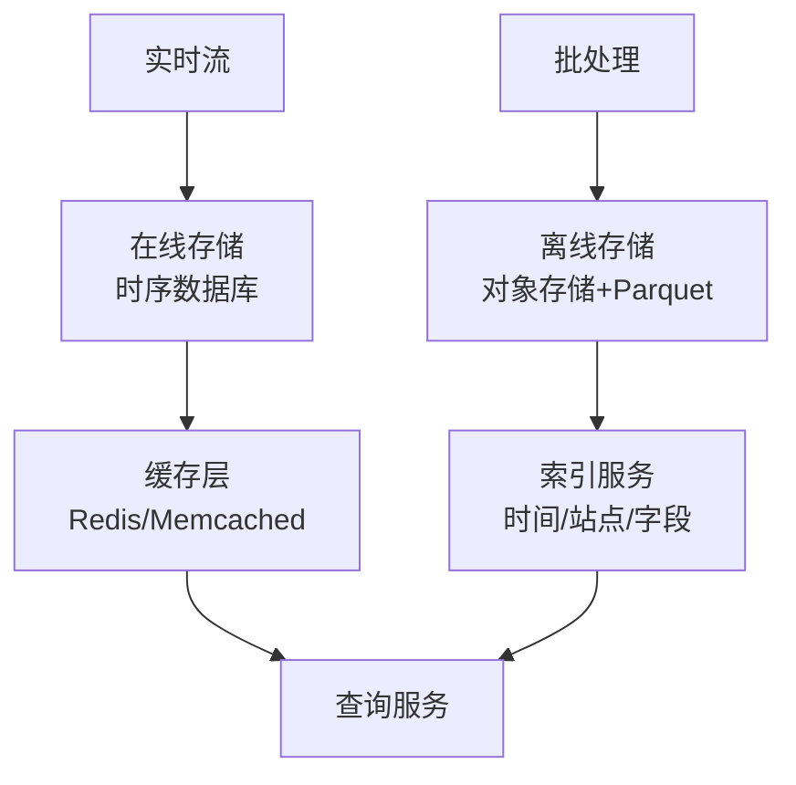

图表来源
- [README.md](file://README.md)
- [市场调研报告.md](file://市场调研报告.md)

章节来源
- [README.md](file://README.md)
- [市场调研报告.md](file://市场调研报告.md)

### 实时数据处理
- 流式计算：窗口聚合、状态管理、乱序处理
- 背压与限流：防止下游过载
- 容错与Exactly-Once：事务提交、幂等写入

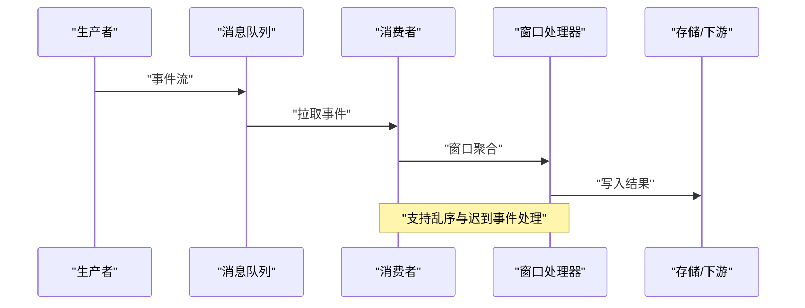

图表来源
- [README.md](file://README.md)
- [市场调研报告.md](file://市场调研报告.md)

章节来源
- [README.md](file://README.md)
- [市场调研报告.md](file://市场调研报告.md)

### 批量处理
- 任务编排：Airflow/Dagster调度
- 并行执行：分片与并发控制
- 数据血缘：记录输入输出与转换逻辑

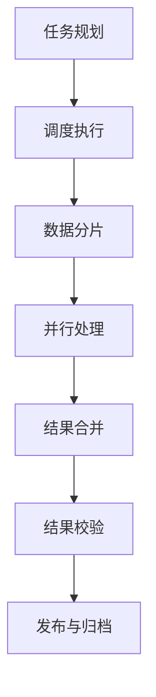

图表来源
- [README.md](file://README.md)
- [市场调研报告.md](file://市场调研报告.md)

章节来源
- [README.md](file://README.md)
- [市场调研报告.md](file://市场调研报告.md)

### 缓存机制
- 热点数据缓存：城市级分钟级温度、风向
- 缓存失效策略：TTL、LRU、按站点维度失效
- 一致性保证：写穿、懒加载、版本号控制

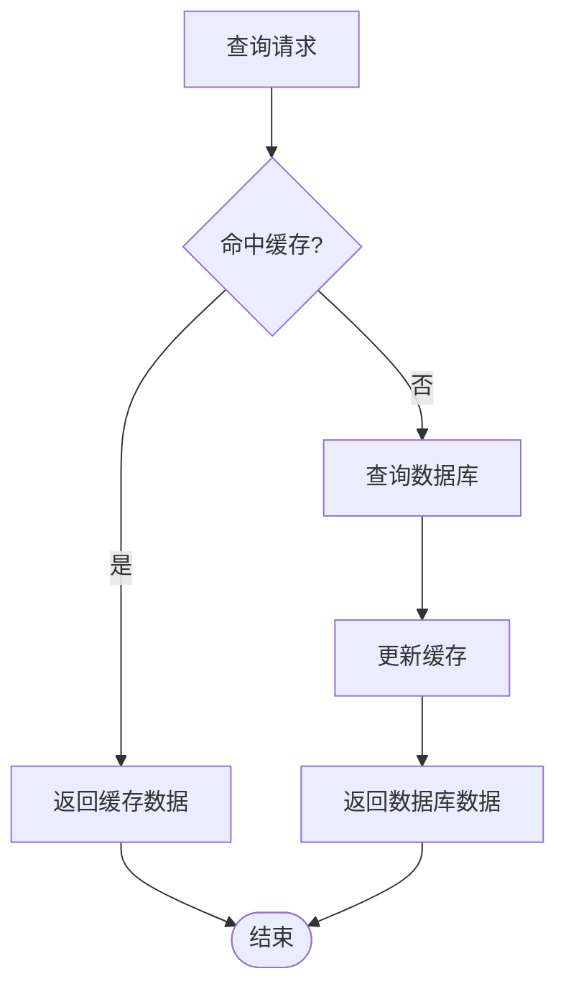

图表来源
- [README.md](file://README.md)
- [市场调研报告.md](file://市场调研报告.md)

章节来源
- [README.md](file://README.md)
- [市场调研报告.md](file://市场调研报告.md)

### 数据质量监控与异常检测
- 质量指标：完整性、准确性、一致性、时效性
- 监控看板：关键指标仪表盘、阈值告警
- 异常检测：规则引擎+机器学习联合检测
- 恢复策略：自动回滚、补偿任务、人工干预

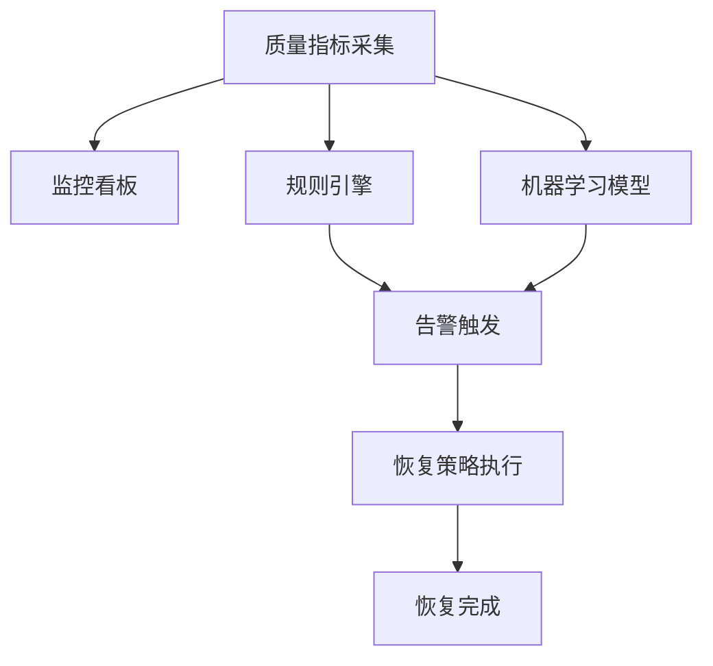

图表来源
- [README.md](file://README.md)
- [市场调研报告.md](file://市场调研报告.md)

章节来源
- [README.md](file://README.md)
- [市场调研报告.md](file://市场调研报告.md)

### 数据格式规范与验证规则
- 字段定义：站点ID、时间戳、温度、湿度、风速、风向、气压、降水
- 数据类型与范围：温度-50~60℃、湿度0~100%、风速0~100m/s
- 必填项与可选项：时间戳、站点ID为必填；其他根据场景可选
- 校验规则：正则校验、范围校验、跨字段一致性校验

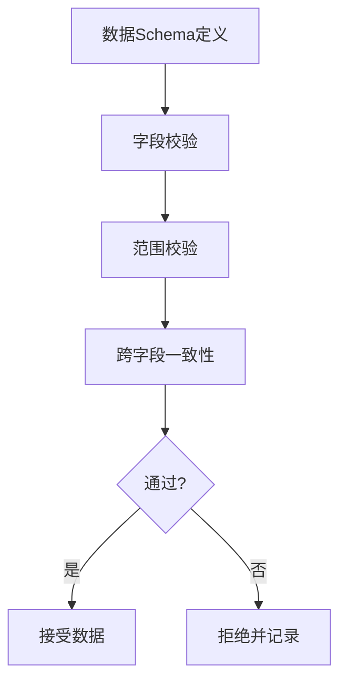

图表来源
- [README.md](file://README.md)
- [市场调研报告.md](file://市场调研报告.md)

章节来源
- [README.md](file://README.md)
- [市场调研报告.md](file://市场调研报告.md)

### 具体数据处理代码示例（路径指引）
- 采集器实现：参见 [采集器模块](file://src/collection/)
- 清洗器实现：参见 [清洗器模块](file://src/cleaning/)
- 转换器实现：参见 [转换器模块](file://src/transformation/)
- 分析器实现：参见 [分析器模块](file://src/analysis/)
- 存储适配器：参见 [存储适配层](file://src/storage/)
- 监控与告警：参见 [监控模块](file://src/monitoring/)

章节来源
- [README.md](file://README.md)
- [市场调研报告.md](file://市场调研报告.md)

## 依赖关系分析
- 内部依赖：采集器→清洗器→转换器→分析器→存储层
- 外部依赖：消息队列、时序数据库、对象存储、缓存服务
- 耦合度：各组件通过接口解耦，便于替换与扩展
- 循环依赖：避免组件间直接循环调用，使用事件驱动

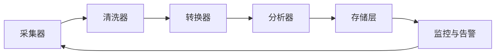

图表来源
- [README.md](file://README.md)
- [市场调研报告.md](file://市场调研报告.md)

章节来源
- [README.md](file://README.md)
- [市场调研报告.md](file://市场调研报告.md)

## 性能考虑
- 批处理优化：数据分片、并行执行、增量更新
- 实时处理优化：窗口大小调优、状态压缩、背压控制
- 存储优化：列式存储、压缩编码、冷热分层
- 缓存优化：热点预热、多级缓存、失效策略

[本节为通用指导，不直接分析具体文件]

## 故障排查指南
- 常见问题：数据延迟、缺失值增多、异常值突增、存储写入失败
- 排查步骤：查看日志→检查上游→验证Schema→回放数据
- 恢复策略：自动重试、补偿任务、人工介入
- 预防措施：灰度发布、混沌工程、容量规划

章节来源
- [README.md](file://README.md)
- [市场调研报告.md](file://市场调研报告.md)

## 结论
本文件系统性地梳理了天气数据处理的关键环节，从采集到分析的全链路设计，结合实时与批量处理模式，提供了数据规范、验证规则、存储策略与监控恢复方案。尽管当前仓库未包含具体代码实现，但上述框架可直接指导后续开发与落地。

[本节为总结性内容，不直接分析具体文件]

## 附录
- 术语表：时序数据、窗口聚合、背压、数据血缘
- 参考资料：市场调研报告、选题创意库、项目复盘文档

章节来源
- [市场调研报告.md](file://市场调研报告.md)
- [选题创意库_212个.md](file://选题创意库_212个.md)
- [项目复盘_产品定位讨论.md](file://项目复盘_产品定位讨论.md)