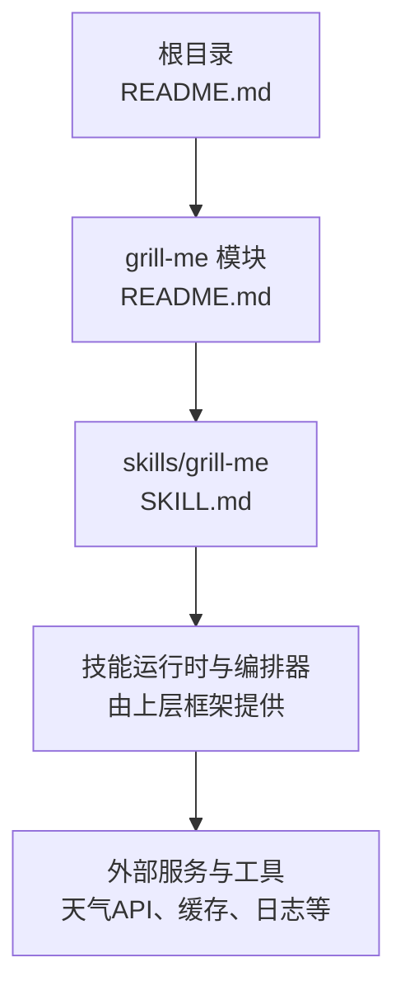
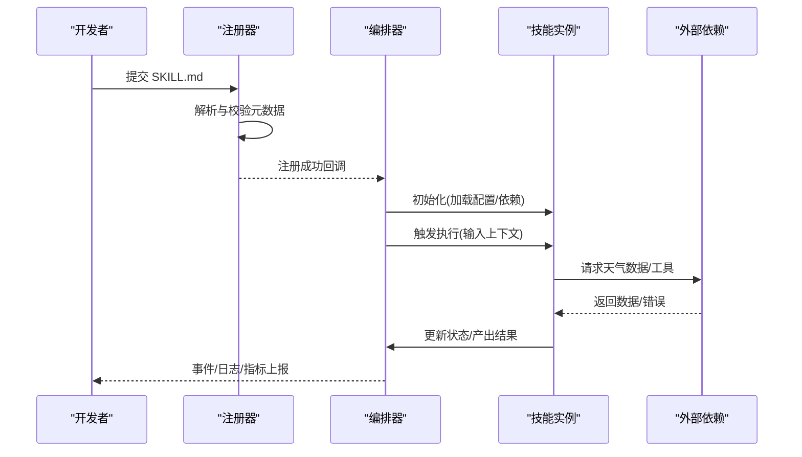
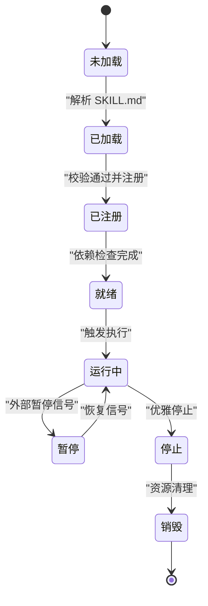
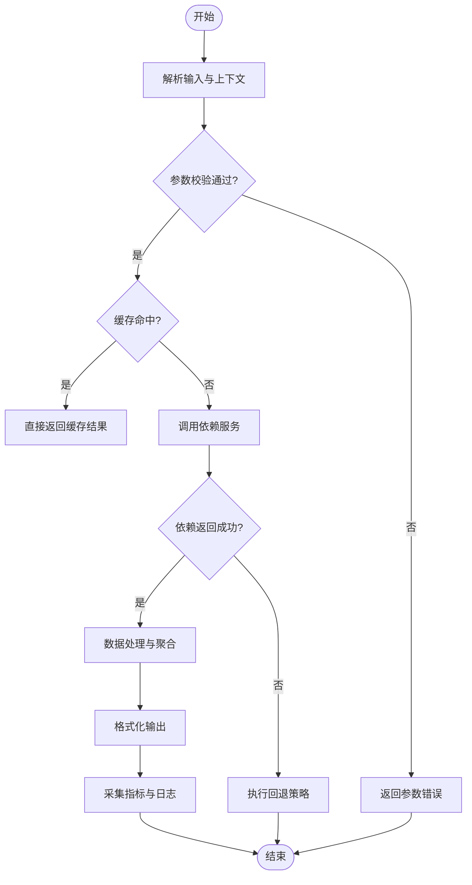
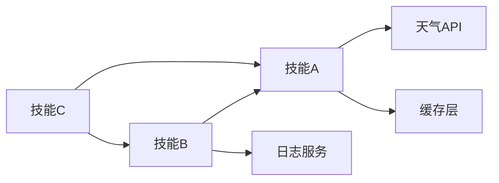

# 技能系统

<cite>
**本文引用的文件**   
- [README.md](file://README.md)
- [grill-me/README.md](file://grill-me/README.md)
- [grill-me/skills/grill-me/SKILL.md](file://grill-me/skills/grill-me/SKILL.md)
</cite>

## 目录
1. [简介](#简介)
2. [项目结构](#项目结构)
3. [核心组件](#核心组件)
4. [架构总览](#架构总览)
5. [详细组件分析](#详细组件分析)
6. [依赖关系分析](#依赖关系分析)
7. [性能考虑](#性能考虑)
8. [故障排查指南](#故障排查指南)
9. [结论](#结论)
10. [附录](#附录)

## 简介
本文件面向“天气智能体技能系统”的开发者与使用者，系统化阐述 SKILL.md 的技能定义结构、参数配置选项与执行流程；说明技能的注册机制、生命周期管理与状态切换逻辑；梳理技能间的依赖关系、数据传递格式与错误处理策略；并提供可操作的技能开发示例、配置模板与最佳实践。同时覆盖调试、测试方法与性能优化技巧，帮助团队快速构建高质量、可维护的天气相关技能。

## 项目结构
仓库采用“按功能域组织”的结构，根目录包含总体说明与文档，子模块 grill-me 聚焦具体技能实现与说明。关键路径如下：
- 根级 README.md：项目背景、目标与使用说明
- grill-me/README.md：模块级说明与使用指引
- grill-me/skills/grill-me/SKILL.md：技能定义与配置规范（核心）

图表来源
- [README.md:1-200](file://README.md#L1-L200)
- [grill-me/README.md:1-200](file://grill-me/README.md#L1-L200)
- [grill-me/skills/grill-me/SKILL.md:1-200](file://grill-me/skills/grill-me/SKILL.md#L1-L200)

章节来源
- [README.md:1-200](file://README.md#L1-L200)
- [grill-me/README.md:1-200](file://grill-me/README.md#L1-L200)
- [grill-me/skills/grill-me/SKILL.md:1-200](file://grill-me/skills/grill-me/SKILL.md#L1-L200)

## 核心组件
- 技能定义文件 SKILL.md：描述技能元数据、输入输出、参数校验、执行步骤、依赖声明、错误码与重试策略等，是技能注册与编排的核心契约。
- 技能运行时与编排器：负责加载 SKILL.md、解析并验证配置、调度执行、管理生命周期与状态机、收集遥测与错误信息。
- 外部依赖：天气数据源、缓存层、日志与监控、消息总线或事件通道等。

章节来源
- [grill-me/skills/grill-me/SKILL.md:1-200](file://grill-me/skills/grill-me/SKILL.md#L1-L200)

## 架构总览
技能系统以“声明式技能 + 运行时编排”为核心。SKILL.md 作为唯一权威定义，被编排器加载后进入注册阶段；运行期根据上下文触发执行，编排器驱动状态机推进，调用外部依赖获取数据，最终产出结果并持久化遥测。

图表来源
- [grill-me/skills/grill-me/SKILL.md:1-200](file://grill-me/skills/grill-me/SKILL.md#L1-L200)

## 详细组件分析

### 技能定义结构（SKILL.md）
SKILL.md 是技能能力的“契约”，建议包含以下字段与语义：
- 元数据
  - 名称、版本、作者、描述、标签
  - 兼容的运行环境与依赖版本
- 输入与输出
  - 输入模式：位置/城市/坐标/时间范围等
  - 输出模式：结构化数据（温度、湿度、风力、预警等）
  - 字段类型、必填项、默认值、取值范围
- 参数配置
  - 全局参数（如语言、时区、单位制）
  - 可选开关（如是否启用缓存、是否返回历史数据）
  - 安全限制（频率限制、白名单区域）
- 执行流程
  - 前置校验、数据获取、计算/聚合、格式化输出
  - 分支与条件（如不同地区的数据源选择）
- 依赖声明
  - 外部 API、本地工具、其他技能
  - 依赖版本与降级策略
- 错误与重试
  - 错误码分类、重试退避策略、熔断阈值
  - 失败回退（缓存/默认值/空结果）
- 遥测与审计
  - 指标埋点、日志级别、敏感信息脱敏

章节来源
- [grill-me/skills/grill-me/SKILL.md:1-200](file://grill-me/skills/grill-me/SKILL.md#L1-L200)

### 技能注册机制
- 发现与加载：扫描 skills 目录，读取 SKILL.md 并解析为内部模型
- 校验与编译：校验必填字段、类型约束、依赖可用性
- 注册表写入：将技能加入注册表，暴露查询与执行接口
- 冲突处理：同名/同版本冲突检测与提示

章节来源
- [grill-me/skills/grill-me/SKILL.md:1-200](file://grill-me/skills/grill-me/SKILL.md#L1-L200)

### 生命周期管理与状态切换
典型生命周期包括：
- 未加载 → 已加载 → 已注册 → 就绪 → 运行中 → 暂停/停止 → 销毁
- 状态转换受事件驱动（如 onInit、onStart、onStop、onDestroy）
- 资源清理：连接池关闭、缓存释放、定时任务取消

图表来源
- [grill-me/skills/grill-me/SKILL.md:1-200](file://grill-me/skills/grill-me/SKILL.md#L1-L200)

### 执行流程与数据流
- 入口：编排器接收请求，匹配技能与版本
- 预处理：参数校验、权限检查、缓存命中
- 执行：调用依赖（天气API/工具），聚合计算
- 后处理：格式化输出、指标采集、审计日志
- 异常：捕获错误、分类上报、回退策略

图表来源
- [grill-me/skills/grill-me/SKILL.md:1-200](file://grill-me/skills/grill-me/SKILL.md#L1-L200)

### 依赖关系与数据传递
- 依赖类型
  - 外部 API（天气数据、地图、告警）
  - 本地工具（计算器、格式化器）
  - 其他技能（组合能力）
- 数据传递格式
  - 输入：JSON Schema 描述，含必填/可选、枚举、范围
  - 输出：标准化响应结构，含数据体、元数据、错误码
- 版本与兼容性
  - 语义化版本控制，向后兼容策略
  - 依赖升级时的灰度与回滚

章节来源
- [grill-me/skills/grill-me/SKILL.md:1-200](file://grill-me/skills/grill-me/SKILL.md#L1-L200)

### 错误处理策略
- 分类
  - 客户端错误（参数非法、权限不足）
  - 服务端错误（超时、限流、上游异常）
  - 网络错误（DNS、TLS、连接中断）
- 处理
  - 重试与退避（指数退避、抖动）
  - 熔断与降级（阈值触发、默认值）
  - 幂等与去重（请求ID、缓存键）
- 观测
  - 错误码统计、延迟分布、失败率
  - 告警规则与通知渠道

章节来源
- [grill-me/skills/grill-me/SKILL.md:1-200](file://grill-me/skills/grill-me/SKILL.md#L1-L200)

### 技能开发示例与配置模板
- 最小可用技能
  - 仅包含必要元数据、输入输出、一个简单执行步骤
  - 使用默认错误处理与无依赖
- 复杂技能
  - 多依赖组合、条件分支、缓存与重试
  - 完善的指标与审计
- 配置模板要点
  - 明确必填字段与默认值
  - 提供示例输入与期望输出
  - 标注敏感信息与脱敏要求

章节来源
- [grill-me/skills/grill-me/SKILL.md:1-200](file://grill-me/skills/grill-me/SKILL.md#L1-L200)

### 最佳实践
- 设计
  - 单一职责、清晰边界、可组合
  - 输入输出稳定，变更遵循语义化版本
- 实现
  - 防御性编程、严格校验、最小权限
  - 可观测性优先（指标、日志、追踪）
- 运维
  - 健康检查、优雅停机、容量规划
  - 自动化测试与回归

[本节为通用指导，不直接分析具体文件]

## 依赖关系分析
- 内聚与耦合
  - 技能内部高内聚，对外通过标准接口交互
  - 依赖声明显式化，避免隐式耦合
- 循环依赖
  - 禁止循环依赖，必要时引入抽象层或事件解耦
- 外部依赖治理
  - 版本锁定、依赖最小化、替代方案预案

图表来源
- [grill-me/skills/grill-me/SKILL.md:1-200](file://grill-me/skills/grill-me/SKILL.md#L1-L200)

章节来源
- [grill-me/skills/grill-me/SKILL.md:1-200](file://grill-me/skills/grill-me/SKILL.md#L1-L200)

## 性能考虑
- 缓存策略
  - 多级缓存（内存/分布式）、合理TTL、热点保护
- 并发与限流
  - 线程池/协程池、背压、令牌桶限流
- I/O 优化
  - 连接复用、批量请求、异步非阻塞
- 资源管理
  - 对象池、懒加载、及时释放
- 观测与调优
  - 关键路径耗时、GC 行为、CPU/内存峰值

[本节为通用指导，不直接分析具体文件]

## 故障排查指南
- 常见问题
  - 参数校验失败、依赖不可用、超时与限流、缓存不一致
- 定位方法
  - 查看错误码与堆栈、检查依赖健康状态、核对配置差异
- 修复建议
  - 增加重试与回退、调整超时与阈值、完善监控告警
- 复现与回归
  - 构造最小用例、注入故障、自动化回归

章节来源
- [grill-me/skills/grill-me/SKILL.md:1-200](file://grill-me/skills/grill-me/SKILL.md#L1-L200)

## 结论
通过以 SKILL.md 为核心的声明式技能体系，配合统一的注册、编排与生命周期管理，可实现高内聚、低耦合、可观测且易扩展的天气智能体技能生态。遵循本文档的结构规范、错误处理与性能优化建议，可显著提升开发效率与系统稳定性。

[本节为总结性内容，不直接分析具体文件]

## 附录
- 术语表
  - 技能：具备独立能力的可编排单元
  - 编排器：负责调度与状态管理的运行时组件
  - 依赖：技能执行所需的外部服务或工具
- 参考
  - 模块说明与使用指引见 grill-me/README.md
  - 根级说明见 README.md

章节来源
- [grill-me/README.md:1-200](file://grill-me/README.md#L1-L200)
- [README.md:1-200](file://README.md#L1-L200)