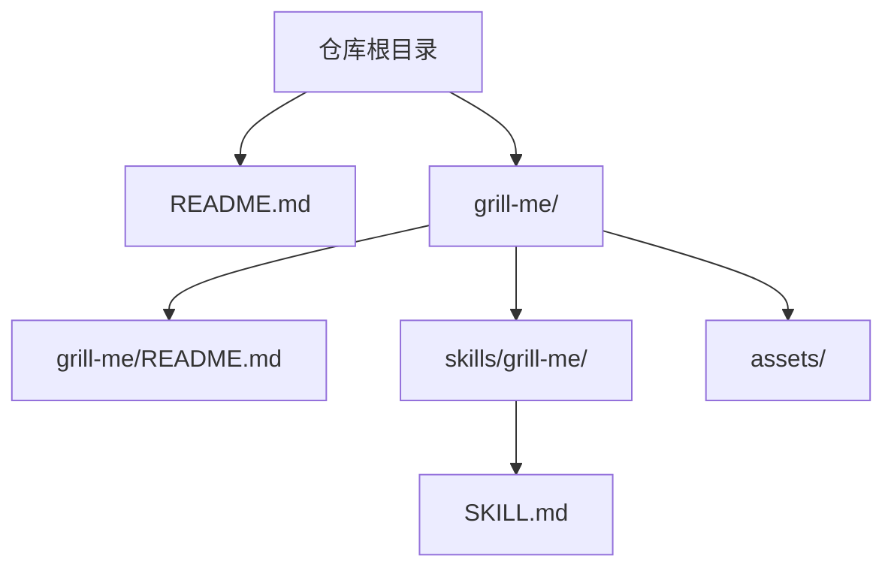
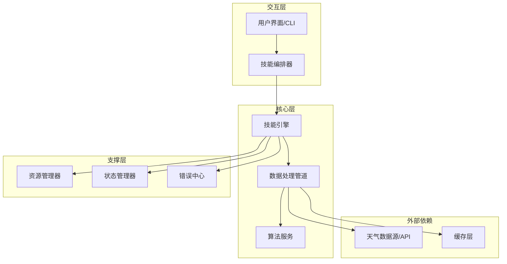
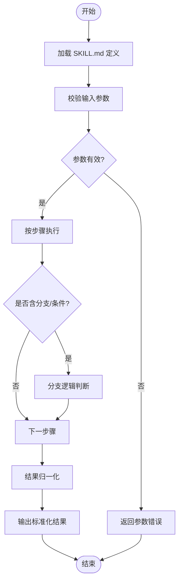
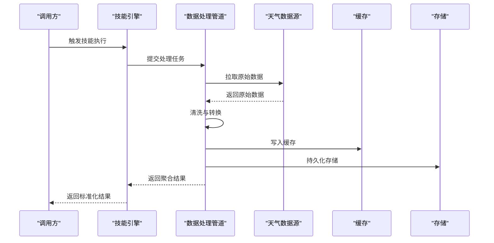
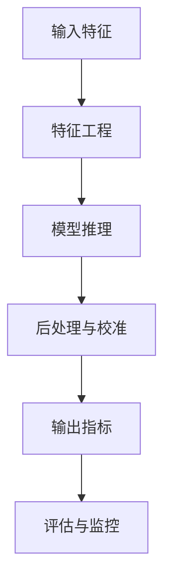
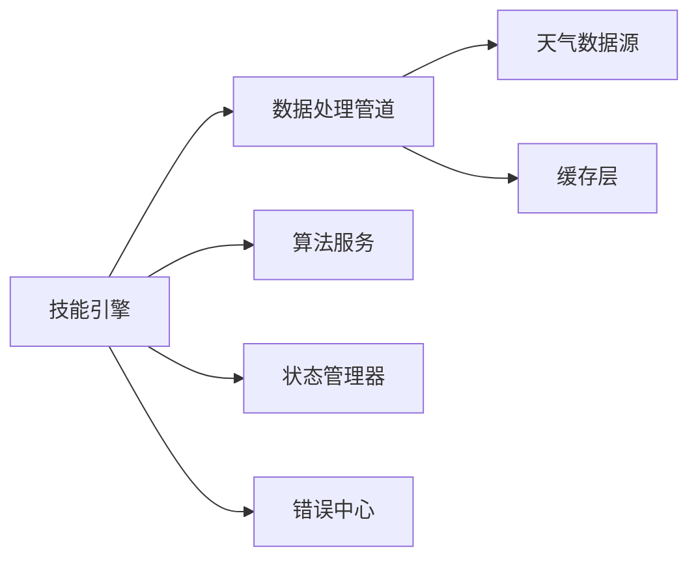

# 核心模块

<cite>
**本文引用的文件**   
- [README.md](file://README.md)
- [grill-me/README.md](file://grill-me/README.md)
- [grill-me/skills/grill-me/SKILL.md](file://grill-me/skills/grill-me/SKILL.md)
</cite>

## 目录
1. [简介](#简介)
2. [项目结构](#项目结构)
3. [核心组件](#核心组件)
4. [架构总览](#架构总览)
5. [详细组件分析](#详细组件分析)
6. [依赖分析](#依赖分析)
7. [性能考虑](#性能考虑)
8. [故障排查指南](#故障排查指南)
9. [结论](#结论)
10. [附录](#附录)

## 简介
本文件面向“天气智能体”的核心模块，聚焦技能系统实现、数据处理流程与算法逻辑。文档基于仓库中可见的说明性文件进行梳理，重点解释 SKILL.md 中的技能定义、参数配置与执行流程，并给出资源文件管理、数据模型设计、接口规范、模块间通信机制、状态管理与错误处理策略的建议与实践模式。由于当前仓库未包含可执行代码，本文以概念性与工程化指导为主，帮助读者在后续开发中快速落地。

## 项目结构
仓库根目录包含顶层 README 与若干说明文档；核心能力集中在 grill-me 子项目中，其 skills 目录下定义了具体技能（如 grill-me）的 SKILL.md 说明文件。assets 目录用于存放静态资源（如图标、模板等）。整体采用“按功能域组织”的结构：每个技能一个目录，便于扩展与维护。

图表来源
- [README.md:1-200](file://README.md#L1-L200)
- [grill-me/README.md:1-200](file://grill-me/README.md#L1-L200)
- [grill-me/skills/grill-me/SKILL.md:1-200](file://grill-me/skills/grill-me/SKILL.md#L1-L200)

章节来源
- [README.md:1-200](file://README.md#L1-L200)
- [grill-me/README.md:1-200](file://grill-me/README.md#L1-L200)

## 核心组件
- 技能定义与编排：通过 SKILL.md 描述技能的名称、用途、输入参数、输出格式、执行步骤与约束条件，作为智能体的“行为契约”。
- 资源管理：assets 目录集中管理静态资源，供技能渲染或提示词模板使用。
- 数据模型：围绕天气查询与结果展示，建议采用统一的数据结构（如地点、时间范围、指标字段），确保跨模块一致。
- 接口规范：定义技能调用入口、请求/响应协议、错误码与重试策略，保证外部系统与内部模块稳定交互。
- 通信与状态：采用事件驱动或消息队列进行模块间通信；对长时任务引入状态机管理生命周期。
- 错误处理：分层捕获异常，区分网络错误、校验失败与业务异常，提供降级与回退策略。

章节来源
- [grill-me/skills/grill-me/SKILL.md:1-200](file://grill-me/skills/grill-me/SKILL.md#L1-L200)

## 架构总览
下图展示了天气智能体核心模块的高层架构：上层为技能编排与用户交互，中层为数据处理与算法服务，下层为外部数据源与资源管理。各层之间通过明确定义的接口与协议通信。

图表来源
- [grill-me/skills/grill-me/SKILL.md:1-200](file://grill-me/skills/grill-me/SKILL.md#L1-L200)
- [grill-me/README.md:1-200](file://grill-me/README.md#L1-L200)

## 详细组件分析

### 技能系统（SKILL.md）
- 职责：定义技能的能力边界、输入参数、输出格式、执行步骤、约束与注意事项，是智能体调度的依据。
- 关键要素：
  - 元信息：技能名称、版本、作者、描述
  - 输入参数：类型、必填项、默认值、取值范围
  - 输出格式：结构化字段、单位、精度
  - 执行流程：步骤顺序、分支条件、重试策略
  - 依赖与权限：外部 API、资源文件、环境变量
  - 错误码与降级：失败场景与恢复路径
- 使用模式：
  - 注册与发现：启动时扫描 skills 目录，加载 SKILL.md 生成能力清单
  - 参数校验：在执行前进行类型与范围校验，返回标准化错误
  - 执行编排：按步骤顺序执行，支持并行与串行混合
  - 结果归一化：将不同数据源的结果映射到统一模型

图表来源
- [grill-me/skills/grill-me/SKILL.md:1-200](file://grill-me/skills/grill-me/SKILL.md#L1-L200)

章节来源
- [grill-me/skills/grill-me/SKILL.md:1-200](file://grill-me/skills/grill-me/SKILL.md#L1-L200)

### 数据处理流程
- 目标：从多源获取天气数据，清洗、转换、聚合，形成统一的数据模型供算法与展示使用。
- 阶段：
  - 采集：HTTP/SDK 拉取原始数据，支持分页与增量更新
  - 清洗：去重、缺失值填充、异常值检测
  - 转换：单位换算、时区对齐、坐标标准化
  - 聚合：按时间窗口与空间维度聚合，生成指标
  - 存储：写入缓存与持久化存储，建立索引
- 容错：断点续传、幂等写入、失败重试与补偿

图表来源
- [grill-me/skills/grill-me/SKILL.md:1-200](file://grill-me/skills/grill-me/SKILL.md#L1-L200)

章节来源
- [grill-me/skills/grill-me/SKILL.md:1-200](file://grill-me/skills/grill-me/SKILL.md#L1-L200)

### 算法逻辑
- 典型算法：
  - 温度趋势预测：基于历史序列的时间序列模型
  - 降水概率估计：分类或回归模型
  - 舒适度指数计算：多指标加权融合
- 实现要点：
  - 特征工程：滞后项、滚动统计、气象因子组合
  - 模型选择：轻量模型优先，兼顾精度与延迟
  - 评估指标：MAE、RMSE、准确率、F1
  - 在线学习：增量更新与漂移检测

图表来源
- [grill-me/skills/grill-me/SKILL.md:1-200](file://grill-me/skills/grill-me/SKILL.md#L1-L200)

章节来源
- [grill-me/skills/grill-me/SKILL.md:1-200](file://grill-me/skills/grill-me/SKILL.md#L1-L200)

### 资源文件管理
- 目录约定：assets 下按功能域划分（如 templates、icons、prompts）
- 加载策略：按需懒加载，热更新支持
- 版本控制：资源与代码同步版本，避免不兼容
- 安全校验：哈希校验与签名验证，防止篡改

章节来源
- [grill-me/README.md:1-200](file://grill-me/README.md#L1-L200)

### 数据模型设计
- 核心实体：
  - 地点：经纬度、行政区划、别名映射
  - 时间：UTC 时间戳、本地时区、时间粒度
  - 指标：温度、湿度、风速、降水、空气质量等
- 关系：一对多（地点-观测）、多对多（指标-时间窗口）
- 规范化：统一单位、精度与时区，提供转换工具

章节来源
- [grill-me/skills/grill-me/SKILL.md:1-200](file://grill-me/skills/grill-me/SKILL.md#L1-L200)

### 接口规范
- 调用入口：REST/gRPC/消息队列，统一网关鉴权
- 请求格式：JSON Schema 校验，必填字段与枚举约束
- 响应格式：成功/失败标准结构，错误码与消息
- 限流与熔断：令牌桶、滑动窗口、熔断器配置

章节来源
- [grill-me/skills/grill-me/SKILL.md:1-200](file://grill-me/skills/grill-me/SKILL.md#L1-L200)

### 模块间通信机制
- 事件总线：发布/订阅模式解耦模块
- 消息队列：异步任务与削峰填谷
- RPC：强一致性场景下的远程调用
- 事件溯源：关键状态变更的可追溯记录

章节来源
- [grill-me/skills/grill-me/SKILL.md:1-200](file://grill-me/skills/grill-me/SKILL.md#L1-L200)

### 状态管理
- 状态机：定义技能执行的生命周期（待执行、执行中、完成、失败）
- 持久化：状态快照与检查点，支持恢复
- 并发控制：锁与事务，避免竞态条件

章节来源
- [grill-me/skills/grill-me/SKILL.md:1-200](file://grill-me/skills/grill-me/SKILL.md#L1-L200)

### 错误处理策略
- 分类：网络错误、校验失败、业务异常、系统异常
- 处理：重试、降级、回滚、告警
- 追踪：链路 ID、日志上下文、指标上报

章节来源
- [grill-me/skills/grill-me/SKILL.md:1-200](file://grill-me/skills/grill-me/SKILL.md#L1-L200)

## 依赖分析
- 内部依赖：技能引擎依赖数据处理管道与算法服务；状态管理与错误中心为横切关注点
- 外部依赖：天气数据源、缓存、存储
- 耦合度：通过接口与协议降低耦合，避免循环依赖

图表来源
- [grill-me/skills/grill-me/SKILL.md:1-200](file://grill-me/skills/grill-me/SKILL.md#L1-L200)

章节来源
- [grill-me/skills/grill-me/SKILL.md:1-200](file://grill-me/skills/grill-me/SKILL.md#L1-L200)

## 性能考虑
- 缓存策略：热点数据多级缓存，TTL 与失效策略
- 批处理：批量拉取与合并计算，减少 IO 次数
- 异步化：非阻塞 I/O 与并行任务调度
- 监控：延迟、吞吐、错误率与资源使用率监控

## 故障排查指南
- 常见问题：
  - 参数校验失败：检查必填字段与取值范围
  - 数据源不可用：查看健康检查与重试日志
  - 状态不一致：检查状态机与检查点恢复
  - 资源加载失败：校验路径与权限
- 定位方法：
  - 启用调试日志与链路追踪
  - 使用沙箱环境复现问题
  - 逐步隔离模块定位根因

章节来源
- [grill-me/skills/grill-me/SKILL.md:1-200](file://grill-me/skills/grill-me/SKILL.md#L1-L200)

## 结论
本文基于仓库中的说明性文件，构建了天气智能体核心模块的概念性文档，涵盖技能系统、数据处理、算法逻辑、资源管理、数据模型、接口规范、通信机制、状态管理与错误处理。建议在后续开发中严格遵循上述规范，结合 SKILL.md 的定义逐步实现与验证，确保系统的可扩展性与稳定性。

## 附录
- 最佳实践：
  - 以 SKILL.md 为契约，先定义后实现
  - 数据模型先行，统一单位与精度
  - 接口与错误码标准化，便于联调
  - 全链路监控与告警，保障线上质量