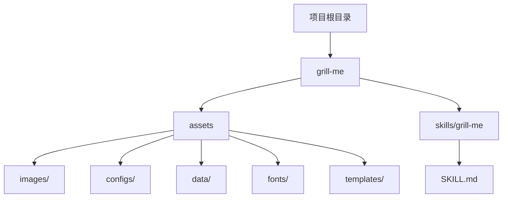
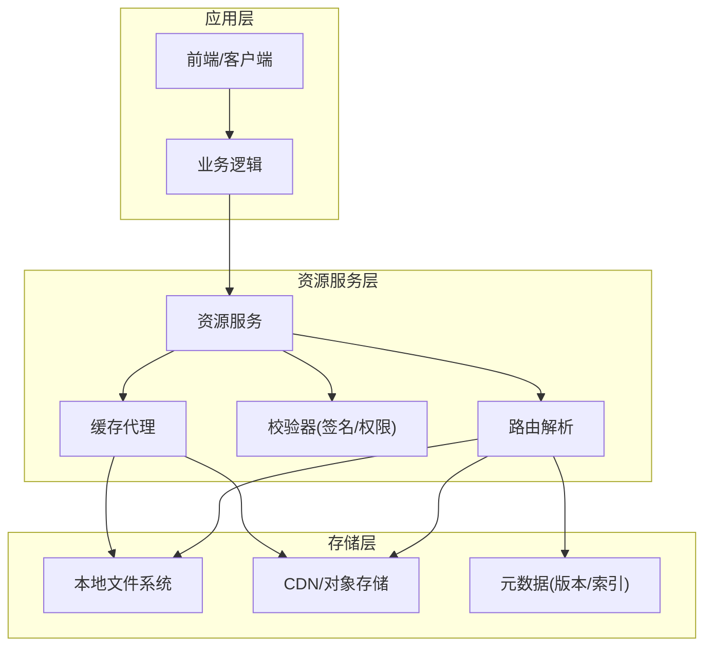
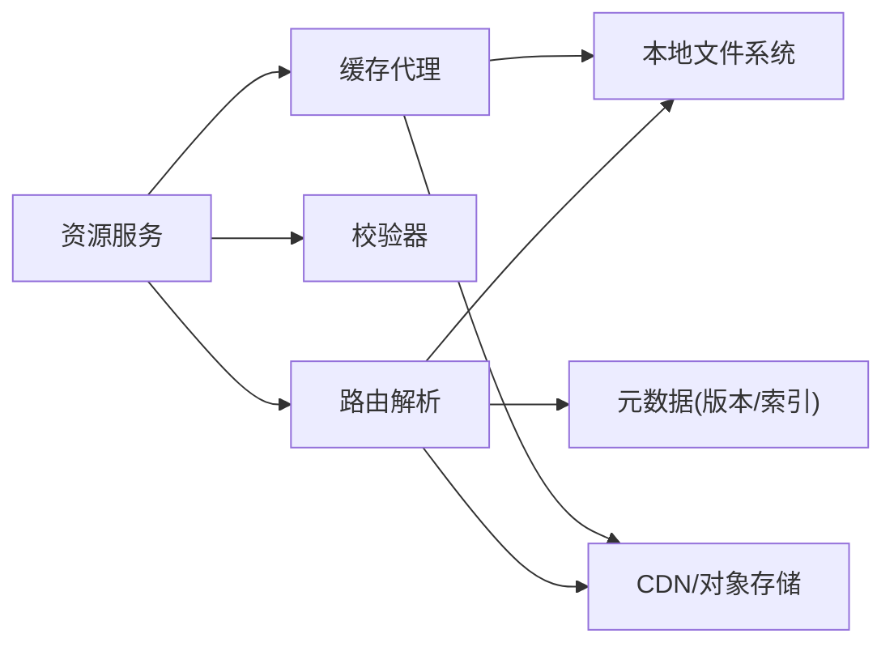

# 资源管理

<cite>
**本文引用的文件**   
- [README.md](file://README.md)
- [grill-me/README.md](file://grill-me/README.md)
- [grill-me/skills/grill-me/SKILL.md](file://grill-me/skills/grill-me/SKILL.md)
</cite>

## 目录
1. [简介](#简介)
2. [项目结构](#项目结构)
3. [核心组件](#核心组件)
4. [架构总览](#架构总览)
5. [详细组件分析](#详细组件分析)
6. [依赖分析](#依赖分析)
7. [性能考虑](#性能考虑)
8. [故障排查指南](#故障排查指南)
9. [结论](#结论)
10. [附录](#附录)

## 简介
本文件面向“天气智能体”项目的资源管理模块，聚焦 assets 目录下的静态资源组织、命名规范与访问接口，并给出加载机制、缓存策略、版本管理的最佳实践。同时覆盖图片、配置文件与数据文件的处理方式，提供资源优化建议、压缩策略与 CDN 集成方案，以及资源更新流程、备份恢复机制和故障排查指南。由于当前仓库中 assets 目录为空，本文以工程化标准为依据，给出可落地的规范与实施路径，便于后续扩展与维护。

## 项目结构
- 根级 README 用于项目总体说明；grill-me 子目录为具体能力域，包含 skills 与 SKILL 定义；assets 目录位于 grill-me 下，用于存放该能力域的静态资源（图片、配置、数据等）。
- 当前 assets 目录为空，建议在后续迭代中按以下结构填充：
  - images：图标、背景图、截图等
  - configs：本地配置、主题、语言包等
  - data：示例数据、规则表、字典等
  - fonts：字体文件
  - templates：模板或片段资源

图表来源
- [grill-me/README.md](file://grill-me/README.md)
- [grill-me/skills/grill-me/SKILL.md](file://grill-me/skills/grill-me/SKILL.md)

章节来源
- [README.md](file://README.md)
- [grill-me/README.md](file://grill-me/README.md)
- [grill-me/skills/grill-me/SKILL.md](file://grill-me/skills/grill-me/SKILL.md)

## 核心组件
- 资源目录与分类：images、configs、data、fonts、templates
- 命名规范：统一小写、连字符分隔、语义化命名，避免空格与特殊字符
- 访问接口：通过统一的资源服务层暴露读取 API，屏蔽底层文件系统差异
- 加载机制：按需懒加载 + 预取关键资源，支持离线缓存
- 缓存策略：基于内容哈希的强缓存与协商缓存并存
- 版本管理：资源版本号与变更日志联动，支持灰度发布与回滚

章节来源
- [grill-me/README.md](file://grill-me/README.md)
- [grill-me/skills/grill-me/SKILL.md](file://grill-me/skills/grill-me/SKILL.md)

## 架构总览
资源管理采用分层设计：应用层调用资源服务层，服务层负责路由到具体资源提供者（本地文件系统、CDN、缓存），并通过校验器确保资源完整性与权限控制。

图表来源
- [grill-me/README.md](file://grill-me/README.md)
- [grill-me/skills/grill-me/SKILL.md](file://grill-me/skills/grill-me/SKILL.md)

## 详细组件分析

### 资源目录与命名规范
- 目录划分
  - images：按功能域再分目录，如 icons、backgrounds、screenshots
  - configs：按环境或主题划分，如 dev、prod、themes
  - data：按用途划分，如 dictionaries、rules、samples
  - fonts：按字重与格式划分，如 w400、w700、woff2
  - templates：按页面或组件划分
- 命名约定
  - 全小写英文字母、数字与连字符，禁止中文与空格
  - 使用语义化名称，体现用途与版本信息（可选）
  - 图片建议保留原始尺寸与缩略图分离
- 文件类型与扩展名
  - 图片：png、jpg/jpeg、webp、svg
  - 配置：json、yaml、toml
  - 数据：json、csv、parquet
  - 字体：woff2、ttf、otf
  - 模板：html、ejs、handlebars

章节来源
- [grill-me/README.md](file://grill-me/README.md)
- [grill-me/skills/grill-me/SKILL.md](file://grill-me/skills/grill-me/SKILL.md)

### 访问接口与服务层
- 统一入口
  - GET /api/resources/{category}/{path}：按分类与路径获取资源
  - HEAD /api/resources/{category}/{path}：仅获取元信息（大小、类型、ETag）
- 查询参数
  - v：资源版本号（可选，默认最新）
  - q：质量/清晰度（针对图片）
  - format：输出格式（针对可转换资源）
- 响应头
  - Content-Type、Content-Length、ETag、Cache-Control、Last-Modified
- 错误码
  - 404 未找到、403 无权限、412 条件不满足、500 内部错误

章节来源
- [grill-me/README.md](file://grill-me/README.md)
- [grill-me/skills/grill-me/SKILL.md](file://grill-me/skills/grill-me/SKILL.md)

### 加载机制与缓存策略
- 加载机制
  - 首屏关键资源预取，非关键资源懒加载
  - 资源清单（manifest）描述依赖关系与版本
- 缓存策略
  - 浏览器端：强缓存（immutable）+ 协商缓存（ETag/Last-Modified）
  - 服务端：内存缓存热点资源，磁盘缓存冷数据
  - CDN：边缘缓存，TTL 按资源类型设置
- 失效与更新
  - 文件名含内容哈希实现强缓存
  - 版本字段 v 配合清单进行增量更新

章节来源
- [grill-me/README.md](file://grill-me/README.md)
- [grill-me/skills/grill-me/SKILL.md](file://grill-me/skills/grill-me/SKILL.md)

### 版本管理与发布流程
- 版本策略
  - 语义化版本：主版本（破坏性变更）、次版本（新增功能）、修订（修复）
  - 资源清单维护版本映射与依赖
- 发布流程
  - 构建阶段生成哈希与清单
  - 部署阶段推送至 CDN 并更新索引
  - 灰度发布与快速回滚机制

章节来源
- [grill-me/README.md](file://grill-me/README.md)
- [grill-me/skills/grill-me/SKILL.md](file://grill-me/skills/grill-me/SKILL.md)

### 图片处理与优化
- 格式选择
  - 照片类优先 webp/jpg，矢量图用 svg，透明背景用 png/webp
- 压缩与尺寸
  - 自动压缩与多分辨率适配（@1x/@2x/@3x）
  - 延迟加载与占位图
- 元数据
  - 去除冗余 EXIF，保留必要版权信息

章节来源
- [grill-me/README.md](file://grill-me/README.md)
- [grill-me/skills/grill-me/SKILL.md](file://grill-me/skills/grill-me/SKILL.md)

### 配置文件与数据文件
- 配置
  - 区分环境与主题，敏感信息走环境变量或密钥管理服务
  - 校验 schema，失败时拒绝启动或降级
- 数据
  - 结构化数据优先 JSON/CSV，大数据集使用 parquet
  - 提供校验脚本与样本数据

章节来源
- [grill-me/README.md](file://grill-me/README.md)
- [grill-me/skills/grill-me/SKILL.md](file://grill-me/skills/grill-me/SKILL.md)

### 字体与模板
- 字体
  - 优先 woff2，按需裁剪字形，启用子集化
- 模板
  - 模板与数据分离，渲染前进行安全检查

章节来源
- [grill-me/README.md](file://grill-me/README.md)
- [grill-me/skills/grill-me/SKILL.md](file://grill-me/skills/grill-me/SKILL.md)

### 资源更新流程与备份恢复
- 更新流程
  - 提交变更 -> 构建生成清单与哈希 -> 推送到 CDN -> 更新索引 -> 验证健康检查
- 备份恢复
  - 定期快照资源目录与清单
  - 恢复时先校验完整性，再替换并重启服务

章节来源
- [grill-me/README.md](file://grill-me/README.md)
- [grill-me/skills/grill-me/SKILL.md](file://grill-me/skills/grill-me/SKILL.md)

### 故障排查指南
- 常见问题
  - 404：路径错误或资源未发布
  - 403：权限不足或签名无效
  - 412：条件请求失败（ETag/If-None-Match）
  - 500：内部错误（校验失败、IO 异常）
- 诊断步骤
  - 检查资源清单与版本映射
  - 查看 CDN 缓存命中与 TTL
  - 核对签名与权限策略
  - 审查构建产物与哈希一致性

章节来源
- [grill-me/README.md](file://grill-me/README.md)
- [grill-me/skills/grill-me/SKILL.md](file://grill-me/skills/grill-me/SKILL.md)

## 依赖分析
- 组件耦合
  - 资源服务层对存储层解耦，通过路由与校验器抽象
  - 缓存代理独立于存储实现，支持多级缓存
- 外部依赖
  - CDN/对象存储作为远端存储
  - 构建工具链生成清单与哈希

图表来源
- [grill-me/README.md](file://grill-me/README.md)
- [grill-me/skills/grill-me/SKILL.md](file://grill-me/skills/grill-me/SKILL.md)

章节来源
- [grill-me/README.md](file://grill-me/README.md)
- [grill-me/skills/grill-me/SKILL.md](file://grill-me/skills/grill-me/SKILL.md)

## 性能考虑
- 减少请求数：合并小资源、使用雪碧图（谨慎）、HTTP/2 多路复用
- 提升缓存命中率：合理设置 TTL、使用内容哈希、启用 CDN 边缘缓存
- 降低传输体积：图片压缩、字体子集化、开启 gzip/brotli
- 优化加载顺序：关键资源优先、非关键资源懒加载
- 监控与度量：QPS、延迟、缓存命中率、带宽占用

[本节为通用指导，无需特定文件引用]

## 故障排查指南
- 定位问题
  - 检查资源清单与版本映射是否一致
  - 确认 CDN 缓存状态与回源策略
  - 校验签名与权限策略是否正确
- 常见错误与修复
  - 404：补发资源或修正路径
  - 403：调整权限或重新生成签名
  - 412：清理客户端缓存或更新 ETag
  - 500：检查构建产物与 IO 权限

章节来源
- [grill-me/README.md](file://grill-me/README.md)
- [grill-me/skills/grill-me/SKILL.md](file://grill-me/skills/grill-me/SKILL.md)

## 结论
本资源管理文档基于仓库现状与工程化标准，给出了 assets 目录的组织规范、访问接口、加载与缓存策略、版本管理与发布流程，以及优化建议与故障排查方法。随着 assets 目录内容的完善，可按本文规范逐步落地，确保资源可维护、可扩展、高性能。

[本节为总结性内容，无需特定文件引用]

## 附录
- 资源清单示例字段：id、path、version、hash、type、size、cdnUrl
- 健康检查接口：GET /health/resources，返回缓存命中率与存储可用性
- 安全建议：限制目录遍历、校验 MIME 类型、启用 HTTPS

[本节为补充信息，无需特定文件引用]