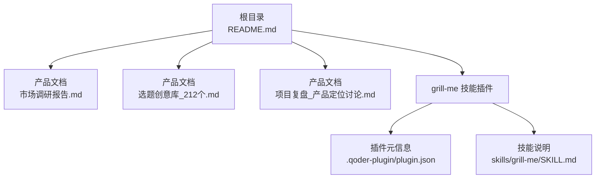
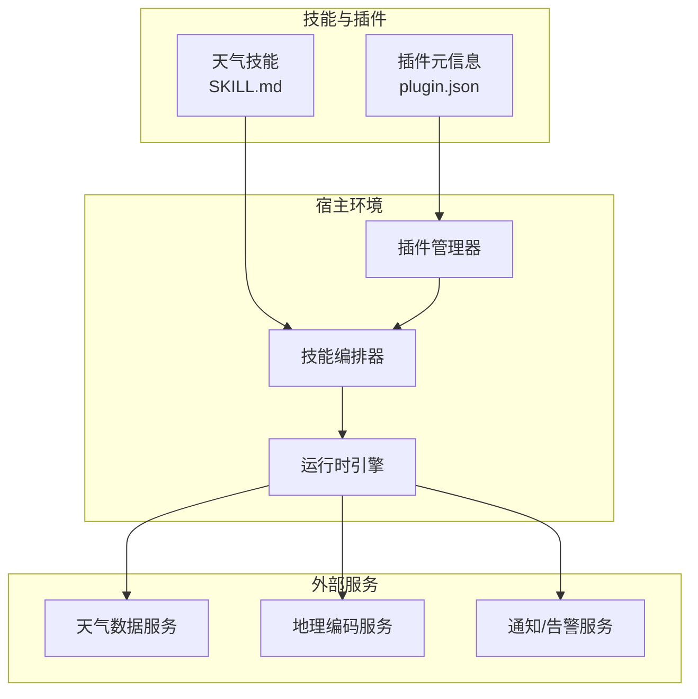
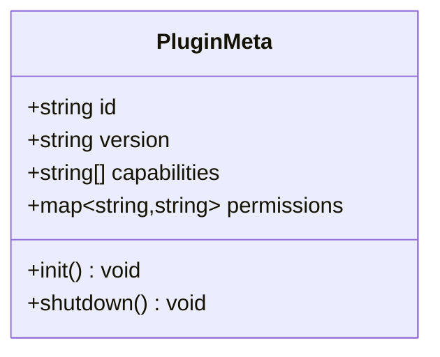
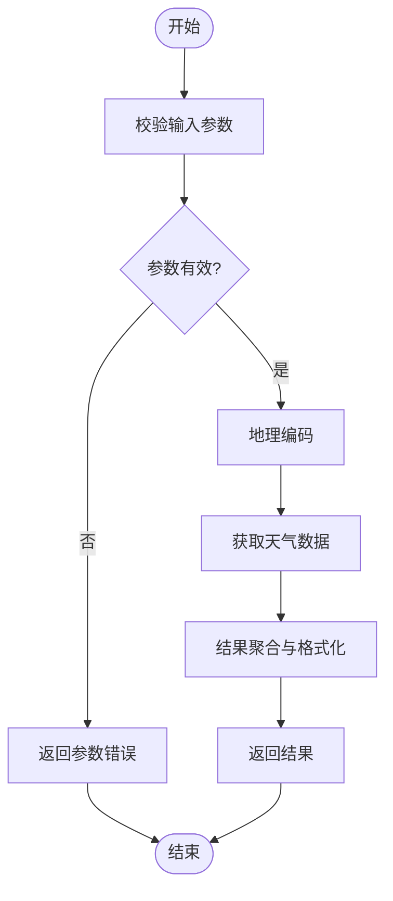
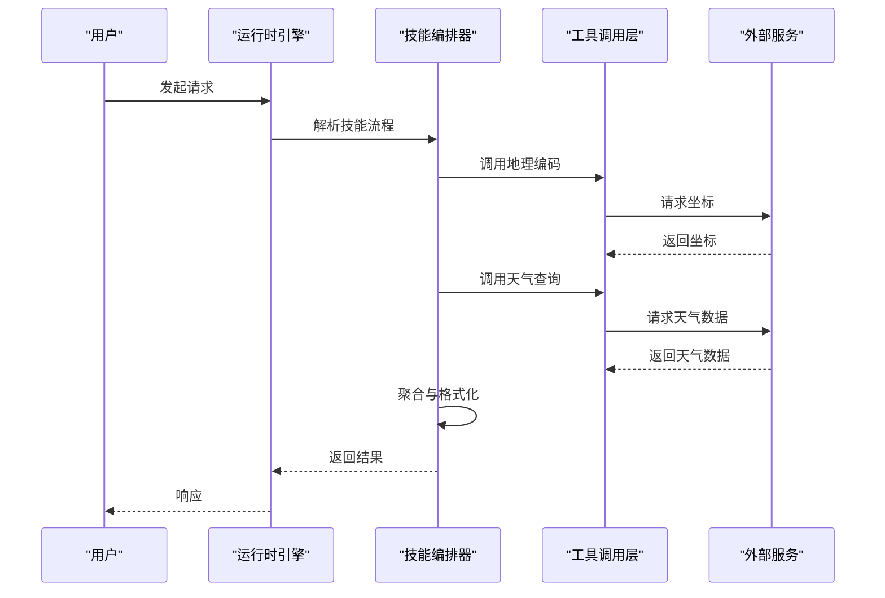
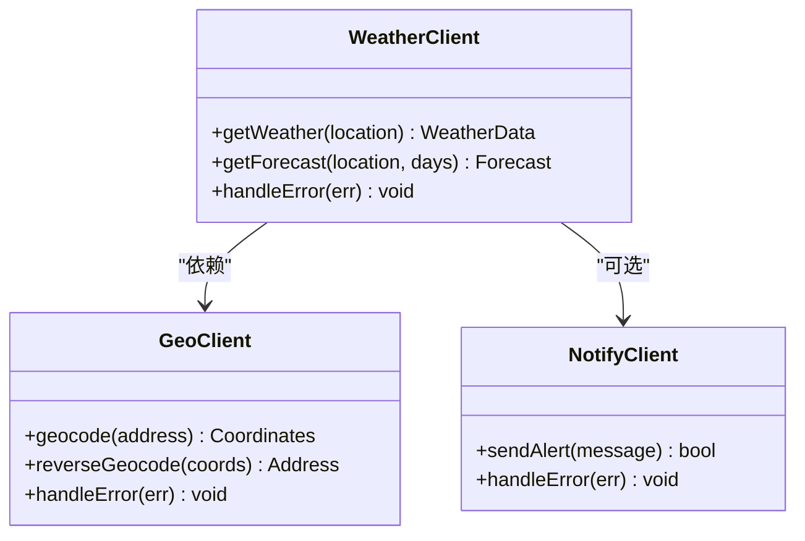
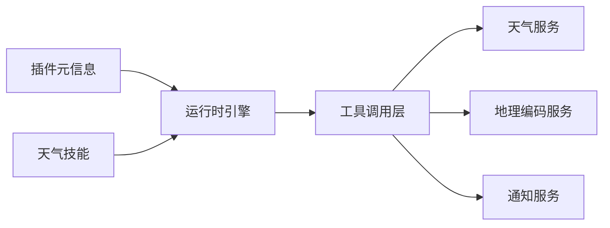

# 系统架构

<cite>
**本文引用的文件**   
- [README.md](file://README.md)
- [grill-me/README.md](file://grill-me/README.md)
- [grill-me/skills/grill-me/SKILL.md](file://grill-me/skills/grill-me/SKILL.md)
- [grill-me/.qoder-plugin/plugin.json](file://grill-me/.qoder-plugin/plugin.json)
- [市场调研报告.md](file://市场调研报告.md)
- [选题创意库_212个.md](file://选题创意库_212个.md)
- [项目复盘_产品定位讨论.md](file://项目复盘_产品定位讨论.md)
</cite>

## 目录
1. [引言](#引言)
2. [项目结构](#项目结构)
3. [核心组件](#核心组件)
4. [架构总览](#架构总览)
5. [详细组件分析](#详细组件分析)
6. [依赖关系分析](#依赖关系分析)
7. [性能考虑](#性能考虑)
8. [故障排查指南](#故障排查指南)
9. [结论](#结论)
10. [附录](#附录)

## 引言
本架构文档面向“天气智能体系统”的设计与实现，聚焦整体系统设计、组件交互关系与数据流向，解释核心架构模式、技术栈选择与系统集成方案。文档同时明确系统边界、模块职责划分与扩展点设计，并提供架构图表、部署拓扑、基础设施要求与性能考量，帮助读者快速理解并在此基础上进行扩展与维护。

## 项目结构
仓库包含产品规划与技能插件两部分：
- 顶层 README 与多份产品文档（市场调研、选题创意、项目复盘）用于定义目标、范围与演进策略。
- grill-me 子目录为技能插件形态的入口，包含插件元信息与技能说明，体现“以技能为中心”的可插拔架构。

图表来源 
- [README.md](file://README.md)
- [grill-me/README.md](file://grill-me/README.md)
- [grill-me/.qoder-plugin/plugin.json](file://grill-me/.qoder-plugin/plugin.json)
- [grill-me/skills/grill-me/SKILL.md](file://grill-me/skills/grill-me/SKILL.md)

章节来源
- [README.md](file://README.md)
- [grill-me/README.md](file://grill-me/README.md)
- [grill-me/.qoder-plugin/plugin.json](file://grill-me/.qoder-plugin/plugin.json)
- [grill-me/skills/grill-me/SKILL.md](file://grill-me/skills/grill-me/SKILL.md)

## 核心组件
- 技能注册与发现：通过插件元信息描述技能名称、版本、能力范围与加载方式，供宿主环境统一发现与装配。
- 技能编排与执行：基于 SKILL 规范组织任务流程、输入输出契约与工具调用约定，驱动天气相关能力的组合执行。
- 外部服务集成：对接天气数据源与地理编码等第三方服务，提供稳定的数据接入与错误恢复机制。
- 运行时与配置：管理运行参数、密钥与开关，支持多环境部署与灰度发布。

章节来源
- [grill-me/.qoder-plugin/plugin.json](file://grill-me/.qoder-plugin/plugin.json)
- [grill-me/skills/grill-me/SKILL.md](file://grill-me/skills/grill-me/SKILL.md)

## 架构总览
系统采用“插件化+技能编排”的架构模式：
- 插件层负责能力封装与对外暴露；
- 技能层定义业务流程与工具调用；
- 运行时负责调度、鉴权、限流与可观测性；
- 外部服务层提供天气数据、地图与告警等能力。

图表来源 
- [grill-me/.qoder-plugin/plugin.json](file://grill-me/.qoder-plugin/plugin.json)
- [grill-me/skills/grill-me/SKILL.md](file://grill-me/skills/grill-me/SKILL.md)

## 详细组件分析

### 插件元信息组件（plugin.json）
- 职责：声明插件标识、版本、能力清单与加载约束，供宿主扫描与装配。
- 关键要点：
  - 唯一标识与版本控制，确保兼容性与回滚能力；
  - 能力清单与权限声明，限制最小权限原则；
  - 生命周期钩子，便于初始化与清理资源。

图表来源 
- [grill-me/.qoder-plugin/plugin.json](file://grill-me/.qoder-plugin/plugin.json)

章节来源
- [grill-me/.qoder-plugin/plugin.json](file://grill-me/.qoder-plugin/plugin.json)

### 天气技能组件（SKILL.md）
- 职责：定义天气查询、预报、预警等技能的输入输出契约、工具调用顺序与错误处理策略。
- 关键要点：
  - 输入校验与默认值填充；
  - 工具链编排（如地理编码→天气查询→结果聚合）；
  - 失败重试与降级策略（缓存、默认值、提示语）。

图表来源 
- [grill-me/skills/grill-me/SKILL.md](file://grill-me/skills/grill-me/SKILL.md)

章节来源
- [grill-me/skills/grill-me/SKILL.md](file://grill-me/skills/grill-me/SKILL.md)

### 运行时编排组件
- 职责：解析技能流程、管理上下文、协调工具调用、处理异常与日志追踪。
- 关键要点：
  - 上下文传递（用户会话、位置、偏好）；
  - 并发与超时控制；
  - 指标采集与链路追踪。

图表来源 
- [grill-me/skills/grill-me/SKILL.md](file://grill-me/skills/grill-me/SKILL.md)

章节来源
- [grill-me/skills/grill-me/SKILL.md](file://grill-me/skills/grill-me/SKILL.md)

### 外部服务集成组件
- 职责：封装天气数据、地理编码与通知服务的访问，提供重试、熔断与缓存。
- 关键要点：
  - 统一错误码与消息映射；
  - 速率限制与退避策略；
  - 健康检查与自动切换。

图表来源 
- [grill-me/skills/grill-me/SKILL.md](file://grill-me/skills/grill-me/SKILL.md)

章节来源
- [grill-me/skills/grill-me/SKILL.md](file://grill-me/skills/grill-me/SKILL.md)

## 依赖关系分析
- 插件与技能：插件元信息驱动技能加载，技能依赖运行时提供的上下文与工具链。
- 运行时与服务：运行时编排技能流程，调用外部服务完成数据获取与通知。
- 耦合与内聚：技能内部高内聚，跨服务低耦合，通过接口与契约解耦。

图表来源 
- [grill-me/.qoder-plugin/plugin.json](file://grill-me/.qoder-plugin/plugin.json)
- [grill-me/skills/grill-me/SKILL.md](file://grill-me/skills/grill-me/SKILL.md)

章节来源
- [grill-me/.qoder-plugin/plugin.json](file://grill-me/.qoder-plugin/plugin.json)
- [grill-me/skills/grill-me/SKILL.md](file://grill-me/skills/grill-me/SKILL.md)

## 性能考虑
- 缓存策略：对热点地点的天气数据进行短期缓存，降低外部服务压力。
- 并发控制：并行调用地理编码与天气查询，设置超时与熔断保护。
- 资源限制：按技能维度进行配额与限流，避免单技能占用过多资源。
- 可观测性：采集延迟、错误率与吞吐指标，支撑容量规划与问题定位。

## 故障排查指南
- 常见问题：
  - 插件未加载：检查插件元信息格式与路径；
  - 技能执行失败：查看输入校验与工具调用日志；
  - 外部服务不可用：确认网络连通、密钥与配额。
- 诊断步骤：
  - 启用调试日志与链路追踪；
  - 隔离测试单个技能与工具；
  - 逐步替换外部服务为模拟端验证。

章节来源
- [grill-me/skills/grill-me/SKILL.md](file://grill-me/skills/grill-me/SKILL.md)

## 结论
本架构以插件化与技能编排为核心，结合外部服务集成与运行时保障，形成可扩展、可维护的天气智能体系统。通过清晰的边界与职责划分、完善的错误恢复与可观测性，系统具备良好的弹性与演进能力。

## 附录
- 产品背景与目标：参考市场调研与选题创意文档，明确业务价值与差异化定位。
- 实施建议：优先落地核心天气查询与地理编码能力，逐步扩展预警与个性化推荐。

章节来源
- [市场调研报告.md](file://市场调研报告.md)
- [选题创意库_212个.md](file://选题创意库_212个.md)
- [项目复盘_产品定位讨论.md](file://项目复盘_产品定位讨论.md)