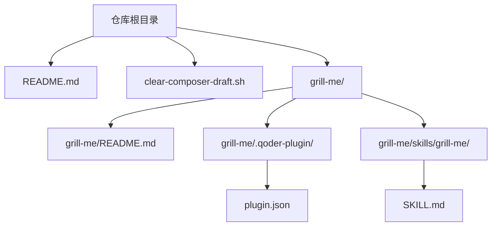
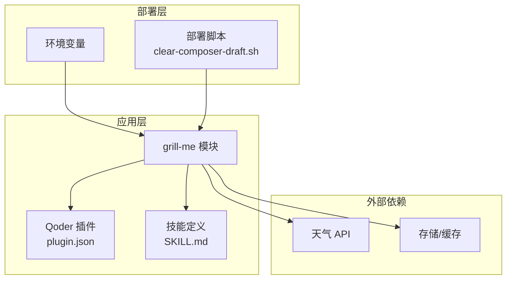
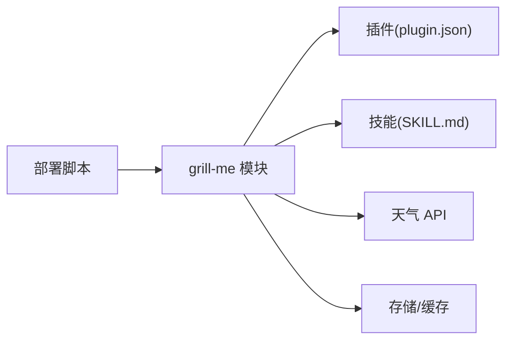

# 部署配置

<cite>
**本文引用的文件**   
- [README.md](file://README.md)
- [clear-composer-draft.sh](file://clear-composer-draft.sh)
- [grill-me/README.md](file://grill-me/README.md)
- [grill-me/.qoder-plugin/plugin.json](file://grill-me/.qoder-plugin/plugin.json)
- [grill-me/skills/grill-me/SKILL.md](file://grill-me/skills/grill-me/SKILL.md)
</cite>

## 目录
1. [简介](#简介)
2. [项目结构](#项目结构)
3. [核心组件](#核心组件)
4. [架构总览](#架构总览)
5. [详细组件分析](#详细组件分析)
6. [依赖分析](#依赖分析)
7. [性能考虑](#性能考虑)
8. [故障排查指南](#故障排查指南)
9. [结论](#结论)
10. [附录](#附录)

## 简介
本文件面向“天气智能体”的部署与配置，目标是帮助读者在本地或生产环境中快速完成环境准备、安装部署、容器化运行、环境变量管理、监控告警、日志管理与故障排查。文档同时给出自动化脚本的使用说明与最佳实践建议，确保部署过程可重复、可观测、可回滚。

## 项目结构
仓库根目录包含项目说明、清理脚本以及一个名为 grill-me 的功能模块（含插件与技能描述）。整体结构简洁，便于扩展为完整的天气智能体服务。

图表来源
- [README.md:1-200](file://README.md#L1-L200)
- [clear-composer-draft.sh:1-200](file://clear-composer-draft.sh#L1-L200)
- [grill-me/README.md:1-200](file://grill-me/README.md#L1-L200)
- [grill-me/.qoder-plugin/plugin.json:1-200](file://grill-me/.qoder-plugin/plugin.json#L1-L200)
- [grill-me/skills/grill-me/SKILL.md:1-200](file://grill-me/skills/grill-me/SKILL.md#L1-L200)

章节来源
- [README.md:1-200](file://README.md#L1-L200)
- [clear-composer-draft.sh:1-200](file://clear-composer-draft.sh#L1-L200)
- [grill-me/README.md:1-200](file://grill-me/README.md#L1-L200)
- [grill-me/.qoder-plugin/plugin.json:1-200](file://grill-me/.qoder-plugin/plugin.json#L1-L200)
- [grill-me/skills/grill-me/SKILL.md:1-200](file://grill-me/skills/grill-me/SKILL.md#L1-L200)

## 核心组件
- 根级 README：提供项目概览与使用说明，是部署前的必读材料。
- clear-composer-draft.sh：用于清理 Composer 草稿或临时构建产物，保障干净部署。
- grill-me 模块：
  - README.md：模块级说明，可能包含该子系统的职责与使用方式。
  - .qoder-plugin/plugin.json：插件元数据，定义插件名称、版本、入口等。
  - skills/grill-me/SKILL.md：技能描述，定义能力边界、输入输出与调用约定。

章节来源
- [README.md:1-200](file://README.md#L1-L200)
- [clear-composer-draft.sh:1-200](file://clear-composer-draft.sh#L1-L200)
- [grill-me/README.md:1-200](file://grill-me/README.md#L1-L200)
- [grill-me/.qoder-plugin/plugin.json:1-200](file://grill-me/.qoder-plugin/plugin.json#L1-L200)
- [grill-me/skills/grill-me/SKILL.md:1-200](file://grill-me/skills/grill-me/SKILL.md#L1-L200)

## 架构总览
从现有仓库可见，部署形态以“脚本 + 插件/技能”为主，尚未出现显式的容器镜像或服务编排文件。建议将 grill-me 作为独立微服务或插件运行时进行容器化，并通过环境变量注入外部依赖（如天气 API Key、数据库连接串等），配合日志与监控实现可观测性。

图表来源
- [grill-me/.qoder-plugin/plugin.json:1-200](file://grill-me/.qoder-plugin/plugin.json#L1-L200)
- [grill-me/skills/grill-me/SKILL.md:1-200](file://grill-me/skills/grill-me/SKILL.md#L1-L200)
- [clear-composer-draft.sh:1-200](file://clear-composer-draft.sh#L1-L200)

## 详细组件分析

### 根级 README
- 作用：项目总览、背景、目标与总体使用说明。
- 部署相关：通常包含前置依赖、运行方式、常见问题入口。
- 建议：在部署前通读，确认依赖版本与环境要求。

章节来源
- [README.md:1-200](file://README.md#L1-L200)

### 清理脚本 clear-composer-draft.sh
- 作用：清理 Composer 草稿或构建中间产物，保证部署环境干净。
- 使用场景：
  - 部署前执行，避免旧产物影响新包解析。
  - CI/CD 流水线中作为前置步骤。
- 注意事项：
  - 确认脚本权限与执行路径。
  - 在生产环境谨慎使用，避免误删重要文件。

章节来源
- [clear-composer-draft.sh:1-200](file://clear-composer-draft.sh#L1-L200)

### grill-me 模块
- README.md：模块级说明，明确职责与用法。
- plugin.json：插件元数据，定义插件标识、版本、入口点等。
- SKILL.md：技能描述，定义能力范围、输入输出格式、错误码约定等。

章节来源
- [grill-me/README.md:1-200](file://grill-me/README.md#L1-L200)
- [grill-me/.qoder-plugin/plugin.json:1-200](file://grill-me/.qoder-plugin/plugin.json#L1-L200)
- [grill-me/skills/grill-me/SKILL.md:1-200](file://grill-me/skills/grill-me/SKILL.md#L1-L200)

## 依赖分析
- 运行时依赖：
  - 插件框架（由 plugin.json 描述）
  - 技能运行时（由 SKILL.md 定义的能力契约）
- 外部依赖：
  - 天气数据源（API Key、限流策略、重试机制）
  - 存储/缓存（可选，用于历史查询与热点缓存）
- 构建/部署依赖：
  - Shell 环境（执行清理脚本）
  - 包管理器（Composer，若存在 PHP 生态）

图表来源
- [clear-composer-draft.sh:1-200](file://clear-composer-draft.sh#L1-L200)
- [grill-me/.qoder-plugin/plugin.json:1-200](file://grill-me/.qoder-plugin/plugin.json#L1-L200)
- [grill-me/skills/grill-me/SKILL.md:1-200](file://grill-me/skills/grill-me/SKILL.md#L1-L200)

章节来源
- [clear-composer-draft.sh:1-200](file://clear-composer-draft.sh#L1-L200)
- [grill-me/.qoder-plugin/plugin.json:1-200](file://grill-me/.qoder-plugin/plugin.json#L1-L200)
- [grill-me/skills/grill-me/SKILL.md:1-200](file://grill-me/skills/grill-me/SKILL.md#L1-L200)

## 性能考虑
- 缓存策略：对高频城市/时段的气象数据进行缓存，降低 API 调用频率。
- 并发控制：限制并发请求数，避免触发上游限流。
- 资源隔离：通过容器化隔离进程与资源配额，提升稳定性。
- 日志采样：生产环境开启结构化日志与采样，减少 I/O 压力。

## 故障排查指南
- 常见现象
  - 启动失败：检查环境变量是否完整、端口占用、权限不足。
  - 调用超时：检查网络连通性与上游 API 限流。
  - 数据异常：核对城市编码、单位换算、时区设置。
- 定位步骤
  - 查看应用日志与系统日志，关注错误堆栈与时间戳。
  - 复现最小用例，逐步缩小问题范围。
  - 启用调试模式与更详细的日志级别（仅在测试环境）。
- 恢复措施
  - 重启服务、清理缓存、回滚到上一稳定版本。
  - 切换备用数据源或降级策略。

## 结论
当前仓库提供了清晰的模块划分与基础脚本支持，适合在此基础上完善容器化与服务编排。建议优先补齐环境变量清单、健康检查与监控指标，形成标准化的部署流程，确保可观测性与可维护性。

## 附录

### 环境要求
- 操作系统：Linux/Windows/macOS（推荐 Linux）
- Shell 环境：bash/sh
- 包管理器：Composer（若涉及 PHP 依赖）
- 容器运行时：Docker（推荐）

### 安装步骤
- 克隆仓库并进入目录
- 执行清理脚本以确保干净环境
- 根据模块 README 安装依赖
- 配置环境变量（见下一节）
- 启动服务或加载插件

章节来源
- [clear-composer-draft.sh:1-200](file://clear-composer-draft.sh#L1-L200)
- [grill-me/README.md:1-200](file://grill-me/README.md#L1-L200)

### 环境变量设置
- WEATHER_API_KEY：天气 API 密钥
- WEATHER_BASE_URL：天气 API 基地址
- CACHE_TTL：缓存过期时间（秒）
- LOG_LEVEL：日志级别（info/debug/error）
- PORT：服务监听端口
- DB_HOST/DB_PORT/DB_NAME/DB_USER/DB_PASS：数据库连接信息（可选）

### 容器化配置
- 镜像构建：基于轻量基础镜像，仅拷贝必要文件
- 运行参数：通过环境变量注入配置，不硬编码
- 健康检查：暴露 /health 端点，返回状态码与简要信息
- 资源限制：CPU/内存上限，避免资源争用

### 监控告警
- 指标采集：QPS、延迟、错误率、缓存命中率、上游调用成功率
- 告警规则：错误率阈值、延迟阈值、资源使用阈值
- 可视化：Grafana 面板展示关键指标

### 日志管理
- 结构化日志：JSON 格式，包含 trace_id、level、msg、fields
- 日志轮转：按大小或时间轮转，保留周期可配置
- 集中收集：接入 ELK/ Loki 等日志平台

### 安全配置建议
- 最小权限原则：运行用户非 root，只授予必要权限
- 密钥管理：使用密钥管理服务或环境变量注入，避免明文
- 网络安全：仅开放必要端口，启用 TLS 加密
- 输入校验：对外部输入进行严格校验与白名单过滤

### 自动化部署流程（CI/CD）
- 代码提交触发构建
- 静态检查与单元测试
- 构建镜像并推送镜像仓库
- 自动发布到目标环境（灰度/全量）
- 健康检查通过后更新流量

### 生产环境最佳实践
- 多副本部署与负载均衡
- 滚动升级与快速回滚
- 定期备份与演练恢复
- 容量规划与压测验证