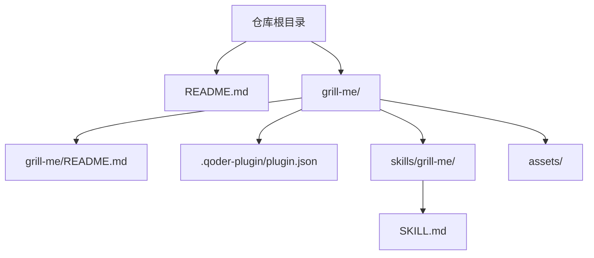
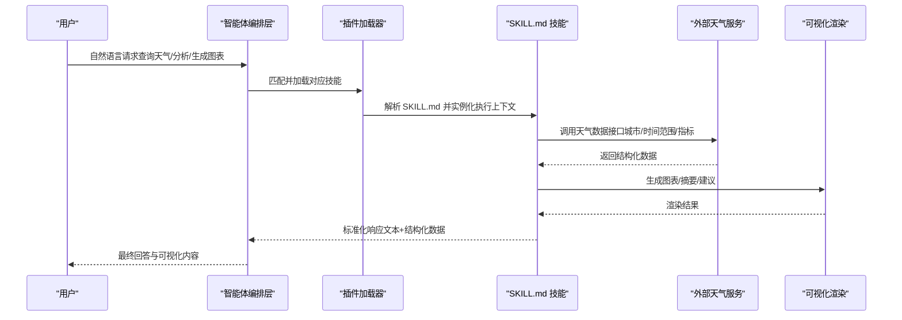
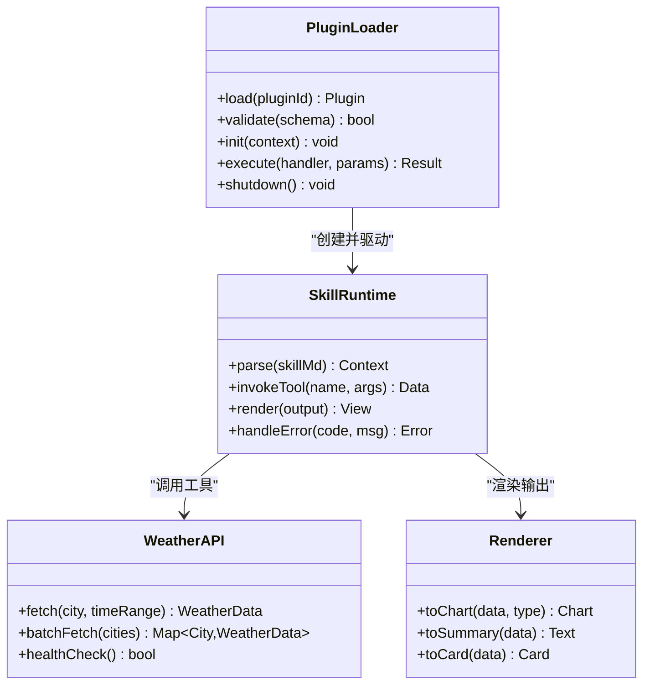
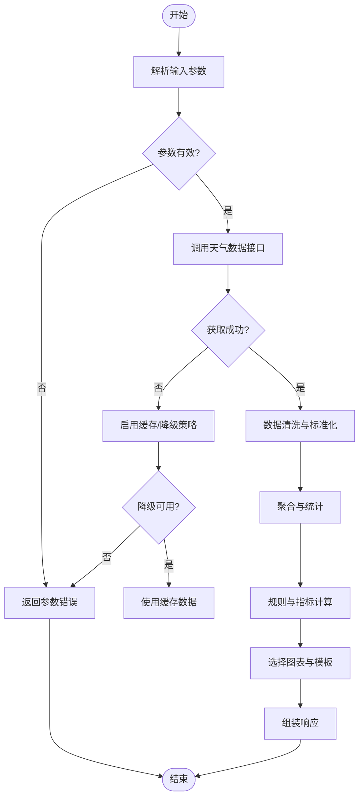
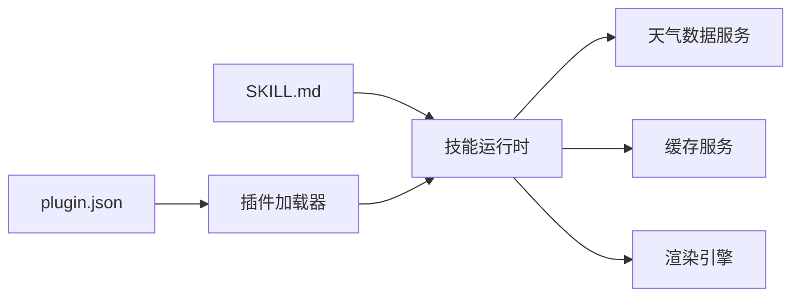

# 技能开发

<cite>
**本文引用的文件**   
- [README.md](file://README.md)
- [grill-me/README.md](file://grill-me/README.md)
- [grill-me/.qoder-plugin/plugin.json](file://grill-me/.qoder-plugin/plugin.json)
- [grill-me/skills/grill-me/SKILL.md](file://grill-me/skills/grill-me/SKILL.md)
</cite>

## 目录
1. [简介](#简介)
2. [项目结构](#项目结构)
3. [核心组件](#核心组件)
4. [架构总览](#架构总览)
5. [详细组件分析](#详细组件分析)
6. [依赖关系分析](#依赖关系分析)
7. [性能考虑](#性能考虑)
8. [故障排查指南](#故障排查指南)
9. [结论](#结论)
10. [附录](#附录)

## 简介
本技术文档面向“天气智能体”技能开发者，围绕 SKILL.md 的结构、语法与最佳实践展开，并结合插件系统的架构、API 接口与扩展机制，给出从需求分析到部署上线的完整流程。文档同时提供代码示例路径指引、公共接口与参数说明、性能优化建议与调试技巧，帮助读者快速构建高质量、可维护的天气数据获取、分析与可视化技能。

## 项目结构
仓库采用“按功能域组织”的方式，根目录包含总体说明与策划类文档；grill-me 子目录为具体技能实现包，其中：
- .qoder-plugin/plugin.json：插件元数据与能力声明
- skills/grill-me/SKILL.md：技能定义与行为描述（核心）
- assets：静态资源（如图标、模板等）
- README.md：技能包的说明与使用说明

图表来源
- [README.md:1-200](file://README.md#L1-L200)
- [grill-me/README.md:1-200](file://grill-me/README.md#L1-L200)
- [grill-me/.qoder-plugin/plugin.json:1-200](file://grill-me/.qoder-plugin/plugin.json#L1-L200)
- [grill-me/skills/grill-me/SKILL.md:1-200](file://grill-me/skills/grill-me/SKILL.md#L1-L200)

章节来源
- [README.md:1-200](file://README.md#L1-L200)
- [grill-me/README.md:1-200](file://grill-me/README.md#L1-L200)
- [grill-me/.qoder-plugin/plugin.json:1-200](file://grill-me/.qoder-plugin/plugin.json#L1-L200)
- [grill-me/skills/grill-me/SKILL.md:1-200](file://grill-me/skills/grill-me/SKILL.md#L1-L200)

## 核心组件
- SKILL.md：技能的行为契约与交互规范，定义输入、输出、工具调用、错误处理与展示格式等。
- plugin.json：插件注册信息，包括名称、版本、能力声明、入口点、权限与依赖等。
- README.md（技能包）：面向使用者的说明，涵盖安装、配置、使用示例与注意事项。

章节来源
- [grill-me/skills/grill-me/SKILL.md:1-200](file://grill-me/skills/grill-me/SKILL.md#L1-L200)
- [grill-me/.qoder-plugin/plugin.json:1-200](file://grill-me/.qoder-plugin/plugin.json#L1-L200)
- [grill-me/README.md:1-200](file://grill-me/README.md#L1-L200)

## 架构总览
天气智能体技能运行于插件框架之上，SKILL.md 作为“技能契约”，由插件加载器解析并驱动执行。典型流程如下：

图表来源
- [grill-me/.qoder-plugin/plugin.json:1-200](file://grill-me/.qoder-plugin/plugin.json#L1-L200)
- [grill-me/skills/grill-me/SKILL.md:1-200](file://grill-me/skills/grill-me/SKILL.md#L1-L200)

## 详细组件分析

### SKILL.md 结构与语法
- 作用：定义技能的职责边界、输入参数、工具调用、数据处理逻辑、错误处理策略与输出格式。
- 常见字段（概念性说明）：
  - 元信息：名称、版本、作者、描述、许可证
  - 能力声明：支持的意图、触发词、可用工具
  - 输入模型：参数名、类型、约束、默认值
  - 工具调用：API 端点、鉴权方式、重试与超时
  - 数据处理：清洗、聚合、阈值判断、异常分支
  - 输出模型：文本摘要、结构化数据、图表类型与字段映射
  - 错误码与降级策略：网络失败、数据缺失、限流回退
  - 安全与合规：隐私字段脱敏、访问控制、审计日志
- 最佳实践：
  - 明确输入校验与默认值，避免空指针与非法状态
  - 将外部依赖封装为工具调用，便于替换与测试
  - 统一错误码与消息，便于前端展示与监控告警
  - 输出遵循稳定 schema，向后兼容变更需版本管理
  - 对耗时操作设置超时与重试上限，避免阻塞主流程

章节来源
- [grill-me/skills/grill-me/SKILL.md:1-200](file://grill-me/skills/grill-me/SKILL.md#L1-L200)

### 插件系统与扩展机制
- 插件元数据（plugin.json）：
  - 标识：id、name、version
  - 入口：entry_point、handler、初始化参数
  - 能力：tools、permissions、dependencies
  - 运行时：timeout、retry、cache、logging
- 扩展点：
  - 工具注册：新增天气数据源或计算函数
  - 中间件：鉴权、限流、缓存、审计
  - 渲染器：图表/报表/卡片模板
- 生命周期：
  - 加载：解析 plugin.json，校验依赖
  - 初始化：建立连接池、加载缓存、预热数据
  - 执行：路由到具体技能，注入上下文
  - 销毁：释放资源、上报指标

图表来源
- [grill-me/.qoder-plugin/plugin.json:1-200](file://grill-me/.qoder-plugin/plugin.json#L1-L200)
- [grill-me/skills/grill-me/SKILL.md:1-200](file://grill-me/skills/grill-me/SKILL.md#L1-L200)

章节来源
- [grill-me/.qoder-plugin/plugin.json:1-200](file://grill-me/.qoder-plugin/plugin.json#L1-L200)
- [grill-me/skills/grill-me/SKILL.md:1-200](file://grill-me/skills/grill-me/SKILL.md#L1-L200)

### 天气数据获取、分析与可视化流程
- 数据获取：
  - 输入：城市、时间范围、指标（温度/降水/风/空气质量）
  - 调用：天气 API（支持批量与分页）
  - 容错：重试、降级、缓存
- 数据分析：
  - 清洗：去重、单位换算、缺失插补
  - 聚合：日/周/月粒度统计、极值与趋势
  - 规则：阈值预警、舒适度指数
- 可视化：
  - 图表：折线（趋势）、柱状（对比）、热力（空间分布）
  - 摘要：关键指标、风险提示、出行建议

图表来源
- [grill-me/skills/grill-me/SKILL.md:1-200](file://grill-me/skills/grill-me/SKILL.md#L1-L200)

章节来源
- [grill-me/skills/grill-me/SKILL.md:1-200](file://grill-me/skills/grill-me/SKILL.md#L1-L200)

### 公共接口、参数与返回值
- 接口分类（概念性说明）：
  - 数据获取：单城市/多城市、时间范围、指标过滤
  - 数据分析：聚合维度、统计方法、阈值配置
  - 可视化：图表类型、样式主题、导出格式
- 通用参数：
  - 城市编码、时区、语言、单位制
  - 分页、排序、过滤条件
  - 鉴权令牌、签名、回调地址
- 通用返回：
  - 状态码、消息、数据体、追踪ID
  - 分页信息、缓存命中标记、耗时统计
- 错误码约定：
  - 客户端错误（参数、权限）
  - 服务端错误（超时、限流、内部异常）
  - 第三方错误（上游不可用、数据缺失）

章节来源
- [grill-me/skills/grill-me/SKILL.md:1-200](file://grill-me/skills/grill-me/SKILL.md#L1-L200)

### 技能开发全流程
- 需求分析：
  - 目标场景（日常查询/出行建议/灾害预警）
  - 数据源与指标优先级
  - 用户体验（响应时间、呈现形式）
- 设计阶段：
  - 定义 SKILL.md 契约（输入/输出/工具/错误）
  - 规划插件能力与扩展点（中间件、渲染器）
  - 制定接口规范与版本策略
- 实现阶段：
  - 编写 SKILL.md，实现工具调用与数据处理
  - 接入天气 API，完善容错与缓存
  - 实现渲染器与模板
- 测试阶段：
  - 单元测试（数据清洗、聚合、规则）
  - 集成测试（API 联调、端到端流程）
  - 性能测试（吞吐、延迟、内存）
- 发布与运维：
  - 打包插件、上传至仓库
  - 灰度发布与监控告警
  - 日志采集与问题定位

章节来源
- [grill-me/README.md:1-200](file://grill-me/README.md#L1-L200)
- [grill-me/skills/grill-me/SKILL.md:1-200](file://grill-me/skills/grill-me/SKILL.md#L1-L200)
- [grill-me/.qoder-plugin/plugin.json:1-200](file://grill-me/.qoder-plugin/plugin.json#L1-L200)

## 依赖关系分析
- 内部依赖：
  - 插件加载器依赖 plugin.json 进行能力发现与初始化
  - 技能运行时依赖 SKILL.md 定义的契约与工具清单
- 外部依赖：
  - 天气数据服务（HTTP/SDK）、缓存服务、渲染引擎
- 耦合与内聚：
  - 通过工具抽象降低与具体数据源的耦合
  - 将数据处理与渲染解耦，提升可测试性与复用性

图表来源
- [grill-me/.qoder-plugin/plugin.json:1-200](file://grill-me/.qoder-plugin/plugin.json#L1-L200)
- [grill-me/skills/grill-me/SKILL.md:1-200](file://grill-me/skills/grill-me/SKILL.md#L1-L200)

章节来源
- [grill-me/.qoder-plugin/plugin.json:1-200](file://grill-me/.qoder-plugin/plugin.json#L1-L200)
- [grill-me/skills/grill-me/SKILL.md:1-200](file://grill-me/skills/grill-me/SKILL.md#L1-L200)

## 性能考虑
- 数据层：
  - 批量接口优先，减少往返次数
  - 合理缓存热点数据（城市+时间窗口），设置过期策略
  - 连接池与超时控制，避免资源耗尽
- 计算层：
  - 惰性计算与增量聚合，避免全量重算
  - 并行处理独立任务（多城市、多指标）
- 渲染层：
  - 按需生成图表，避免无用渲染
  - 模板预编译与复用
- 监控与观测：
  - 关键指标埋点（QPS、延迟、错误率、缓存命中率）
  - 链路追踪与采样日志

[本节为通用指导，不直接分析具体文件]

## 故障排查指南
- 常见问题：
  - 参数校验失败：检查必填项、类型与取值范围
  - 上游不可用：查看健康检查与降级开关
  - 数据缺失：确认时间范围与城市编码有效性
  - 渲染异常：核对模板字段与数据类型
- 定位步骤：
  - 查看错误码与消息，结合追踪ID检索日志
  - 复现实例，逐步缩小范围（参数/缓存/上游）
  - 启用调试模式，打印关键中间态
- 恢复策略：
  - 自动重试与熔断
  - 切换备用数据源
  - 回滚到上一稳定版本

章节来源
- [grill-me/skills/grill-me/SKILL.md:1-200](file://grill-me/skills/grill-me/SKILL.md#L1-L200)

## 结论
通过以 SKILL.md 为核心的技能契约与插件化架构，天气智能体可实现高内聚、低耦合、易扩展的数据获取、分析与可视化能力。遵循本文档的结构规范、接口约定与最佳实践，能够显著提升开发效率与系统稳定性，并为后续持续演进奠定基础。

[本节为总结性内容，不直接分析具体文件]

## 附录
- 术语表：
  - 技能：基于 SKILL.md 定义的可执行单元
  - 插件：承载技能及其能力的运行时容器
  - 工具：被技能调用的外部能力（如天气 API）
  - 渲染器：将结构化数据转换为可视化的组件
- 参考路径：
  - 插件元数据：[grill-me/.qoder-plugin/plugin.json](file://grill-me/.qoder-plugin/plugin.json)
  - 技能契约：[grill-me/skills/grill-me/SKILL.md](file://grill-me/skills/grill-me/SKILL.md)
  - 技能说明：[grill-me/README.md](file://grill-me/README.md)

[本节为补充信息，不直接分析具体文件]