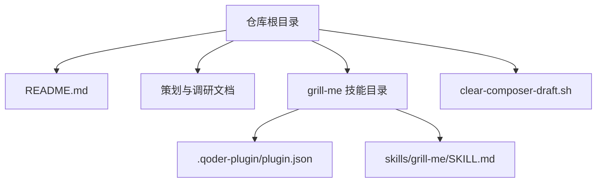
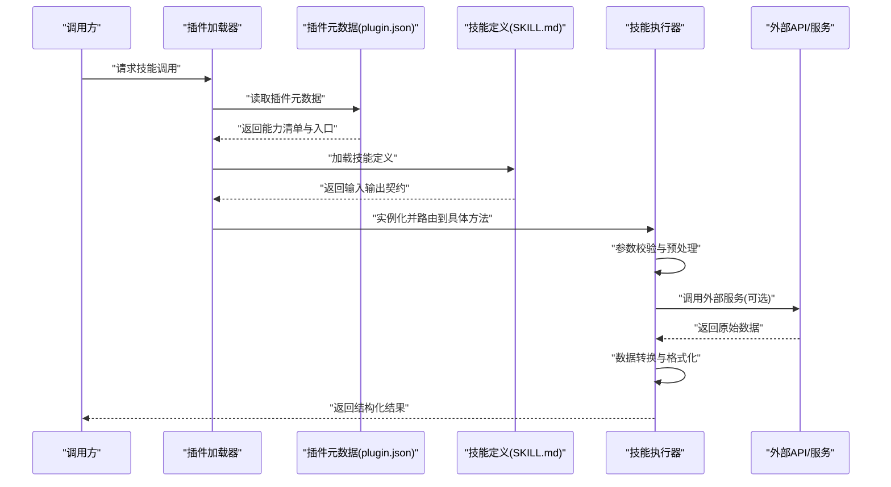
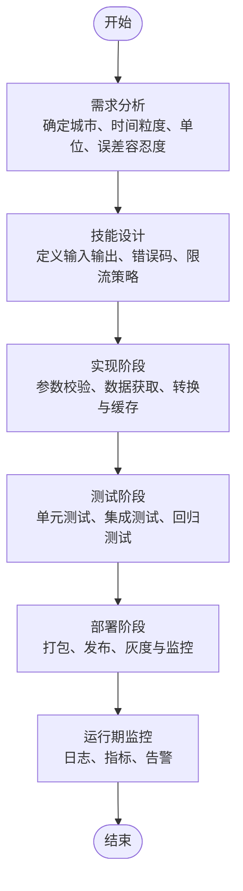
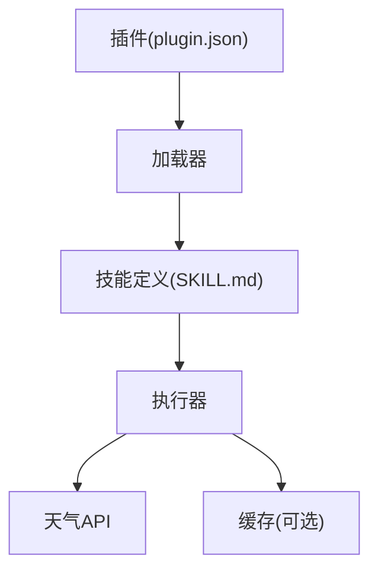

# 技能开发流程

<cite>
**本文档引用的文件**   
- [README.md](file://README.md)
- [grill-me/README.md](file://grill-me/README.md)
- [grill-me/.qoder-plugin/plugin.json](file://grill-me/.qoder-plugin/plugin.json)
- [grill-me/skills/grill-me/SKILL.md](file://grill-me/skills/grill-me/SKILL.md)
- [clear-composer-draft.sh](file://clear-composer-draft.sh)
- [市场调研报告.md](file://市场调研报告.md)
- [选题创意库_212个.md](file://选题创意库_212个.md)
- [项目复盘_产品定位讨论.md](file://项目复盘_产品定位讨论.md)
</cite>

## 目录
1. [简介](#简介)
2. [项目结构](#项目结构)
3. [核心组件](#核心组件)
4. [架构总览](#架构总览)
5. [详细组件分析](#详细组件分析)
6. [依赖分析](#依赖分析)
7. [性能考虑](#性能考虑)
8. [故障排查指南](#故障排查指南)
9. [结论](#结论)
10. [附录](#附录)

## 简介
本指南面向“天气智能体技能”开发者，提供从零到上线的完整开发流程：需求分析、技能设计、实现、测试与部署。文档覆盖开发环境搭建、工具链配置、调试技巧、标准化模板与项目结构建议、代码规范与命名约定、版本管理策略，并给出一个完整的“天气查询技能”示例路径，帮助快速上手与高质量交付。

## 项目结构
仓库采用“多技能插件化”组织方式，根目录包含项目说明与策划文档；每个技能以独立子目录形式存在，并通过插件描述文件进行注册与能力声明。典型结构如下：
- 根级说明与策划文档：用于项目背景、目标与规划
- 技能目录（如 grill-me）：包含插件元数据、技能定义与资源
- 插件元数据（plugin.json）：描述技能名称、版本、入口、能力等
- 技能定义（SKILL.md）：描述技能功能、输入输出、交互协议与约束
- 辅助脚本（如 clear-composer-draft.sh）：用于清理或构建辅助任务

图表来源
- [README.md](file://README.md)
- [grill-me/.qoder-plugin/plugin.json](file://grill-me/.qoder-plugin/plugin.json)
- [grill-me/skills/grill-me/SKILL.md](file://grill-me/skills/grill-me/SKILL.md)
- [clear-composer-draft.sh](file://clear-composer-draft.sh)

章节来源
- [README.md](file://README.md)
- [grill-me/README.md](file://grill-me/README.md)
- [grill-me/.qoder-plugin/plugin.json](file://grill-me/.qoder-plugin/plugin.json)
- [grill-me/skills/grill-me/SKILL.md](file://grill-me/skills/grill-me/SKILL.md)
- [clear-composer-draft.sh](file://clear-composer-draft.sh)

## 核心组件
- 插件元数据（plugin.json）
  - 作用：声明技能标识、版本、入口点、能力范围、权限与依赖
  - 关注点：字段完整性、版本号语义化、入口路径正确性、依赖声明准确性
- 技能定义（SKILL.md）
  - 作用：描述技能的功能边界、输入参数、输出格式、错误码、调用约束
  - 关注点：接口契约清晰、参数校验规则、异常处理约定、可观测性要求
- 辅助脚本（clear-composer-draft.sh）
  - 作用：清理草稿或中间产物，保障构建一致性
  - 关注点：幂等性、安全删除范围、失败回滚提示

章节来源
- [grill-me/.qoder-plugin/plugin.json](file://grill-me/.qoder-plugin/plugin.json)
- [grill-me/skills/grill-me/SKILL.md](file://grill-me/skills/grill-me/SKILL.md)
- [clear-composer-draft.sh](file://clear-composer-draft.sh)

## 架构总览
技能加载与执行的关键链路通常包括：插件发现与解析、技能定义加载、参数校验与路由、业务逻辑执行、结果序列化与返回。下图展示从外部调用到技能执行的端到端流程。

图表来源
- [grill-me/.qoder-plugin/plugin.json](file://grill-me/.qoder-plugin/plugin.json)
- [grill-me/skills/grill-me/SKILL.md](file://grill-me/skills/grill-me/SKILL.md)

## 详细组件分析

### 插件元数据（plugin.json）
- 职责
  - 声明技能唯一标识、版本、名称、描述
  - 指定入口模块与方法名
  - 声明所需权限、环境变量、依赖项
- 关键检查点
  - 版本号遵循语义化版本控制
  - 入口路径与实际文件一致
  - 权限最小化原则
  - 依赖项明确且版本稳定

章节来源
- [grill-me/.qoder-plugin/plugin.json](file://grill-me/.qoder-plugin/plugin.json)

### 技能定义（SKILL.md）
- 职责
  - 定义技能功能、输入参数、输出格式、错误码
  - 描述调用约束、重试策略、超时设置
  - 记录示例请求与响应
- 关键检查点
  - 参数类型与取值范围明确
  - 错误码与消息统一
  - 示例覆盖常见场景与边界条件
  - 可观测性字段（traceId、耗时等）

章节来源
- [grill-me/skills/grill-me/SKILL.md](file://grill-me/skills/grill-me/SKILL.md)

### 辅助脚本（clear-composer-draft.sh）
- 职责
  - 清理构建草稿、临时文件或缓存
  - 保证构建环境干净与可重复
- 关键检查点
  - 仅删除受控目录
  - 失败时给出明确提示
  - 支持 dry-run 模式（建议）

章节来源
- [clear-composer-draft.sh](file://clear-composer-draft.sh)

### 天气查询技能示例（从零到上线）
以下流程基于现有技能模板与插件机制，演示如何创建一个“天气查询技能”。

图表来源
- [grill-me/skills/grill-me/SKILL.md](file://grill-me/skills/grill-me/SKILL.md)
- [grill-me/.qoder-plugin/plugin.json](file://grill-me/.qoder-plugin/plugin.json)

步骤要点
- 需求分析
  - 明确用户意图（当前/预报/历史）、地域精度、单位体系（摄氏度/华氏度）、数据源选择
- 技能设计
  - 输入：城市、日期范围、单位、是否含空气质量指数
  - 输出：温度、体感、湿度、风速、降水概率、AQI 等
  - 错误：网络超时、参数非法、无数据、配额不足
- 实现
  - 参数校验与默认值填充
  - 调用天气 API 并做重试与降级
  - 数据标准化与缓存（热点城市）
- 测试
  - 单测：参数校验、转换函数、错误分支
  - 集成：对接真实或 Mock 的天气服务
  - 回归：变更影响面评估
- 部署
  - 打包插件、更新 plugin.json 版本
  - 灰度发布与回滚预案
  - 接入日志与指标采集

章节来源
- [grill-me/skills/grill-me/SKILL.md](file://grill-me/skills/grill-me/SKILL.md)
- [grill-me/.qoder-plugin/plugin.json](file://grill-me/.qoder-plugin/plugin.json)

### 概念总览
以下为通用技能生命周期概念图，不直接映射具体代码文件，用于理解整体流程。

[本图为概念示意，无需图表来源]

## 依赖分析
- 内部依赖
  - 插件元数据驱动技能发现与加载
  - 技能定义指导参数校验与结果格式化
- 外部依赖
  - 天气数据服务（HTTP/SDK）
  - 缓存与配置中心（可选）
- 风险与缓解
  - 外部服务不可用：重试、熔断、降级与缓存
  - 参数不一致：契约先行、严格校验、自动化测试
  - 版本冲突：语义化版本、依赖锁定、兼容性矩阵

图表来源
- [grill-me/.qoder-plugin/plugin.json](file://grill-me/.qoder-plugin/plugin.json)
- [grill-me/skills/grill-me/SKILL.md](file://grill-me/skills/grill-me/SKILL.md)

章节来源
- [grill-me/.qoder-plugin/plugin.json](file://grill-me/.qoder-plugin/plugin.json)
- [grill-me/skills/grill-me/SKILL.md](file://grill-me/skills/grill-me/SKILL.md)

## 性能考虑
- 缓存策略
  - 对热点城市与短时预报启用缓存，合理设置 TTL
- 并发与限流
  - 限制并发调用外部 API，避免触发配额或限流
- 数据压缩与分页
  - 大结果集按需分页与字段裁剪
- 监控与可观测性
  - 记录关键指标（延迟、错误率、命中率）与追踪 ID

[本节为通用建议，无需章节来源]

## 故障排查指南
- 常见问题
  - 插件无法加载：检查 plugin.json 路径与字段完整性
  - 参数校验失败：核对 SKILL.md 定义的输入约束
  - 外部服务超时：检查网络、代理、超时与重试配置
  - 结果格式异常：确认转换逻辑与字段映射
- 排查步骤
  - 开启调试日志与追踪 ID
  - 使用最小复现用例隔离问题
  - 逐步断言中间状态与返回值
  - 必要时回滚至上一稳定版本

章节来源
- [grill-me/.qoder-plugin/plugin.json](file://grill-me/.qoder-plugin/plugin.json)
- [grill-me/skills/grill-me/SKILL.md](file://grill-me/skills/grill-me/SKILL.md)

## 结论
通过标准化的插件元数据与技能定义，结合清晰的开发流程与完善的测试部署实践，可以快速、可靠地构建天气类智能体技能。建议在团队内推广契约先行、版本化管理与可观测性建设，持续提升质量与效率。

[本节为总结性内容，无需章节来源]

## 附录

### 开发环境与工具链建议
- 编辑器与插件
  - 启用 JSON Schema 校验（plugin.json）
  - Markdown 语法高亮与链接检查（SKILL.md）
- 命令行工具
  - 使用脚本清理草稿与中间产物，确保构建一致性
- 调试与测试
  - 本地 Mock 天气服务，覆盖成功、失败与边界场景
  - 引入断言与覆盖率统计

章节来源
- [clear-composer-draft.sh](file://clear-composer-draft.sh)
- [grill-me/.qoder-plugin/plugin.json](file://grill-me/.qoder-plugin/plugin.json)
- [grill-me/skills/grill-me/SKILL.md](file://grill-me/skills/grill-me/SKILL.md)

### 代码规范与命名约定
- 命名
  - 插件与技能名称小写短横线风格，语义清晰
  - 字段命名遵循驼峰或下划线之一，保持全局一致
- 注释
  - 公共接口与复杂逻辑需有注释说明
- 错误处理
  - 统一错误码与消息格式，便于前端与下游消费
- 版本管理
  - 语义化版本（主.次.修订），变更日志与迁移指引

章节来源
- [grill-me/.qoder-plugin/plugin.json](file://grill-me/.qoder-plugin/plugin.json)
- [grill-me/skills/grill-me/SKILL.md](file://grill-me/skills/grill-me/SKILL.md)

### 版本管理与发布策略
- 分支策略
  - main 稳定分支，feature 分支开发，release 分支预发
- 标签与发布
  - 每次发布打标签，附带变更摘要与兼容说明
- 灰度与回滚
  - 先灰度后全量，保留一键回滚能力

章节来源
- [grill-me/.qoder-plugin/plugin.json](file://grill-me/.qoder-plugin/plugin.json)

### 参考文档与素材
- 项目说明与策划文档可用于对齐目标与范围
- 市场调研与创意库有助于拓展技能场景与差异化能力

章节来源
- [README.md](file://README.md)
- [市场调研报告.md](file://市场调研报告.md)
- [选题创意库_212个.md](file://选题创意库_212个.md)
- [项目复盘_产品定位讨论.md](file://项目复盘_产品定位讨论.md)