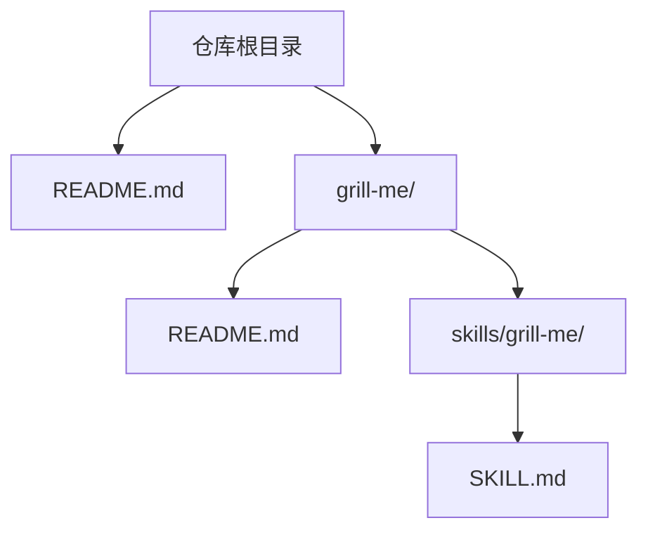
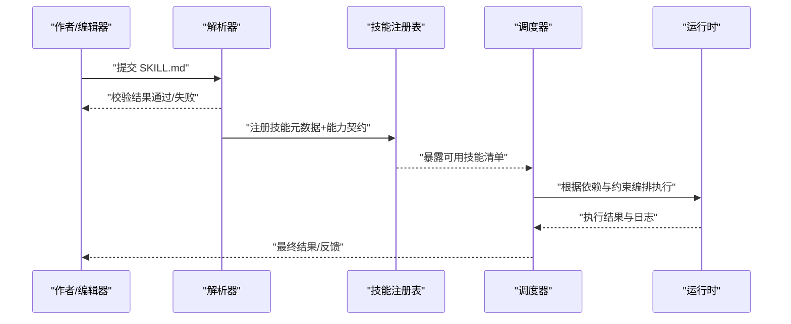
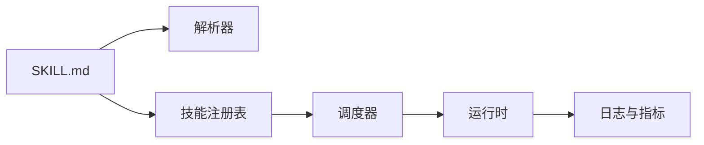

# 技能文件结构

<cite>
**本文档引用的文件**   
- [README.md](file://README.md)
- [grill-me/README.md](file://grill-me/README.md)
- [grill-me/skills/grill-me/SKILL.md](file://grill-me/skills/grill-me/SKILL.md)
</cite>

## 目录
1. [简介](#简介)
2. [项目结构](#项目结构)
3. [核心组件](#核心组件)
4. [架构总览](#架构总览)
5. [详细组件分析](#详细组件分析)
6. [依赖关系分析](#依赖关系分析)
7. [性能考虑](#性能考虑)
8. [故障排查指南](#故障排查指南)
9. [结论](#结论)
10. [附录](#附录)

## 简介
本技术文档围绕 SKILL.md 文件结构展开，目标是帮助开发者与内容作者理解并规范地编写“技能”描述文件。SKILL.md 用于定义一个技能的元数据、能力描述、依赖关系、版本信息与使用示例等，是技能注册、发现与执行的重要依据。本文从语法规范、字段定义、配置选项、富文本渲染规则、模板与最佳实践、验证规则与常见错误处理等方面进行全面说明，并提供可视化图示辅助理解。

## 项目结构
仓库采用“按功能域组织”的结构，技能以目录形式存放于 skills 子目录下，每个技能对应一个独立的 SKILL.md 文件。根目录 README 提供项目级说明，grill-me 子模块包含其自身的 README 与技能定义。

图表来源
- [README.md:1-200](file://README.md#L1-L200)
- [grill-me/README.md:1-200](file://grill-me/README.md#L1-L200)
- [grill-me/skills/grill-me/SKILL.md:1-200](file://grill-me/skills/grill-me/SKILL.md#L1-L200)

章节来源
- [README.md:1-200](file://README.md#L1-L200)
- [grill-me/README.md:1-200](file://grill-me/README.md#L1-L200)
- [grill-me/skills/grill-me/SKILL.md:1-200](file://grill-me/skills/grill-me/SKILL.md#L1-L200)

## 核心组件
SKILL.md 作为单一事实源，承载以下关键信息：
- 技能标识与元数据：名称、版本、作者、许可证、标签等
- 能力描述：自然语言描述、目标场景、输入输出约定
- 依赖关系：外部工具、模型、API、环境变量等
- 行为约束：权限、安全策略、速率限制、重试与回退策略
- 运行配置：参数、默认值、校验规则、开关项
- 示例与用法：调用序列、请求/响应样例、边界用例
- 维护信息：变更记录、兼容性矩阵、弃用提示

这些组件共同构成可被解析器与运行时消费的技能契约。

章节来源
- [grill-me/skills/grill-me/SKILL.md:1-200](file://grill-me/skills/grill-me/SKILL.md#L1-L200)

## 架构总览
下图展示了 SKILL.md 在系统中的角色与交互：编辑器或 CLI 生成/校验 SKILL.md；解析器读取并构建技能模型；调度器依据依赖与约束进行编排；运行时执行具体步骤并返回结果。

图表来源
- [grill-me/skills/grill-me/SKILL.md:1-200](file://grill-me/skills/grill-me/SKILL.md#L1-L200)

## 详细组件分析

### SKILL.md 语法与字段定义
- 文件格式：Markdown（.md），支持标准 Markdown 语法与扩展标记
- 头部元数据：建议使用 YAML Front Matter 或结构化段落声明关键字段（名称、版本、作者、许可证、标签、描述）
- 正文结构：建议分节组织，如“概述”“能力描述”“依赖”“配置”“示例”“变更日志”等
- 字段类型与约束：
  - 字符串：名称、描述、作者、许可证
  - 语义化版本：遵循 SemVer（主.次.补丁）
  - 布尔开关：启用/禁用某特性
  - 数组/列表：标签、依赖项、环境变量
  - 对象/映射：配置键值对、参数定义
- 富文本渲染：标题、列表、表格、代码块、链接、图片、引用等；强调与高亮需保持可读性

章节来源
- [grill-me/skills/grill-me/SKILL.md:1-200](file://grill-me/skills/grill-me/SKILL.md#L1-L200)

### 技能元数据与描述信息
- 元数据字段：
  - 名称：唯一标识技能，建议短小且具语义
  - 版本：语义化版本，便于兼容性与升级管理
  - 作者/维护者：责任人信息
  - 许可证：开源协议或内部许可
  - 标签：分类与检索关键词
- 描述信息：
  - 一句话概述：明确用途与价值
  - 适用场景：典型用例与边界条件
  - 输入输出：数据类型、格式、约束与示例

章节来源
- [grill-me/skills/grill-me/SKILL.md:1-200](file://grill-me/skills/grill-me/SKILL.md#L1-L200)

### 依赖关系与版本控制
- 依赖类型：
  - 外部服务/API：域名、路径、鉴权方式
  - 模型/算法：版本、量化、部署位置
  - 工具/库：包名、版本范围、安装方式
  - 环境变量：密钥、端点、开关
- 版本控制：
  - 依赖锁定：固定版本或最小版本要求
  - 兼容性矩阵：与运行时/平台的兼容说明
  - 弃用策略：迁移指引与替代方案

章节来源
- [grill-me/skills/grill-me/SKILL.md:1-200](file://grill-me/skills/grill-me/SKILL.md#L1-L200)

### 运行配置与行为约束
- 配置项：
  - 参数定义：名称、类型、默认值、取值范围、必填性
  - 开关项：功能启停、调试模式、限流阈值
- 行为约束：
  - 权限与安全：最小权限原则、敏感信息脱敏
  - 可靠性：重试次数、超时时间、熔断与回退
  - 可观测性：日志级别、指标上报、追踪ID

章节来源
- [grill-me/skills/grill-me/SKILL.md:1-200](file://grill-me/skills/grill-me/SKILL.md#L1-L200)

### 示例与用法
- 示例结构：
  - 调用序列：步骤编号、动作、参数、预期结果
  - 请求/响应：JSON/表单/流式数据样例
  - 边界用例：空输入、异常输入、超时、限流
- 最佳实践：
  - 示例可复现：提供最小必要上下文
  - 覆盖典型路径：成功、失败、重试、回退
  - 标注注意事项：权限、配额、费用

章节来源
- [grill-me/skills/grill-me/SKILL.md:1-200](file://grill-me/skills/grill-me/SKILL.md#L1-L200)

### 维护信息与变更记录
- 变更记录：版本号、日期、变更摘要、影响面
- 兼容性说明：平台、运行时、依赖的兼容矩阵
- 弃用与迁移：旧版字段/行为的替代方案与时间表

章节来源
- [grill-me/skills/grill-me/SKILL.md:1-200](file://grill-me/skills/grill-me/SKILL.md#L1-L200)

### 富文本渲染规则与标记语言
- 支持的标记：标题、段落、列表、表格、代码块、链接、图片、引用、分割线
- 渲染建议：
  - 层级清晰：合理使用标题层级
  - 可读优先：避免过度装饰
  - 一致性：统一术语与命名风格
- 特殊元素：
  - 代码块：标注语言、行号、高亮
  - 表格：对齐、单位、示例值
  - 链接：相对/绝对路径、外链安全

章节来源
- [grill-me/skills/grill-me/SKILL.md:1-200](file://grill-me/skills/grill-me/SKILL.md#L1-L200)

### 文件模板与最佳实践
- 模板结构建议：
  - 头部元数据（名称、版本、作者、许可证、标签）
  - 概述与目标
  - 能力描述（输入/输出、约束）
  - 依赖与环境（外部服务、模型、变量）
  - 配置项（参数、开关、默认值）
  - 示例与用法（调用序列、样例）
  - 变更记录与维护（版本、兼容性、弃用）
- 最佳实践：
  - 单一职责：一个 SKILL.md 对应一个技能
  - 可验证：字段齐全、类型正确、示例可运行
  - 可演进：版本化与变更记录完善
  - 可维护：结构稳定、命名一致、注释清晰

章节来源
- [grill-me/skills/grill-me/SKILL.md:1-200](file://grill-me/skills/grill-me/SKILL.md#L1-L200)

### 文件验证规则与常见错误处理
- 验证规则：
  - 存在性：文件路径与命名符合规范
  - 完整性：必需字段齐全、类型正确
  - 一致性：版本语义化、依赖锁定、枚举值合法
  - 安全性：无敏感信息泄露、外链白名单
- 常见错误：
  - 字段缺失或类型不匹配
  - 版本不符合语义化规范
  - 依赖未锁定或版本冲突
  - 示例不可复现或缺少上下文
- 错误处理：
  - 解析失败：返回详细错误定位与修复建议
  - 校验失败：列出违规字段与期望值
  - 运行时异常：记录上下文、重试与回退策略

章节来源
- [grill-me/skills/grill-me/SKILL.md:1-200](file://grill-me/skills/grill-me/SKILL.md#L1-L200)

## 依赖关系分析
SKILL.md 与系统其他组件的依赖关系如下：
- 解析器依赖 SKILL.md 的结构与字段定义
- 注册表依赖元数据进行索引与检索
- 调度器依赖依赖声明进行资源准备与编排
- 运行时依赖配置与约束进行执行控制

图表来源
- [grill-me/skills/grill-me/SKILL.md:1-200](file://grill-me/skills/grill-me/SKILL.md#L1-L200)

章节来源
- [grill-me/skills/grill-me/SKILL.md:1-200](file://grill-me/skills/grill-me/SKILL.md#L1-L200)

## 性能考虑
- 解析性能：扁平化字段、避免深层嵌套、缓存已解析结果
- 校验性能：增量校验、并行检查、短路失败快速返回
- 运行时性能：依赖懒加载、连接池复用、批处理与缓存
- 可观测性：关键路径埋点、延迟与吞吐监控、错误率统计

[本节为通用指导，无需特定文件来源]

## 故障排查指南
- 常见问题定位：
  - 解析失败：检查语法与字段类型
  - 依赖缺失：确认环境配置与网络可达
  - 权限不足：核对令牌与访问策略
  - 超时/限流：调整阈值与重试策略
- 诊断步骤：
  - 启用详细日志与追踪
  - 最小化示例复现问题
  - 逐步隔离依赖与服务
- 恢复策略：
  - 回滚到上一稳定版本
  - 切换备用依赖或服务
  - 降级功能与限流保护

章节来源
- [grill-me/skills/grill-me/SKILL.md:1-200](file://grill-me/skills/grill-me/SKILL.md#L1-L200)

## 结论
SKILL.md 是技能能力的契约与说明书，规范的语法、完整的字段、清晰的依赖与严格的验证是保障技能质量与可维护性的关键。通过模板化与最佳实践，团队可高效产出高质量技能定义，并在解析、注册、调度与运行各阶段获得稳定可靠的体验。

[本节为总结性内容，无需特定文件来源]

## 附录
- 参考文件：
  - 项目根说明：README.md
  - 模块说明：grill-me/README.md
  - 技能定义：grill-me/skills/grill-me/SKILL.md

章节来源
- [README.md:1-200](file://README.md#L1-L200)
- [grill-me/README.md:1-200](file://grill-me/README.md#L1-L200)
- [grill-me/skills/grill-me/SKILL.md:1-200](file://grill-me/skills/grill-me/SKILL.md#L1-L200)