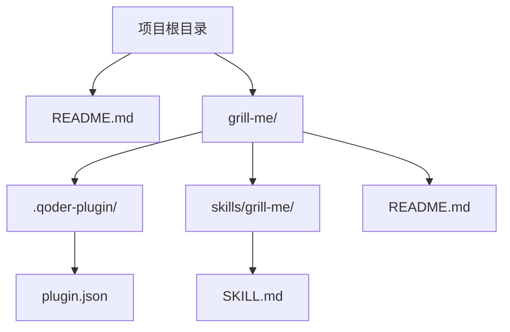
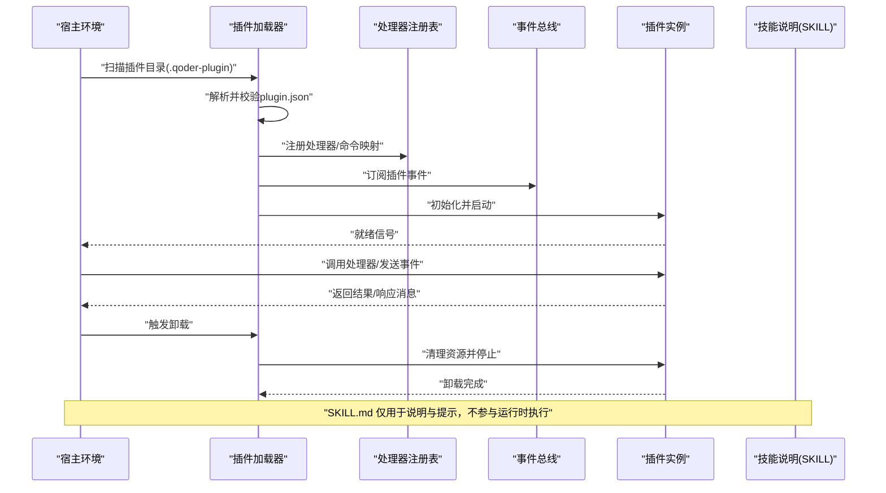
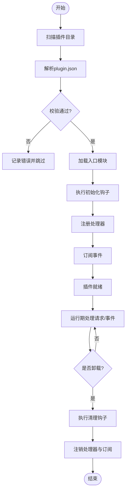
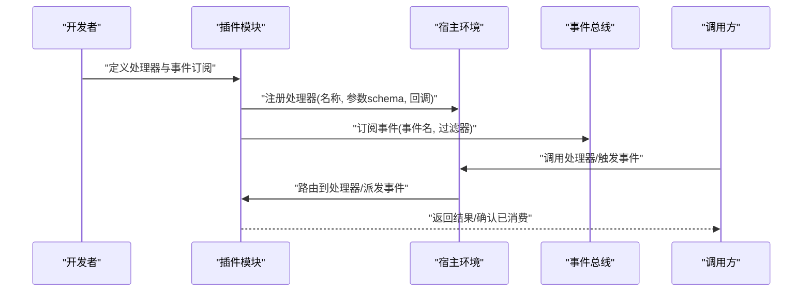
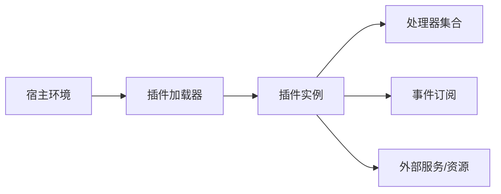

# 插件系统架构

<cite>
**本文档引用的文件**
- [README.md](file://README.md)
- [grill-me/.qoder-plugin/plugin.json](file://grill-me/.qoder-plugin/plugin.json)
- [grill-me/README.md](file://grill-me/README.md)
- [grill-me/skills/grill-me/SKILL.md](file://grill-me/skills/grill-me/SKILL.md)
</cite>

## 目录
1. [简介](#简介)
2. [项目结构](#项目结构)
3. [核心组件](#核心组件)
4. [架构总览](#架构总览)
5. [详细组件分析](#详细组件分析)
6. [依赖关系分析](#依赖关系分析)
7. [性能考虑](#性能考虑)
8. [故障排查指南](#故障排查指南)
9. [结论](#结论)
10. [附录](#附录)

## 简介
本文件为“天气智能体插件系统”的架构文档，聚焦于插件配置、生命周期管理、加载与卸载流程、API 接口、事件系统与消息协议、开发最佳实践与安全考量，以及调试与性能监控方法。文档基于仓库中现有插件示例（grill-me）进行归纳与扩展说明，帮助开发者快速理解并构建高质量的插件。

## 项目结构
仓库包含一个示例插件目录 grill-me，其内部遵循 .qoder-plugin 规范，提供 plugin.json 作为插件元数据与能力声明入口；skills 目录用于描述技能行为与使用说明。根目录 README 提供项目背景与总体说明。

图表来源
- [README.md:1-200](file://README.md#L1-L200)
- [grill-me/.qoder-plugin/plugin.json:1-200](file://grill-me/.qoder-plugin/plugin.json#L1-L200)
- [grill-me/README.md:1-200](file://grill-me/README.md#L1-L200)
- [grill-me/skills/grill-me/SKILL.md:1-200](file://grill-me/skills/grill-me/SKILL.md#L1-L200)

章节来源
- [README.md:1-200](file://README.md#L1-L200)
- [grill-me/.qoder-plugin/plugin.json:1-200](file://grill-me/.qoder-plugin/plugin.json#L1-L200)
- [grill-me/README.md:1-200](file://grill-me/README.md#L1-L200)
- [grill-me/skills/grill-me/SKILL.md:1-200](file://grill-me/skills/grill-me/SKILL.md#L1-L200)

## 核心组件
- 插件清单（plugin.json）：定义插件标识、版本、名称、描述、作者、入口脚本、能力声明、权限、资源路径等。该文件是插件加载器识别与初始化的关键依据。
- 技能说明（SKILL.md）：以人类可读的方式描述插件技能的使用方式、输入输出、约束与示例，便于使用者与上层编排系统理解。
- 插件运行时（由宿主环境实现）：负责扫描、校验、加载、初始化、注册处理器、订阅事件、路由请求、执行回调、回收与卸载。

章节来源
- [grill-me/.qoder-plugin/plugin.json:1-200](file://grill-me/.qoder-plugin/plugin.json#L1-L200)
- [grill-me/skills/grill-me/SKILL.md:1-200](file://grill-me/skills/grill-me/SKILL.md#L1-L200)

## 架构总览
下图展示插件从发现到运行、再到卸载的整体流程，以及插件与宿主之间的交互边界。

图表来源
- [grill-me/.qoder-plugin/plugin.json:1-200](file://grill-me/.qoder-plugin/plugin.json#L1-L200)
- [grill-me/skills/grill-me/SKILL.md:1-200](file://grill-me/skills/grill-me/SKILL.md#L1-L200)

## 详细组件分析

### 插件清单（plugin.json）结构与字段含义
- 标识与版本
  - id：插件唯一标识，建议采用反向域名或命名空间前缀，避免冲突。
  - version：语义化版本号，用于兼容性与升级策略。
  - name/description：人类可读的名称与描述，用于 UI 展示与检索。
- 入口与类型
  - entry/main：插件主入口脚本或模块路径，宿主据此加载运行时逻辑。
  - type：插件类型（如 handler/event/webhook），决定宿主如何与之交互。
- 能力声明
  - handlers：处理器列表，声明可被调用的动作、参数 schema、返回值约定。
  - events：事件订阅声明，列出插件关心的事件名与过滤条件。
  - permissions：权限范围，限制对敏感 API、文件系统、网络访问等。
- 资源与国际化
  - assets：静态资源目录（图标、模板、样式等）。
  - i18n：多语言键值映射，支持界面文案本地化。
- 扩展机制
  - extends：继承基础插件的能力集，减少重复配置。
  - config_schema：运行时配置项的 JSON Schema，供宿主生成表单或校验输入。
  - hooks：生命周期钩子（如 onInit、onReady、onShutdown），允许插件在关键阶段注入行为。

注意：以上字段为通用插件清单设计建议，具体以宿主实现为准。若当前仓库未提供完整 schema，请以宿主代码为准进行对齐。

章节来源
- [grill-me/.qoder-plugin/plugin.json:1-200](file://grill-me/.qoder-plugin/plugin.json#L1-L200)

### 插件生命周期与加载流程
- 发现与校验
  - 宿主扫描 .qoder-plugin 目录，读取 plugin.json，校验必填字段与格式。
- 初始化与注册
  - 根据 entry 加载插件模块，执行初始化钩子。
  - 将 handlers 注册到处理器路由表，将 events 订阅到事件总线。
- 运行期
  - 接收外部请求或事件，按路由分发至对应处理器。
  - 处理器执行业务逻辑，必要时调用外部服务或读写资源。
- 卸载与回收
  - 收到卸载指令后，触发 onShutdown 钩子，释放连接、关闭定时器、清理缓存。
  - 从注册表与事件总线注销处理器与订阅。

图表来源
- [grill-me/.qoder-plugin/plugin.json:1-200](file://grill-me/.qoder-plugin/plugin.json#L1-L200)

### 插件 API 接口、事件系统与消息协议
- 处理器接口
  - 入参：标准化请求对象（含上下文、鉴权信息、参数校验结果）。
  - 出参：统一响应对象（状态码、数据体、错误码、追踪 ID）。
  - 异步支持：支持 Promise/回调模式，超时与重试策略由宿主控制。
- 事件系统
  - 事件模型：事件名、负载、时间戳、来源标识、优先级。
  - 订阅模式：精确匹配、通配符、过滤器表达式。
  - 可靠性：至少一次投递、幂等性要求、死信队列与重试上限。
- 消息协议
  - 传输层：进程内函数调用或 IPC（如消息队列、事件总线）。
  - 编解码：JSON/Protobuf，需定义严格 schema 与版本兼容性。
  - 安全：签名校验、防重放、最小权限原则。

章节来源
- [grill-me/.qoder-plugin/plugin.json:1-200](file://grill-me/.qoder-plugin/plugin.json#L1-L200)

### 插件开发最佳实践
- 明确职责边界：每个插件只解决单一领域问题，避免耦合。
- 配置驱动：使用 config_schema 暴露必要开关，默认值保守且安全。
- 幂等与容错：处理器保证幂等，异常时返回结构化错误，不泄露堆栈。
- 可观测性：埋点日志、指标上报、链路追踪，便于定位问题。
- 资源管理：显式打开/关闭连接，避免泄漏；大对象及时释放。
- 向后兼容：变更接口时保留旧版本兼容层，逐步迁移。

[本节为通用指导，不直接分析具体文件]

### 安全考虑
- 权限最小化：仅在 permissions 中声明所需权限，避免过度授权。
- 输入校验：对所有入参进行白名单校验与长度限制。
- 输出过滤：禁止回显敏感信息，统一错误码与脱敏规则。
- 依赖安全：锁定第三方库版本，定期更新漏洞补丁。
- 沙箱隔离：限制文件系统与网络访问范围，启用白名单。

[本节为通用指导，不直接分析具体文件]

### 插件实现示例（概念流程）
以下流程展示一个典型插件如何注册处理器、订阅事件并响应请求。

图表来源
- [grill-me/.qoder-plugin/plugin.json:1-200](file://grill-me/.qoder-plugin/plugin.json#L1-L200)

## 依赖关系分析
- 插件与宿主
  - 插件通过 plugin.json 声明能力，宿主负责解析与绑定。
  - 插件不应直接依赖宿主的内部实现，应通过稳定接口交互。
- 插件内部依赖
  - 处理器之间尽量解耦，通过事件或消息传递协作。
  - 共享状态需线程安全，避免竞态条件。
- 外部依赖
  - 网络调用需设置超时与重试，失败降级。
  - 文件与数据库访问需事务与锁保护。

图表来源
- [grill-me/.qoder-plugin/plugin.json:1-200](file://grill-me/.qoder-plugin/plugin.json#L1-L200)

章节来源
- [grill-me/.qoder-plugin/plugin.json:1-200](file://grill-me/.qoder-plugin/plugin.json#L1-L200)

## 性能考虑
- 懒加载：按需加载处理器与资源，减少启动开销。
- 批处理：批量写入与查询，降低 I/O 次数。
- 缓存：热点数据缓存，合理设置过期与失效策略。
- 并发控制：限流与熔断，防止雪崩效应。
- 监控：CPU、内存、GC、I/O 指标采集与告警。

[本节为通用指导，不直接分析具体文件]

## 故障排查指南
- 常见问题
  - 插件未加载：检查 plugin.json 必填字段与路径正确性。
  - 处理器未注册：确认 handlers 声明与入口模块导出一致。
  - 事件未触发：核对事件名、过滤器与订阅时机。
  - 资源泄漏：检查连接关闭、定时器清理与缓存释放。
- 诊断步骤
  - 开启详细日志，捕获错误堆栈与上下文。
  - 使用宿主提供的插件管理面板查看状态与指标。
  - 复现问题并缩小范围，逐步定位。
- 恢复策略
  - 热重载：在不重启宿主的情况下重新加载插件。
  - 回滚版本：快速恢复到上一个稳定版本。
  - 隔离故障：禁用问题插件，保障核心功能可用。

[本节为通用指导，不直接分析具体文件]

## 结论
本架构文档围绕插件清单、生命周期、API、事件与消息协议展开，提供了从设计到实现的系统性指导。通过遵循最佳实践与安全策略，开发者可以构建稳定、可扩展、易维护的天气智能体插件。建议在实现过程中结合宿主的实际接口与工具链，确保一致性与可观测性。

[本节为总结性内容，不直接分析具体文件]

## 附录
- 术语表
  - 插件：封装特定能力的独立模块，通过标准接口与宿主交互。
  - 处理器：对外暴露的可调用单元，处理请求并返回结果。
  - 事件：系统内异步通知机制，用于解耦与扩展现有行为。
  - 消息协议：插件与宿主之间通信的数据格式与规则。
- 参考文件
  - 插件清单示例：grill-me/.qoder-plugin/plugin.json
  - 技能说明示例：grill-me/skills/grill-me/SKILL.md
  - 项目说明：README.md

[本节为补充信息，不直接分析具体文件]