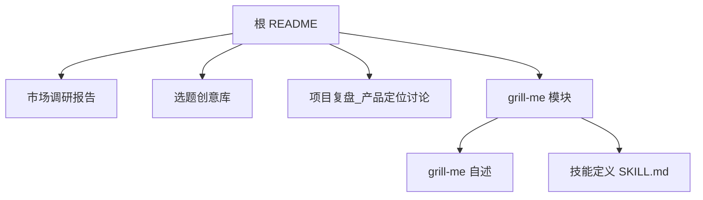
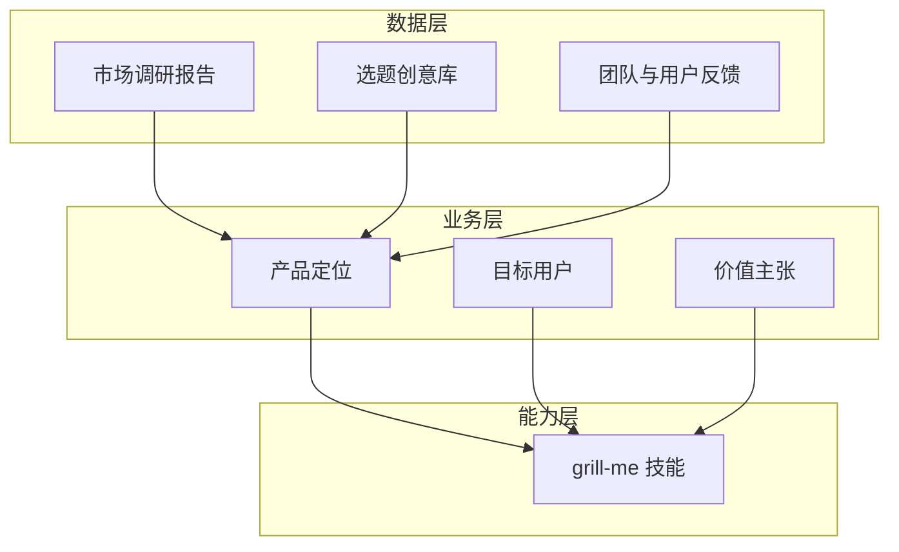
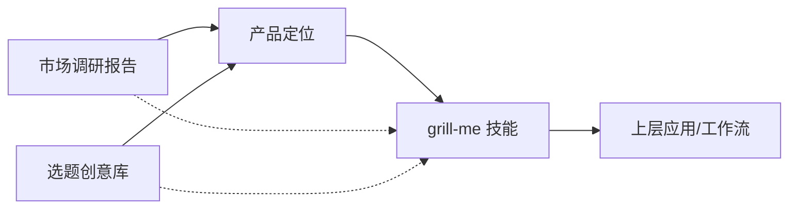

# 项目复盘

<cite>
**本文引用的文件**   
- [README.md](file://README.md)
- [市场调研报告.md](file://市场调研报告.md)
- [选题创意库_212个.md](file://选题创意库_212个.md)
- [项目复盘_产品定位讨论.md](file://项目复盘_产品定位讨论.md)
- [grill-me/README.md](file://grill-me/README.md)
- [grill-me/skills/grill-me/SKILL.md](file://grill-me/skills/grill-me/SKILL.md)
</cite>

## 目录
1. [引言](#引言)
2. [项目结构](#项目结构)
3. [核心组件](#核心组件)
4. [架构总览](#架构总览)
5. [详细组件分析](#详细组件分析)
6. [依赖分析](#依赖分析)
7. [性能考量](#性能考量)
8. [故障排查指南](#故障排查指南)
9. [结论](#结论)
10. [附录](#附录)

## 引言
本复盘文档围绕“天气代理竞赛”项目，系统梳理开发过程、产品定位决策与验证结果，总结团队反馈与用户调研，提炼关键技术与商业决策，并给出迭代建议与后续发展方向。目标是沉淀可复用的经验与最佳实践，为未来类似项目提供参考。

## 项目结构
仓库以“竞赛产物 + 市场研究 + 产品定位复盘”为主轴组织：
- 根级说明与复盘材料：README.md、市场调研报告.md、选题创意库_212个.md、项目复盘_产品定位讨论.md
- 子模块 grill-me：包含技能定义与使用说明（skills/grill-me/SKILL.md）以及模块自述（README.md）

图表来源
- [README.md:1-200](file://README.md#L1-L200)
- [市场调研报告.md:1-200](file://市场调研报告.md#L1-L200)
- [选题创意库_212个.md:1-200](file://选题创意库_212个.md#L1-L200)
- [项目复盘_产品定位讨论.md:1-200](file://项目复盘_产品定位讨论.md#L1-L200)
- [grill-me/README.md:1-200](file://grill-me/README.md#L1-L200)
- [grill-me/skills/grill-me/SKILL.md:1-200](file://grill-me/skills/grill-me/SKILL.md#L1-L200)

章节来源
- [README.md:1-200](file://README.md#L1-L200)
- [项目复盘_产品定位讨论.md:1-200](file://项目复盘_产品定位讨论.md#L1-L200)

## 核心组件
- 产品定位与复盘文档：承载目标、范围、关键决策、验证结论与迭代路线
- 市场调研报告：需求洞察、竞品分析、用户画像与机会点
- 选题创意库：候选方向与筛选依据
- grill-me 技能：面向具体场景的能力封装与使用约定

章节来源
- [项目复盘_产品定位讨论.md:1-200](file://项目复盘_产品定位讨论.md#L1-L200)
- [市场调研报告.md:1-200](file://市场调研报告.md#L1-L200)
- [选题创意库_212个.md:1-200](file://选题创意库_212个.md#L1-L200)
- [grill-me/skills/grill-me/SKILL.md:1-200](file://grill-me/skills/grill-me/SKILL.md#L1-L200)

## 架构总览
从“业务—数据—能力”三层视角理解项目：
- 业务层：产品定位、目标用户、核心价值主张与商业化路径
- 数据层：调研数据、用户反馈、市场指标与验证结论
- 能力层：grill-me 技能作为可复用能力单元，支撑多场景落地

图表来源
- [项目复盘_产品定位讨论.md:1-200](file://项目复盘_产品定位讨论.md#L1-L200)
- [市场调研报告.md:1-200](file://市场调研报告.md#L1-L200)
- [选题创意库_212个.md:1-200](file://选题创意库_212个.md#L1-L200)
- [grill-me/skills/grill-me/SKILL.md:1-200](file://grill-me/skills/grill-me/SKILL.md#L1-L200)

## 详细组件分析

### 产品定位与复盘（项目复盘_产品定位讨论.md）
- 内容要点：目标与范围、关键决策（技术选型、边界与取舍）、验证方法与结论、风险与对策、迭代计划
- 复盘方法：回顾里程碑、对比预期与实际、提取教训与改进项
- 输出物：路线图、优先级清单、度量指标

章节来源
- [项目复盘_产品定位讨论.md:1-200](file://项目复盘_产品定位讨论.md#L1-L200)

### 市场调研报告（市场调研报告.md）
- 内容要点：宏观趋势、细分赛道、竞品矩阵、用户画像、需求强度与付费意愿
- 分析方法：定性与定量结合，数据来源与可信度评估
- 结论映射：将洞察转化为产品定位与功能优先级

章节来源
- [市场调研报告.md:1-200](file://市场调研报告.md#L1-L200)

### 选题创意库（选题创意库_212个.md）
- 内容要点：候选方向清单、筛选维度（可行性、差异化、商业性、合规性）
- 使用方法：快速打分、淘汰机制、聚焦高潜力方向

章节来源
- [选题创意库_212个.md:1-200](file://选题创意库_212个.md#L1-L200)

### grill-me 技能（grill-me/skills/grill-me/SKILL.md）
- 内容要点：能力边界、输入输出约定、调用方式、错误处理与回退策略
- 设计原则：最小可用、可组合、可观测、可测试
- 集成方式：通过统一接口接入上层应用或工作流

章节来源
- [grill-me/skills/grill-me/SKILL.md:1-200](file://grill-me/skills/grill-me/SKILL.md#L1-L200)

### grill-me 模块自述（grill-me/README.md）
- 内容要点：模块职责、安装与使用步骤、版本与兼容性说明
- 维护要点：变更日志、问题反馈渠道、贡献规范

章节来源
- [grill-me/README.md:1-200](file://grill-me/README.md#L1-L200)

## 依赖分析
- 文档间依赖：产品定位基于市场调研与创意库；复盘结论反哺下一轮调研与创意收敛
- 能力依赖：grill-me 技能依赖明确的输入契约与错误处理；上层应用需遵循调用约定
- 外部依赖：数据源、第三方服务、合规要求等需在复盘与报告中明确

图表来源
- [项目复盘_产品定位讨论.md:1-200](file://项目复盘_产品定位讨论.md#L1-L200)
- [市场调研报告.md:1-200](file://市场调研报告.md#L1-L200)
- [选题创意库_212个.md:1-200](file://选题创意库_212个.md#L1-L200)
- [grill-me/skills/grill-me/SKILL.md:1-200](file://grill-me/skills/grill-me/SKILL.md#L1-L200)

章节来源
- [项目复盘_产品定位讨论.md:1-200](file://项目复盘_产品定位讨论.md#L1-L200)
- [市场调研报告.md:1-200](file://市场调研报告.md#L1-L200)
- [选题创意库_212个.md:1-200](file://选题创意库_212个.md#L1-L200)
- [grill-me/skills/grill-me/SKILL.md:1-200](file://grill-me/skills/grill-me/SKILL.md#L1-L200)

## 性能考量
- 数据获取与处理：缓存热点数据、批处理与分页、超时与重试策略
- 能力调用：幂等性设计、降级与熔断、资源配额与限流
- 可观测性：关键路径埋点、错误率与延迟监控、告警阈值
- 成本优化：按需调用、结果复用、冷启动优化

[本节为通用指导，不直接分析具体文件]

## 故障排查指南
- 常见问题定位：输入校验失败、上游服务不可用、权限与鉴权异常、数据格式不一致
- 排查流程：复现—隔离—定位—修复—回归验证
- 工具与手段：日志采集、链路追踪、错误码规范、沙箱与回放
- 预防机制：契约测试、灰度发布、回滚预案

章节来源
- [项目复盘_产品定位讨论.md:1-200](file://项目复盘_产品定位讨论.md#L1-L200)
- [grill-me/skills/grill-me/SKILL.md:1-200](file://grill-me/skills/grill-me/SKILL.md#L1-L200)

## 结论
- 产品定位应基于扎实的市场调研与用户洞察，并通过小步快跑的方式持续验证
- 关键决策需兼顾技术可行性与商业回报，建立清晰的取舍标准
- 能力模块化（如 grill-me）有助于提升复用性与交付效率
- 复盘是持续改进的基石，建议形成固定节奏与模板化产出

[本节为总结性内容，不直接分析具体文件]

## 附录
- 术语表：产品定位、MVP、PMF、SLA、SLO、幂等、熔断、灰度等
- 参考模板：复盘报告模板、调研报告模板、技能定义模板
- 指标体系：北极星指标、过程指标、健康指标

[本节为补充信息，不直接分析具体文件]