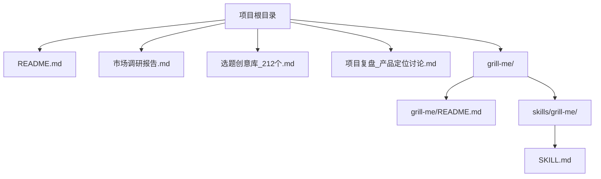
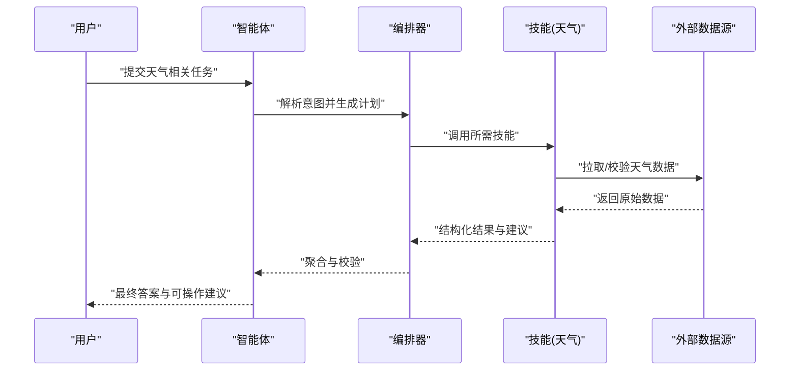
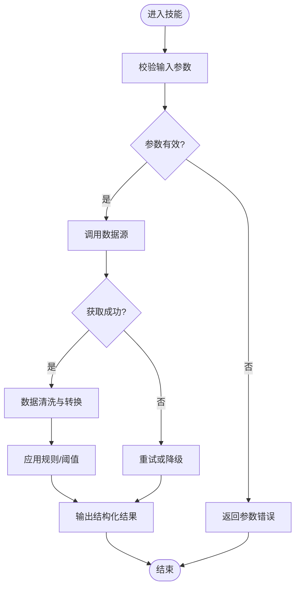
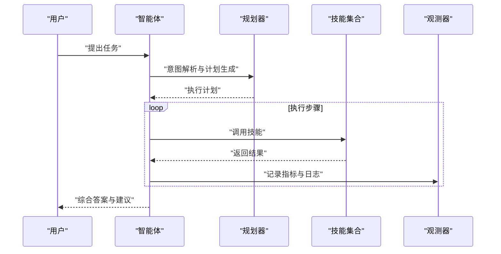
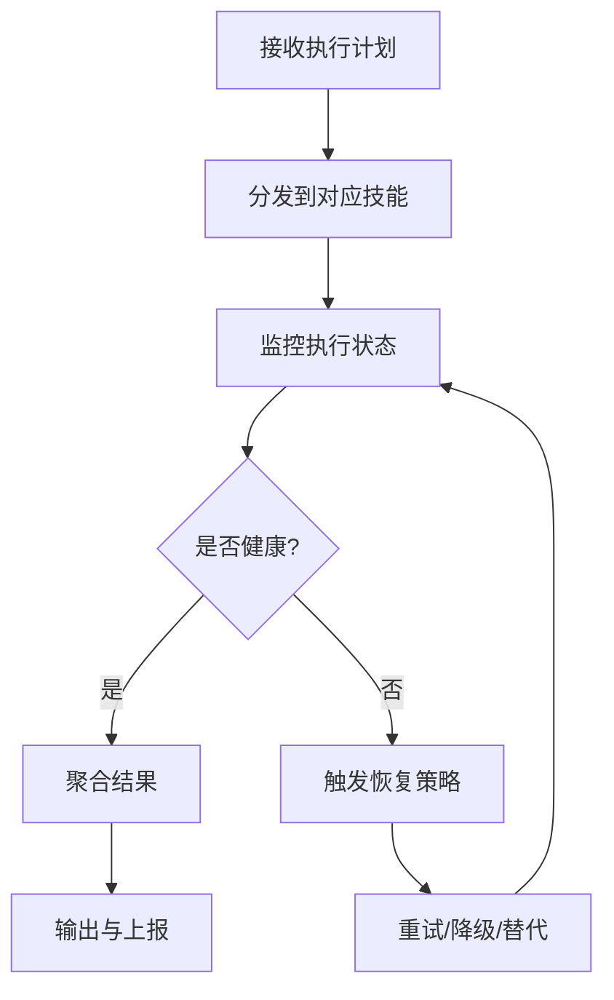
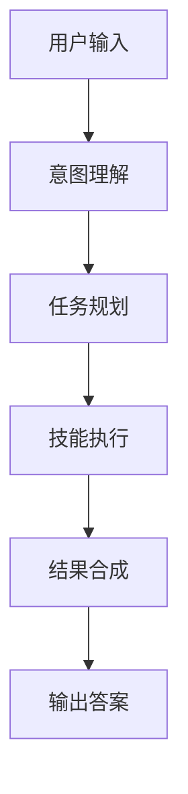
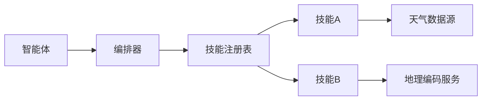

# 项目概览

<cite>
**本文引用的文件**   
- [README.md](file://README.md)
- [grill-me/README.md](file://grill-me/README.md)
- [grill-me/skills/grill-me/SKILL.md](file://grill-me/skills/grill-me/SKILL.md)
- [市场调研报告.md](file://市场调研报告.md)
- [选题创意库_212个.md](file://选题创意库_212个.md)
- [项目复盘_产品定位讨论.md](file://项目复盘_产品定位讨论.md)
</cite>

## 目录
1. [简介](#简介)
2. [项目结构](#项目结构)
3. [核心组件](#核心组件)
4. [架构总览](#架构总览)
5. [详细组件分析](#详细组件分析)
6. [依赖关系分析](#依赖关系分析)
7. [性能考量](#性能考量)
8. [故障排查指南](#故障排查指南)
9. [结论](#结论)
10. [附录](#附录)

## 简介
本项目面向“天气智能体竞赛”，旨在构建一个以智能代理为核心的天气服务解决方案。通过整合多源天气数据、智能决策与交互能力，为个人用户与企业场景提供精准、可解释、可操作的天气相关服务。项目强调“智能体”的规划、工具调用与反馈闭环，能够在复杂任务中自动编排多个技能（Skill）完成端到端流程，如预报查询、风险预警、出行建议与活动优化等。

项目的价值在于：
- 将分散的天气数据与业务规则统一为“可被智能体调用的技能”，提升复用性与扩展性。
- 以智能体为中心，实现从意图理解到行动执行的自动化闭环，降低使用门槛。
- 在竞赛场景中突出“可编排、可评估、可复现”的工程化能力，便于评测与对比。

与其他竞品的差异化优势：
- 技能化架构：以“技能”为单位封装能力，支持热插拔与组合编排。
- 面向任务的智能体工作流：强调多步推理与工具调用，而非单一问答。
- 评测友好：结构化输出与可观测性设计，便于量化评估与回归测试。

## 项目结构
仓库采用“文档驱动 + 技能模块”的组织方式。根目录包含总体说明与调研材料；grill-me 子目录为具体技能实现与说明，skills 下按技能维度划分，SKILL.md 描述该技能的职责、输入输出与使用方式。

图表来源
- [README.md](file://README.md)
- [grill-me/README.md](file://grill-me/README.md)
- [grill-me/skills/grill-me/SKILL.md](file://grill-me/skills/grill-me/SKILL.md)
- [市场调研报告.md](file://市场调研报告.md)
- [选题创意库_212个.md](file://选题创意库_212个.md)
- [项目复盘_产品定位讨论.md](file://项目复盘_产品定位讨论.md)

章节来源
- [README.md](file://README.md)
- [grill-me/README.md](file://grill-me/README.md)
- [grill-me/skills/grill-me/SKILL.md](file://grill-me/skills/grill-me/SKILL.md)
- [市场调研报告.md](file://市场调研报告.md)
- [选题创意库_212个.md](file://选题创意库_212个.md)
- [项目复盘_产品定位讨论.md](file://项目复盘_产品定位讨论.md)

## 核心组件
- 智能体（Agent）：负责意图识别、任务拆解、工具调度与结果汇总。
- 技能（Skill）：封装具体的天气相关能力，如数据获取、规则判断、建议生成等。
- 编排器（Orchestrator）：协调多个技能执行顺序，处理异常与重试。
- 评测与观测：记录关键指标、日志与中间状态，支撑竞赛评分与回溯。

这些组件共同构成“意图→规划→执行→反馈”的闭环，确保在多变天气条件下仍能稳定输出高质量建议。

章节来源
- [grill-me/skills/grill-me/SKILL.md](file://grill-me/skills/grill-me/SKILL.md)

## 架构总览
下图展示智能体与技能之间的交互关系，以及数据与控制流的走向。

图表来源
- [grill-me/skills/grill-me/SKILL.md](file://grill-me/skills/grill-me/SKILL.md)
- [grill-me/README.md](file://grill-me/README.md)

## 详细组件分析

### 技能（Skill）设计与职责
- 职责边界清晰：每个技能聚焦单一能力，如“实时天气查询”“空气质量评估”“出行风险提示”。
- 输入输出规范：定义明确的参数与返回结构，便于编排器组合与评测。
- 错误处理：对网络异常、数据缺失、格式错误等进行分类处理与降级策略。

图表来源
- [grill-me/skills/grill-me/SKILL.md](file://grill-me/skills/grill-me/SKILL.md)

章节来源
- [grill-me/skills/grill-me/SKILL.md](file://grill-me/skills/grill-me/SKILL.md)

### 智能体（Agent）工作流
- 意图理解：对用户自然语言进行语义解析，映射到任务模板。
- 任务规划：根据目标与约束生成执行计划，选择合适技能序列。
- 执行监控：跟踪每一步状态，处理失败与超时，必要时回滚或替代方案。
- 结果合成：将多技能输出合并为一致的结构化答案，附带依据与置信度。

图表来源
- [grill-me/README.md](file://grill-me/README.md)
- [grill-me/skills/grill-me/SKILL.md](file://grill-me/skills/grill-me/SKILL.md)

章节来源
- [grill-me/README.md](file://grill-me/README.md)
- [grill-me/skills/grill-me/SKILL.md](file://grill-me/skills/grill-me/SKILL.md)

### 编排器（Orchestrator）与错误恢复
- 编排策略：支持串行、并行与条件分支，适应不同复杂度任务。
- 容错机制：重试、熔断、降级与补偿动作，保障稳定性。
- 可观测性：关键路径埋点与指标上报，便于追踪与优化。

图表来源
- [grill-me/README.md](file://grill-me/README.md)

章节来源
- [grill-me/README.md](file://grill-me/README.md)

### 概念性总览
下图给出一个不绑定具体代码的概念流程图，帮助初学者理解“智能体+技能”的整体工作方式。

[本图为概念示意，不直接映射具体源码文件]

## 依赖关系分析
- 内部依赖：智能体依赖编排器与技能接口；编排器依赖技能注册表与配置。
- 外部依赖：天气数据源、地理编码服务、规则引擎等。
- 耦合与内聚：技能高内聚、低耦合，通过标准接口接入；编排器屏蔽细节，提高整体灵活性。

图表来源
- [grill-me/README.md](file://grill-me/README.md)
- [grill-me/skills/grill-me/SKILL.md](file://grill-me/skills/grill-me/SKILL.md)

章节来源
- [grill-me/README.md](file://grill-me/README.md)
- [grill-me/skills/grill-me/SKILL.md](file://grill-me/skills/grill-me/SKILL.md)

## 性能考量
- 缓存策略：对热点数据（如城市基础信息、常用阈值）进行缓存，减少重复请求。
- 并发控制：合理设置并行度，避免资源争用与限流。
- 批处理：批量拉取与更新，降低网络开销。
- 延迟优化：关键路径去重与短路逻辑，优先返回确定性结果。

[本节为通用指导，不直接分析具体文件]

## 故障排查指南
- 常见问题
  - 数据源不可达：检查网络连通性与鉴权配置，启用降级策略。
  - 参数校验失败：核对输入结构与必填字段，补充默认值或提示。
  - 规则冲突：审查阈值与优先级，增加冲突检测与告警。
- 诊断方法
  - 查看技能执行日志与中间状态，定位失败步骤。
  - 使用观测指标（成功率、时延、错误码分布）快速定位瓶颈。
  - 回放历史用例，验证修复效果。

章节来源
- [grill-me/skills/grill-me/SKILL.md](file://grill-me/skills/grill-me/SKILL.md)

## 结论
本项目以“智能体+技能”为核心范式，构建了可扩展、可编排、可评测的天气服务能力。通过清晰的职责边界与工程化实践，既满足竞赛场景的高标准要求，也为后续产品化奠定基础。未来可在多模态数据融合、个性化推荐与跨域协同方面持续演进。

[本节为总结性内容，不直接分析具体文件]

## 附录
- 发展历程
  - 初期：明确问题域与竞品分析，形成选题与定位。
  - 中期：搭建技能骨架与智能体框架，完成核心流程打通。
  - 当前：完善错误处理与观测体系，推进评测与回归。
  - 未来：扩展技能生态，增强可解释性与用户体验。
- 使用场景与案例
  - 个人出行：基于实时天气与空气质量，动态调整通勤路线与装备建议。
  - 户外活动：结合降水概率与风力，给出最佳时段与备选方案。
  - 企业运营：针对物流与仓储，提供风险预警与调度建议。

章节来源
- [市场调研报告.md](file://市场调研报告.md)
- [选题创意库_212个.md](file://选题创意库_212个.md)
- [项目复盘_产品定位讨论.md](file://项目复盘_产品定位讨论.md)
- [grill-me/README.md](file://grill-me/README.md)
- [grill-me/skills/grill-me/SKILL.md](file://grill-me/skills/grill-me/SKILL.md)